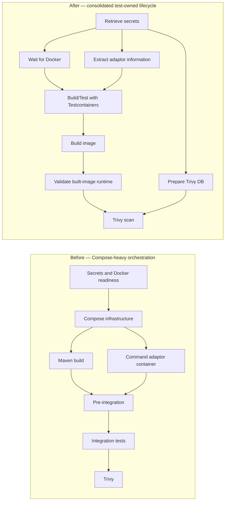

# FDP Command Adaptor SNS — CI/CD Optimisation

## Executive Summary

The SNS pilot replaced a Docker Compose-heavy integration-test path with a test-owned Testcontainers environment and simplified the CI dependency graph. Redis, ZooKeeper, Kafka, Schema Registry and five downstream aggregates are controlled from Java test code while the business suite runs the SNS application in the test JVM. The exact Docker image is then built, validated separately and scanned with Trivy.

Docker context and layer ordering were tightened, the BuildKit builder/cache strategy was made reusable, duplicate Maven work was removed, adaptor metadata extraction was collapsed from four Maven evaluations to one, and Trivy database preparation was moved onto an independent pipeline path.

> **Measured:** The successful CI baseline averaged **13m35s** across ten runs. Two measured optimised runs completed in **4m57s** and **4m44s**.
>
> **Best observed comparison:** Comparing the baseline average with the fastest observed optimised run gives an **8m51s** reduction, approximately **65.2%**, or approximately **2.87x** faster. The **4m44s** result is observed performance, not a guaranteed duration.

The optimisation retains the Cucumber business suite, exact built-image runtime validation and Trivy vulnerability/secret scanning. Docker availability, zero-test detection, minimum feature/scenario coverage, completed-scenario accounting, readiness and failure diagnostics prevent speed from being achieved by silently running less validation.

## Pipeline Architecture



Lifecycle ownership was distributed across Compose services, helper containers and multiple CI steps. Several steps overlapped, so their visible durations cannot be added or directly compared with the consolidated final step.

Build/Test, image build and runtime validation remain sequential correctness boundaries. Docker readiness, adaptor-information extraction and Trivy database preparation overlap where their dependencies permit.

## Measured Impact

The detailed evidence and future timing updates are maintained in [Results, Engineering Learnings & Reuse Guide](04-SNS-CI-CD-Results-Learnings-and-Reuse.md), which is the measurement source of truth.

| Change | Before | After | Impact |
| --- | ---: | ---: | --- |
| Docker layer ordering | 75.82–77.90s | 4.62–5.08s | Approximately 15–16x faster in the controlled same-daemon warm rebuild |
| Kafka Streams shutdown | Approximately 30s known tail | No longer observed in representative post-fix runs | Approximately 30s known shutdown wait no longer observed |
| Runtime image validation | Approximately 1:06 | Approximately 0:30–0:34 | Approximately 32–36s step reduction |
| Adaptor information | Approximately 15–21s | Approximately 11s | Approximately 4–10s visible-step improvement |
| Final Trivy contribution | Approximately 40–49s | Approximately 14–15s | Approximately 25–35s removed from the final critical path |
| **Full CI** | **13:35 average** | **4:57 / 4:44** | **Best observed: 8:51 / ~65.2% / ~2.87x** |

The Docker rebuild is a controlled Docker measurement, not a full-CI result. Kafka Streams receives only the observed approximately 30-second shutdown-tail attribution, not the complete Build/Test difference. Trivy database preparation still takes approximately 28–31 seconds but now overlaps other useful work. Individual impacts must not be added together because measurements overlap and have different scopes.

## Architectural and Structural Improvements

| Change | Final implementation | Evidence boundary |
| --- | --- | --- |
| Docker context | Context restricted to the packaged JAR and OpenTelemetry agent | Original measured context: approximately 191.27 MB. Controlled BuildKit/content-store observation after optimisation: 189 B. This is not a universal CI transfer comparison; no cold-build or image-size reduction is claimed |
| BuildKit builder/cache strategy | Default builder with shared reuse, isolated writes and inline fallback | Default-builder path approximately 18–20s faster than custom builder in the comparison; registry-cache benefit not isolated |
| Testcontainers architecture | Test code owns infrastructure, dynamic endpoints/topics, readiness, diagnostics and cleanup | Major system-level contributor; no isolated saving assigned |
| CI Docker compatibility | Testcontainers 1.20.4, Docker API 1.41, DIND endpoint/host override, registry authentication and DIND-specific Ryuk setting | Correctness/reliability enabler; no performance saving assigned |
| False-green protection | Current seven feature files and 14 business scenarios protected by minimum thresholds, plus Docker and zero-test controls | Correctness protection; no performance saving assigned |
| Kafka polling/consumers | Correct 500ms semantics, larger poll batches, early exit and duplicate-consumer removal | Correctness and structural improvement; no isolated timing |
| Aggregate startup/readiness | Five aggregates start concurrently and readiness checks run in parallel | Structural critical-path improvement; no isolated timing |
| Exact-image validation | The image produced by CI starts separately and must become ready | Runtime coverage retained; Maven reuse supplies the measured step reduction |

## Documentation Map

```text
FDP Command Adaptor SNS — CI/CD Optimisation
│
├── Docker & CI Pipeline Optimisation
├── Testcontainers Migration & Test Reliability
├── Built-Image Validation & Maven Optimisation
└── Results, Engineering Learnings & Reuse Guide
```

- [Docker & CI Pipeline Optimisation](01-SNS-CI-CD-Docker-and-Pipeline-Optimisation.md) — `.dockerignore`, layer ordering, builder/cache strategy, dependency graph, adaptor information and Trivy.
- [Testcontainers Migration & Test Reliability](02-SNS-Testcontainers-Migration-and-Test-Reliability.md) — infrastructure lifecycle, CI compatibility, business-suite protection, Kafka polling, concurrent startup, diagnostics and shutdown.
- [Built-Image Validation & Maven Optimisation](03-SNS-Built-Image-Validation-and-Maven-Optimisation.md) — exact packaged-image validation, focused runtime profile and Maven artefact reuse.
- [Results, Engineering Learnings & Reuse Guide](04-SNS-CI-CD-Results-Learnings-and-Reuse.md) — complete measurement evidence, evidence classification, experiments not retained and adoption guidance.

## Publication Review Items

- Add Jira/Epic and merge request links.
- Add before/after pipeline screenshots.
- Link the baseline sample and both measured optimised runs.
- Confirm rollout and ownership for centrally managed CI/Docker configuration.
- Convert relative Markdown links and the Mermaid source into native Confluence page links/diagram elements during publication if required by the target space.
