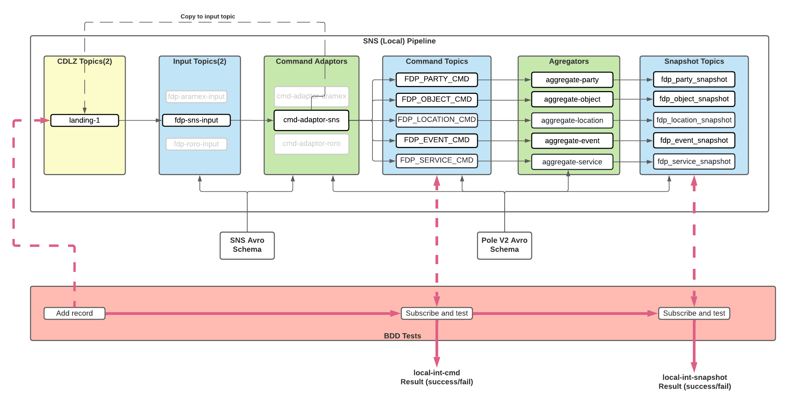

From a10d6a5c82cda6af124c4d7504071c17d6b493f9 Mon Sep 17 00:00:00 2001
From: d-aktasb <benan.aktas@digital.homeoffice.gov.uk>
Date: Wed, 8 Jul 2026 09:43:25 +0100
Subject: [PATCH 01/38] CST-2177 create .dockerignore file

---
 cmd-adaptor-sns/.dockerignore | 34 ++++++++++++++++++++++++++++++++++
 1 file changed, 34 insertions(+)
 create mode 100644 cmd-adaptor-sns/.dockerignore

diff --git a/cmd-adaptor-sns/.dockerignore b/cmd-adaptor-sns/.dockerignore
new file mode 100644
index 00000000..3c1aef56
--- /dev/null
+++ b/cmd-adaptor-sns/.dockerignore
@@ -0,0 +1,34 @@
+#Source is not needed by the current Dockerfile; Maven builds the JAR before Docker packaging.
+src/
+
+#Exclude generated output by default, but keep the runtime artefacts copied by the Dockerfile.
+target/**
+!target/
+!target/cmd-adaptor-sns-exec.jar
+!target/dependencies/
+!target/dependencies/opentelemetry-javaagent.jar
+
+#Maven wrapper and build metadata are not used by the current Dockerfile.
+.mvn/
+mvnw
+mvnw.cmd
+pom.xml
+
+#IDE / editor
+.idea/
+.vscode/
+*.iml
+*.ipr
+*.iws
+
+#OS files
+.DS_Store
+Thumbs.db
+
+#VCS and local noise
+.git/
+.gitignore
+*.log
+tmp/
+temp/
+.tmp/
\ No newline at end of file
-- 
GitLab


From 3f7d9674ad2c7bf0595689be3f5136b143c87df6 Mon Sep 17 00:00:00 2001
From: d-aktasb <benan.aktas@digital.homeoffice.gov.uk>
Date: Thu, 9 Jul 2026 14:22:58 +0100
Subject: [PATCH 02/38] =?UTF-8?q?CST-2189=20measuring=20T3.3=20=E2=80=94?=
 =?UTF-8?q?=20Apply=20one=20safe=20Docker=20build=20optimisation?=
MIME-Version: 1.0
Content-Type: text/plain; charset=UTF-8
Content-Transfer-Encoding: 8bit

---
 .../Dockerfile.layer-order-prototype          |  37 ++++
 cmd-adaptor-sns/T3.3-rerun-warm-cache.sh      |  94 +++++++++
 cmd-adaptor-sns/T3.3-run-measurements.sh      | 184 ++++++++++++++++++
 3 files changed, 315 insertions(+)
 create mode 100644 cmd-adaptor-sns/Dockerfile.layer-order-prototype
 create mode 100755 cmd-adaptor-sns/T3.3-rerun-warm-cache.sh
 create mode 100755 cmd-adaptor-sns/T3.3-run-measurements.sh

diff --git a/cmd-adaptor-sns/Dockerfile.layer-order-prototype b/cmd-adaptor-sns/Dockerfile.layer-order-prototype
new file mode 100644
index 00000000..9a3bbbd3
--- /dev/null
+++ b/cmd-adaptor-sns/Dockerfile.layer-order-prototype
@@ -0,0 +1,37 @@
+FROM amazoncorretto:17
+
+WORKDIR /tmp
+
+RUN yum install -y \
+        shadow-utils \
+        unzip \
+    && yum update -y ca-certificates cpio curl cyrus-sasl-lib expat glib2 libcurl libdb libssh2 libdb-utils libnghttp2 libpng libtasn1 libxml2 ncurses ncurses-base ncurses-libs nss nss-util nss-softokn nspr openldap openssl-libs python python-libs sqlite xz-libs yum zlib \
+    && yum erase -y vim-data \
+    && yum clean all \
+    && rm -rf /var/cache/yum \
+    && curl --silent --output /tmp/envconsul.zip https://releases.hashicorp.com/envconsul/0.13.1/envconsul_0.13.1_linux_amd64.zip \
+    && unzip envconsul.zip \
+    && rm -f envconsul.zip \
+    && mv envconsul /usr/local/bin/envconsul \
+    && chown root:root /usr/local/bin/envconsul \
+    && chmod 0755 /usr/local/bin/envconsul \
+    && adduser \
+      -u 1000 \
+      -U \
+      -m \
+      -s /bin/bash \
+      fdpuser
+
+COPY ./target/cmd-adaptor-sns-exec.jar /local/cmd-adaptor-sns-exec.jar
+COPY ./target/dependencies/opentelemetry-javaagent.jar /local/opentelemetry-javaagent.jar
+
+RUN chmod 0755 /local/cmd-adaptor-sns-exec.jar \
+    && chown fdpuser:fdpuser /local/cmd-adaptor-sns-exec.jar \
+    && chmod 0755 /local/opentelemetry-javaagent.jar \
+    && chown fdpuser:fdpuser /local/opentelemetry-javaagent.jar
+
+# Run Application as non-root
+WORKDIR /home/fdpuser
+USER fdpuser
+
+CMD ["java", "-agentlib:jdwp=transport=dt_socket,server=y,suspend=n,address=*:8077", "-javaagent:/local/opentelemetry-javaagent.jar", "-Dcom.sun.management.jmxremote", "-Dcom.sun.management.jmxremote.port=9012", "-Dcom.sun.management.jmxremote.rmi.port=9012", "-Dcom.sun.management.jmxremote.authenticate=false", "-Dcom.sun.management.jmxremote.local.only=false", "-Dcom.sun.management.jmxremote.ssl=false", "-Djava.rmi.server.hostname=localhost", "-jar", "/local/cmd-adaptor-sns-exec.jar"]
diff --git a/cmd-adaptor-sns/T3.3-rerun-warm-cache.sh b/cmd-adaptor-sns/T3.3-rerun-warm-cache.sh
new file mode 100755
index 00000000..37437ade
--- /dev/null
+++ b/cmd-adaptor-sns/T3.3-rerun-warm-cache.sh
@@ -0,0 +1,94 @@
+#!/usr/bin/env bash
+#
+# T3.3 - Warm-cache re-test with a REAL content change (not timestamp-only touch)
+#
+# The first run showed both Dockerfiles reporting the COPY layer as CACHED
+# after a `touch` on the jar. That proves touch did not change the file's
+# content hash - it does NOT prove or disprove the layer-order hypothesis.
+#
+# This script forces an actual content change to the jar (appends a byte),
+# then reruns the two warm-cache builds so the COPY layer is genuinely
+# invalidated in both Dockerfiles. This is the valid version of Section 3
+# from T3.3-run-measurements.sh.
+#
+# Run from the repo root, same as the main script.
+
+set -uo pipefail
+
+MODULE_DIR="cmd-adaptor-sns"
+PROD_DOCKERFILE="${MODULE_DIR}/Dockerfile"
+PROTO_DOCKERFILE="${MODULE_DIR}/Dockerfile.layer-order-prototype"
+JAR="${MODULE_DIR}/target/cmd-adaptor-sns-exec.jar"
+
+# Write under the repo checkout, not /tmp - some environments (VDI / ephemeral
+# dev containers) clear /tmp between sessions, silently losing the evidence
+# after the script has already finished successfully.
+RESULTS_DIR="${MODULE_DIR}/T3.3-artifacts"
+mkdir -p "$RESULTS_DIR"
+SUMMARY="${RESULTS_DIR}/rerun-summary.txt"
+
+log() { echo "[$(date '+%H:%M:%S')] $*"; }
+section() { echo; echo "=== $* ==="; echo; }
+record() { echo "$*" | tee -a "$SUMMARY"; }
+
+: > "$SUMMARY"
+
+if [ ! -f "$JAR" ]; then
+  log "ERROR: $JAR not found. Run the Maven build first."
+  exit 1
+fi
+
+SHA_BEFORE=$(shasum -a 256 "$JAR" | awk '{print $1}')
+record "jar_sha_before_content_change=${SHA_BEFORE}"
+
+section "Forcing a real content change to the JAR (append one byte)"
+# This changes the file's content hash without needing a full Maven rebuild.
+# It is a legitimate way to test Docker's content-based cache invalidation,
+# though a real `mvn package` rebuild is closer to the real-world trigger.
+# We do this non-destructively: append then keep the file usable as a cache-key
+# test artefact only (not run as a real jar in this test).
+printf '\0' >> "$JAR"
+
+SHA_AFTER=$(shasum -a 256 "$JAR" | awk '{print $1}')
+record "jar_sha_after_content_change=${SHA_AFTER}"
+
+if [ "$SHA_BEFORE" = "$SHA_AFTER" ]; then
+  log "ERROR: content hash did not change - append failed. Aborting."
+  exit 1
+fi
+record "content_hash_changed=true"
+
+section "3a-rerun. Current Dockerfile warm-cache rebuild after real content change"
+/usr/bin/time -p docker build \
+  -t cmd-adaptor-sns:t33-current-warm-after-real-change \
+  -f "$PROD_DOCKERFILE" \
+  "$MODULE_DIR/" 2>&1 | tee ${RESULTS_DIR}/current-warm-after-real-change.log
+CURRENT_TIME=$(grep -E '^real' ${RESULTS_DIR}/current-warm-after-real-change.log | tail -1)
+record "current_warm_after_real_change_timing=${CURRENT_TIME}"
+record "current_warm_after_real_change_cached_lines:"
+grep -iE 'CACHED' ${RESULTS_DIR}/current-warm-after-real-change.log | tee -a "$SUMMARY"
+
+section "3b-rerun. Layer-order prototype warm-cache rebuild after real content change"
+/usr/bin/time -p docker build \
+  -t cmd-adaptor-sns:t33-layer-order-warm-after-real-change \
+  -f "$PROTO_DOCKERFILE" \
+  "$MODULE_DIR/" 2>&1 | tee ${RESULTS_DIR}/layer-order-warm-after-real-change.log
+PROTO_TIME=$(grep -E '^real' ${RESULTS_DIR}/layer-order-warm-after-real-change.log | tail -1)
+record "layer_order_warm_after_real_change_timing=${PROTO_TIME}"
+record "layer_order_warm_after_real_change_cached_lines:"
+grep -iE 'CACHED' ${RESULTS_DIR}/layer-order-warm-after-real-change.log | tee -a "$SUMMARY"
+
+section "Image sizes"
+docker images cmd-adaptor-sns:t33-current-warm-after-real-change | tee -a "$SUMMARY"
+docker images cmd-adaptor-sns:t33-layer-order-warm-after-real-change | tee -a "$SUMMARY"
+
+section "Interpretation guide (fill in manually)"
+record "If current_* shows the yum/envconsul RUN step as CACHED: unexpected (current Dockerfile has COPY before yum, so invalidating COPY should force yum to rerun too under normal Docker layer semantics). Investigate if seen."
+record "If layer_order_* shows the yum/envconsul RUN step as CACHED while current_* does not: this CONFIRMS the layer-order hypothesis."
+record "If both show yum/envconsul as CACHED: touch/change still did not propagate as expected - investigate BuildKit cache mode (check for --cache-from or registry cache being used)."
+
+section "Done"
+log "Restore the jar to its original state if you need a clean artefact:"
+log "  (re-run: mvn -pl ${MODULE_DIR} -am -DskipTests clean package)"
+log "Summary: $SUMMARY"
+cat "$SUMMARY"
\ No newline at end of file
diff --git a/cmd-adaptor-sns/T3.3-run-measurements.sh b/cmd-adaptor-sns/T3.3-run-measurements.sh
new file mode 100755
index 00000000..d6b603f9
--- /dev/null
+++ b/cmd-adaptor-sns/T3.3-run-measurements.sh
@@ -0,0 +1,184 @@
+#!/usr/bin/env bash
+#
+# T3.3 - Dockerfile Layer-Order Prototype Measurement Script
+# Repository: fdp-cmd-adaptor-sns
+# Module: cmd-adaptor-sns
+#
+# Run this from the repository root (the directory containing the
+# cmd-adaptor-sns/ module folder), on the customer machine where Docker
+# is available and Maven can resolve the private FDP artifacts.
+#
+# Usage:
+#   cd <repo-root>
+#   ./cmd-adaptor-sns/T3.3-run-measurements.sh
+#
+# All raw output is captured under /tmp/sns-t33-*.log and a machine-readable
+# summary is written to /tmp/sns-t33-summary.txt. Nothing here modifies the
+# production Dockerfile.
+
+set -uo pipefail
+
+MODULE_DIR="cmd-adaptor-sns"
+PROD_DOCKERFILE="${MODULE_DIR}/Dockerfile"
+PROTO_DOCKERFILE="${MODULE_DIR}/Dockerfile.layer-order-prototype"
+JAR="${MODULE_DIR}/target/cmd-adaptor-sns-exec.jar"
+AGENT="${MODULE_DIR}/target/dependencies/opentelemetry-javaagent.jar"
+
+# Write all output under the repo checkout, not /tmp - some environments
+# (VDI / ephemeral dev containers) clear /tmp between sessions or commands,
+# which silently loses the evidence after the script has already finished.
+RESULTS_DIR="${MODULE_DIR}/T3.3-artifacts"
+mkdir -p "$RESULTS_DIR"
+SUMMARY="${RESULTS_DIR}/summary.txt"
+
+log() { echo "[$(date '+%H:%M:%S')] $*"; }
+section() { echo; echo "=== $* ==="; echo; }
+
+: > "$SUMMARY"
+record() { echo "$*" | tee -a "$SUMMARY"; }
+
+section "0. Pre-flight checks"
+
+FAIL=0
+
+if [ ! -f "$PROD_DOCKERFILE" ]; then
+  log "ERROR: production Dockerfile not found at $PROD_DOCKERFILE"
+  FAIL=1
+else
+  log "OK: production Dockerfile found at $PROD_DOCKERFILE"
+fi
+
+if [ ! -f "$PROTO_DOCKERFILE" ]; then
+  log "ERROR: prototype Dockerfile not found at $PROTO_DOCKERFILE"
+  FAIL=1
+else
+  log "OK: prototype Dockerfile found at $PROTO_DOCKERFILE"
+fi
+
+if [ ! -f "$JAR" ]; then
+  log "ERROR: required artefact missing: $JAR"
+  log "Run: mvn -pl ${MODULE_DIR} -am -DskipTests clean package (or install) from repo root first."
+  FAIL=1
+else
+  log "OK: found $JAR"
+fi
+
+if [ ! -f "$AGENT" ]; then
+  log "ERROR: required artefact missing: $AGENT"
+  FAIL=1
+else
+  log "OK: found $AGENT"
+fi
+
+if ! docker version >/dev/null 2>&1; then
+  log "ERROR: Docker daemon not reachable. Start Docker and re-run."
+  FAIL=1
+else
+  log "OK: Docker daemon reachable"
+fi
+
+# Confirm production Dockerfile is untouched by this script (checksum only, no writes)
+PROD_SHA_BEFORE=$(shasum -a 256 "$PROD_DOCKERFILE" 2>/dev/null | awk '{print $1}')
+
+if [ "$FAIL" -ne 0 ]; then
+  log "Pre-flight checks failed. Aborting before any build."
+  exit 1
+fi
+
+record "artefact_check=pass"
+record "production_dockerfile_sha_before=${PROD_SHA_BEFORE}"
+
+section "1. Current Dockerfile no-cache build (after T3.2)"
+/usr/bin/time -p docker build --no-cache \
+  -t cmd-adaptor-sns:t33-current-no-cache \
+  -f "$PROD_DOCKERFILE" \
+  "$MODULE_DIR/" 2>&1 | tee ${RESULTS_DIR}/current-no-cache.log
+CURRENT_NOCACHE_TIME=$(grep -E '^real' ${RESULTS_DIR}/current-no-cache.log | tail -1)
+record "current_no_cache_build_timing=${CURRENT_NOCACHE_TIME}"
+
+docker images cmd-adaptor-sns:t33-current-no-cache | tee -a "$SUMMARY"
+
+log "Smoke check: current no-cache image"
+docker run --rm --entrypoint sh cmd-adaptor-sns:t33-current-no-cache -c \
+  'java -version && test -f /local/cmd-adaptor-sns-exec.jar && test -f /local/opentelemetry-javaagent.jar && echo "current image smoke passed"' \
+  2>&1 | tee -a ${RESULTS_DIR}/current-no-cache.log
+
+section "2. Layer-order prototype no-cache build"
+/usr/bin/time -p docker build --no-cache \
+  -t cmd-adaptor-sns:t33-layer-order-no-cache \
+  -f "$PROTO_DOCKERFILE" \
+  "$MODULE_DIR/" 2>&1 | tee ${RESULTS_DIR}/layer-order-no-cache.log
+LAYERORDER_NOCACHE_TIME=$(grep -E '^real' ${RESULTS_DIR}/layer-order-no-cache.log | tail -1)
+record "layer_order_no_cache_build_timing=${LAYERORDER_NOCACHE_TIME}"
+
+docker images cmd-adaptor-sns:t33-layer-order-no-cache | tee -a "$SUMMARY"
+
+log "Smoke check: layer-order no-cache image"
+docker run --rm --entrypoint sh cmd-adaptor-sns:t33-layer-order-no-cache -c \
+  'java -version && envconsul --version && test -f /local/cmd-adaptor-sns-exec.jar && test -f /local/opentelemetry-javaagent.jar && echo "layer-order candidate smoke passed"' \
+  2>&1 | tee -a ${RESULTS_DIR}/layer-order-no-cache.log
+
+section "3. Application JAR change — touch method"
+touch "$JAR"
+JAR_SHA_AFTER_TOUCH=$(shasum -a 256 "$JAR" | awk '{print $1}')
+record "jar_sha_after_touch=${JAR_SHA_AFTER_TOUCH}"
+
+section "3a. Current Dockerfile warm-cache rebuild after touch"
+/usr/bin/time -p docker build \
+  -t cmd-adaptor-sns:t33-current-warm-after-jar-touch \
+  -f "$PROD_DOCKERFILE" \
+  "$MODULE_DIR/" 2>&1 | tee ${RESULTS_DIR}/current-warm-after-jar-touch.log
+CURRENT_WARM_TOUCH_TIME=$(grep -E '^real' ${RESULTS_DIR}/current-warm-after-jar-touch.log | tail -1)
+record "current_warm_after_touch_timing=${CURRENT_WARM_TOUCH_TIME}"
+
+CURRENT_YUM_CACHED=$(grep -iE 'yum install|CACHED' ${RESULTS_DIR}/current-warm-after-jar-touch.log | grep -i CACHED | head -3)
+record "current_warm_after_touch_cached_lines:"
+echo "${CURRENT_YUM_CACHED}" | tee -a "$SUMMARY"
+
+section "3b. Layer-order prototype warm-cache rebuild after touch"
+/usr/bin/time -p docker build \
+  -t cmd-adaptor-sns:t33-layer-order-warm-after-jar-touch \
+  -f "$PROTO_DOCKERFILE" \
+  "$MODULE_DIR/" 2>&1 | tee ${RESULTS_DIR}/layer-order-warm-after-jar-touch.log
+LAYERORDER_WARM_TOUCH_TIME=$(grep -E '^real' ${RESULTS_DIR}/layer-order-warm-after-jar-touch.log | tail -1)
+record "layer_order_warm_after_touch_timing=${LAYERORDER_WARM_TOUCH_TIME}"
+
+LAYERORDER_YUM_CACHED=$(grep -iE 'yum install|CACHED' ${RESULTS_DIR}/layer-order-warm-after-jar-touch.log | grep -i CACHED | head -3)
+record "layer_order_warm_after_touch_cached_lines:"
+echo "${LAYERORDER_YUM_CACHED}" | tee -a "$SUMMARY"
+
+# Detect whether touch alone changed the JAR's content hash vs a real rebuild.
+# If Docker's COPY cache key is content-based, a timestamp-only touch may not
+# invalidate the layer. Flag this explicitly rather than assuming either way.
+record "note=If current_warm_after_touch shows the COPY layer as CACHED with no yum re-run either way, timestamp-only touch may not have invalidated content-based cache keys. Repeat with a real artefact rebuild (mvn package) if so, and re-run sections 3a/3b."
+
+section "4. Image size comparison"
+for img in \
+  cmd-adaptor-sns:t33-current-no-cache \
+  cmd-adaptor-sns:t33-layer-order-no-cache \
+  cmd-adaptor-sns:t33-current-warm-after-jar-touch \
+  cmd-adaptor-sns:t33-layer-order-warm-after-jar-touch ; do
+  docker images "$img" | tail -n +2
+done | tee -a "$SUMMARY"
+
+section "5. Optional Trivy scan (layer-order image only, non-blocking)"
+if command -v trivy >/dev/null 2>&1; then
+  trivy image --severity CRITICAL,HIGH --exit-code 0 cmd-adaptor-sns:t33-layer-order-no-cache 2>&1 | tee ${RESULTS_DIR}/trivy.log
+else
+  log "trivy not installed - skipping optional scan"
+  record "trivy_scan=skipped (not installed)"
+fi
+
+section "6. Confirm production Dockerfile was not modified"
+PROD_SHA_AFTER=$(shasum -a 256 "$PROD_DOCKERFILE" 2>/dev/null | awk '{print $1}')
+record "production_dockerfile_sha_after=${PROD_SHA_AFTER}"
+if [ "$PROD_SHA_BEFORE" = "$PROD_SHA_AFTER" ]; then
+  record "production_dockerfile_unmodified=true"
+else
+  record "production_dockerfile_unmodified=FALSE -- INVESTIGATE, SHA CHANGED"
+fi
+
+section "Done"
+log "Raw logs: ${RESULTS_DIR}/*.log"
+log "Summary: $SUMMARY"
+cat "$SUMMARY"
\ No newline at end of file
-- 
GitLab


From 94822a6cb659b1853d0dbb70eb97b680813532c6 Mon Sep 17 00:00:00 2001
From: d-aktasb <benan.aktas@digital.homeoffice.gov.uk>
Date: Wed, 22 Jul 2026 09:41:42 +0100
Subject: [PATCH 03/38] =?UTF-8?q?CST-2263=20T4.2=20=E2=80=94=20Implement?=
 =?UTF-8?q?=20Redis=20Testcontainers=20smoke/wiring=20pilot?=
MIME-Version: 1.0
Content-Type: text/plain; charset=UTF-8
Content-Transfer-Encoding: 8bit

---
 cmd-adaptor-sns-integration-tests/pom.xml     | 36 ++++++++-
 .../fdp/testcontainers/MinimalRedisTest.java  | 78 +++++++++++++++++++
 2 files changed, 113 insertions(+), 1 deletion(-)
 create mode 100644 cmd-adaptor-sns-integration-tests/src/test/java/uk/gov/ho/dacc/fdp/testcontainers/MinimalRedisTest.java

diff --git a/cmd-adaptor-sns-integration-tests/pom.xml b/cmd-adaptor-sns-integration-tests/pom.xml
index cf75a7b3..44f2783c 100644
--- a/cmd-adaptor-sns-integration-tests/pom.xml
+++ b/cmd-adaptor-sns-integration-tests/pom.xml
@@ -12,6 +12,11 @@
 
     <artifactId>cmd-adaptor-sns-integration-testing</artifactId>
 
+    <properties>
+        <testcontainers.version>1.19.8</testcontainers.version>
+        <jedis.version>4.4.3</jedis.version>
+    </properties>
+
     <profiles>
         <profile>
             <id>local</id>
@@ -109,6 +114,15 @@
                 <fdp.app.kafka.topic.suffix>sns</fdp.app.kafka.topic.suffix>
             </properties>
         </profile>
+        <profile>
+            <!-- T4.2 Testcontainers Redis smoke/wiring pilot — opt-in, local only -->
+            <id>local-testcontainers</id>
+            <properties>
+                <skip.containers>true</skip.containers>
+                <skip.aggregators>true</skip.aggregators>
+                <skip.integration.tests>false</skip.integration.tests>
+            </properties>
+        </profile>
         <profile>
             <!-- To be used on the deployment to the dacc-fdp-dev K8s namespaces -->
             <id>k8s-dacc-fdp-dev</id>
@@ -188,6 +202,26 @@
             <scope>test</scope>
         </dependency>
 
+        <!-- T4.2: Testcontainers Redis smoke/wiring pilot -->
+        <dependency>
+            <groupId>org.testcontainers</groupId>
+            <artifactId>testcontainers</artifactId>
+            <version>${testcontainers.version}</version>
+            <scope>test</scope>
+        </dependency>
+        <dependency>
+            <groupId>org.testcontainers</groupId>
+            <artifactId>junit-jupiter</artifactId>
+            <version>${testcontainers.version}</version>
+            <scope>test</scope>
+        </dependency>
+        <dependency>
+            <groupId>redis.clients</groupId>
+            <artifactId>jedis</artifactId>
+            <version>${jedis.version}</version>
+            <scope>test</scope>
+        </dependency>
+
     </dependencies>
 
     <build>
@@ -408,4 +442,4 @@
             <url>https://packages.confluent.io/maven/</url>
         </repository>
     </repositories>
-</project>
+</project>
\ No newline at end of file
diff --git a/cmd-adaptor-sns-integration-tests/src/test/java/uk/gov/ho/dacc/fdp/testcontainers/MinimalRedisTest.java b/cmd-adaptor-sns-integration-tests/src/test/java/uk/gov/ho/dacc/fdp/testcontainers/MinimalRedisTest.java
new file mode 100644
index 00000000..80a34e5c
--- /dev/null
+++ b/cmd-adaptor-sns-integration-tests/src/test/java/uk/gov/ho/dacc/fdp/testcontainers/MinimalRedisTest.java
@@ -0,0 +1,78 @@
+package uk.gov.ho.dacc.fdp.testcontainers;
+
+import org.junit.jupiter.api.AfterEach;
+import org.junit.jupiter.api.Test;
+import org.testcontainers.containers.GenericContainer;
+import org.testcontainers.containers.wait.strategy.Wait;
+import org.testcontainers.junit.jupiter.Container;
+import org.testcontainers.junit.jupiter.Testcontainers;
+import redis.clients.jedis.Jedis;
+
+import java.util.UUID;
+
+import static org.junit.jupiter.api.Assertions.assertEquals;
+import static org.junit.jupiter.api.Assertions.assertNotNull;
+import static org.junit.jupiter.api.Assertions.assertTrue;
+
+/**
+ * T4.2 — Redis Testcontainers smoke/wiring pilot.
+ * <p>
+ * Starts redis:5.0.6 via Testcontainers and verifies PING + SET/GET
+ * from the Java test JVM through the mapped host and port.
+ * <p>
+ * Run command:
+ * <pre>
+ * mvn -pl cmd-adaptor-sns-integration-tests -am \
+ *   -Plocal-testcontainers \
+ *   -Dtest=MinimalRedisTest \
+ *   test
+ * </pre>
+ */
+@Testcontainers
+class MinimalRedisTest {
+
+    @Container
+    private final GenericContainer<?> redis = new GenericContainer<>("redis:5.0.6")
+            .withExposedPorts(6379)
+            .waitingFor(Wait.forLogMessage(".*Ready to accept connections.*\\n", 1));
+
+    private Jedis client;
+
+    private Jedis createClient() {
+        Jedis jedis = new Jedis(redis.getHost(), redis.getFirstMappedPort());
+        jedis.connect();
+        return jedis;
+    }
+
+    @AfterEach
+    void tearDown() {
+        if (client != null && client.isConnected()) {
+            client.close();
+        }
+    }
+
+    @Test
+    void pingReturnsPong() {
+        client = createClient();
+        String pong = client.ping();
+        assertEquals("PONG", pong, "Redis PING should return PONG");
+    }
+
+    @Test
+    void setAndGetUniqueKey() {
+        client = createClient();
+
+        String key = "t42-pilot-" + UUID.randomUUID();
+        String value = "test-value-" + UUID.randomUUID();
+
+        client.set(key, value);
+        String retrieved = client.get(key);
+
+        assertNotNull(retrieved, "GET should return a value after SET");
+        assertEquals(value, retrieved, "GET should return the exact value that was SET");
+
+        client.del(key);
+        assertTrue(client.get(key) == null || client.get(key).isEmpty(),
+                "Key should be deleted after cleanup");
+    }
+}
\ No newline at end of file
-- 
GitLab


From b265940b8e4728239be3bd7374ae4e8c54d370b8 Mon Sep 17 00:00:00 2001
From: d-aktasb <benan.aktas@digital.homeoffice.gov.uk>
Date: Mon, 3 Aug 2026 11:27:18 +0100
Subject: [PATCH 04/38] =?UTF-8?q?CST-2263=20T4.2=20=E2=80=94=20Implement?=
 =?UTF-8?q?=20Redis=20Testcontainers=20smoke/wiring=20pilot?=
MIME-Version: 1.0
Content-Type: text/plain; charset=UTF-8
Content-Transfer-Encoding: 8bit

---
 redis-only-compose-script.sh | 47 ++++++++++++++++++++++++++++++++++++
 1 file changed, 47 insertions(+)
 create mode 100644 redis-only-compose-script.sh

diff --git a/redis-only-compose-script.sh b/redis-only-compose-script.sh
new file mode 100644
index 00000000..a73a5760
--- /dev/null
+++ b/redis-only-compose-script.sh
@@ -0,0 +1,47 @@
+#!/usr/bin/env bash
+set -euo pipefail
+
+COMPOSE_FILE="${COMPOSE_FILE:-cmd-adaptor-sns-integration-tests/src/test/resources/docker-compose/docker-compose.yml}"
+RUN_LABEL="${1:-compose-run-2}"
+KEY="t43-compose-redis-${RUN_LABEL}"
+VALUE="value-${RUN_LABEL}"
+
+cleanup() {
+  local cleanup_start cleanup_end
+
+  cleanup_start=$(date +%s%N)
+  docker compose -f "$COMPOSE_FILE" down --remove-orphans
+  cleanup_end=$(date +%s%N)
+
+  awk "BEGIN {print \"compose_cleanup_seconds=\" (($cleanup_end-$cleanup_start)/1000000000)}"
+}
+
+trap cleanup EXIT
+
+docker compose -f "$COMPOSE_FILE" down --remove-orphans
+
+START=$(date +%s%N)
+docker compose -f "$COMPOSE_FILE" up -d redis
+
+until [ "$(docker compose -f "$COMPOSE_FILE" exec -T redis redis-cli ping 2>/dev/null)" = "PONG" ]; do
+  sleep 0.2
+done
+
+END=$(date +%s%N)
+
+awk "BEGIN {print \"compose_startup_to_ready_seconds=\" (($END-$START)/1000000000)}"
+
+PING_RESULT=$(docker compose -f "$COMPOSE_FILE" exec -T redis redis-cli ping)
+SET_RESULT=$(docker compose -f "$COMPOSE_FILE" exec -T redis redis-cli set "$KEY" "$VALUE")
+GET_RESULT=$(docker compose -f "$COMPOSE_FILE" exec -T redis redis-cli get "$KEY")
+DEL_RESULT=$(docker compose -f "$COMPOSE_FILE" exec -T redis redis-cli del "$KEY")
+
+printf 'PING=%s\n' "$PING_RESULT"
+printf 'SET=%s\n' "$SET_RESULT"
+printf 'GET=%s\n' "$GET_RESULT"
+printf 'DEL=%s\n' "$DEL_RESULT"
+
+if [ "$PING_RESULT" != "PONG" ] || [ "$SET_RESULT" != "OK" ] || [ "$GET_RESULT" != "$VALUE" ] || [ "$DEL_RESULT" != "1" ]; then
+  echo "Redis smoke check failed for ${RUN_LABEL}" >&2
+  exit 1
+fi
\ No newline at end of file
-- 
GitLab


From b77989bd031e8b482e189ca0d061d2c827d0f2fa Mon Sep 17 00:00:00 2001
From: d-aktasb <benan.aktas@digital.homeoffice.gov.uk>
Date: Tue, 4 Aug 2026 09:18:59 +0100
Subject: [PATCH 05/38] CST-2320 Polish Redis smoke test docs and Dockerfile
 layering

- Clarify MinimalRedisTest as an opt-in local Testcontainers smoke check
- Document dynamic Redis host/port resolution and explicit key cleanup
- Improve test key naming/readability for repeat local runs
- Reorder Dockerfile COPY steps to place app artifacts after base setup
- Keep jar/javaagent permission ownership steps grouped in a dedicated RUN
- Update envconsul download/extract commands used in image build
---
 .../fdp/testcontainers/MinimalRedisTest.java  | 18 ++++++++++++-----
 cmd-adaptor-sns/Dockerfile                    | 20 +++++++++----------
 2 files changed, 23 insertions(+), 15 deletions(-)

diff --git a/cmd-adaptor-sns-integration-tests/src/test/java/uk/gov/ho/dacc/fdp/testcontainers/MinimalRedisTest.java b/cmd-adaptor-sns-integration-tests/src/test/java/uk/gov/ho/dacc/fdp/testcontainers/MinimalRedisTest.java
index 80a34e5c..591fbee9 100644
--- a/cmd-adaptor-sns-integration-tests/src/test/java/uk/gov/ho/dacc/fdp/testcontainers/MinimalRedisTest.java
+++ b/cmd-adaptor-sns-integration-tests/src/test/java/uk/gov/ho/dacc/fdp/testcontainers/MinimalRedisTest.java
@@ -15,14 +15,18 @@ import static org.junit.jupiter.api.Assertions.assertNotNull;
 import static org.junit.jupiter.api.Assertions.assertTrue;
 
 /**
- * T4.2 — Redis Testcontainers smoke/wiring pilot.
+ * E2-S1.2 — Redis Testcontainers local smoke check.
  * <p>
  * Starts redis:5.0.6 via Testcontainers and verifies PING + SET/GET
- * from the Java test JVM through the mapped host and port.
+ * from the Java test JVM through the dynamically mapped host and port.
+ * Container lifecycle is managed by {@link Testcontainers}; no manual
+ * Docker start/stop or container reuse is used.
+ * <p>
+ * Opt-in only — not part of the default Maven build or CI pipeline.
  * <p>
  * Run command:
  * <pre>
- * mvn -pl cmd-adaptor-sns-integration-tests -am \
+ * mvn -pl cmd-adaptor-sns-integration-tests \
  *   -Plocal-testcontainers \
  *   -Dtest=MinimalRedisTest \
  *   test
@@ -39,6 +43,7 @@ class MinimalRedisTest {
     private Jedis client;
 
     private Jedis createClient() {
+        // Endpoint is resolved dynamically at runtime — no hardcoded host or port.
         Jedis jedis = new Jedis(redis.getHost(), redis.getFirstMappedPort());
         jedis.connect();
         return jedis;
@@ -62,8 +67,9 @@ class MinimalRedisTest {
     void setAndGetUniqueKey() {
         client = createClient();
 
-        String key = "t42-pilot-" + UUID.randomUUID();
-        String value = "test-value-" + UUID.randomUUID();
+        // UUID suffix ensures test data is isolated across repeated runs.
+        String key   = "minimal-redis-" + UUID.randomUUID();
+        String value = "test-value-"     + UUID.randomUUID();
 
         client.set(key, value);
         String retrieved = client.get(key);
@@ -71,6 +77,8 @@ class MinimalRedisTest {
         assertNotNull(retrieved, "GET should return a value after SET");
         assertEquals(value, retrieved, "GET should return the exact value that was SET");
 
+        // Explicit cleanup — container is also destroyed after the test class,
+        // but del() keeps the state clean if the container is reused in future.
         client.del(key);
         assertTrue(client.get(key) == null || client.get(key).isEmpty(),
                 "Key should be deleted after cleanup");
diff --git a/cmd-adaptor-sns/Dockerfile b/cmd-adaptor-sns/Dockerfile
index 5c59e70d..a824691a 100644
--- a/cmd-adaptor-sns/Dockerfile
+++ b/cmd-adaptor-sns/Dockerfile
@@ -8,9 +8,6 @@
 #############################################################################
 FROM amazoncorretto:17
 
-COPY ./target/cmd-adaptor-sns-exec.jar /local
-COPY ./target/dependencies/opentelemetry-javaagent.jar /local/opentelemetry-javaagent.jar
-
 WORKDIR /tmp
 
 RUN yum install -y \
@@ -20,10 +17,9 @@ RUN yum install -y \
     && yum erase -y vim-data \
     && yum clean all \
     && rm -rf /var/cache/yum \
-    && curl --fail --silent --show-error --location --output /tmp/envconsul.zip https://releases.hashicorp.com/envconsul/0.13.4/envconsul_0.13.4_linux_amd64.zip \
-    && echo "53656bd797ea7e1b91459edfc072613e3a229ede5bd8619465cf961ec450fdc5  /tmp/envconsul.zip" | sha256sum --check --status - \
-    && unzip /tmp/envconsul.zip \
-    && rm -f /tmp/envconsul.zip \
+    && curl --silent --output /tmp/envconsul.zip https://releases.hashicorp.com/envconsul/0.13.1/envconsul_0.13.1_linux_amd64.zip \
+    && unzip envconsul.zip \
+    && rm -f envconsul.zip \
     && mv envconsul /usr/local/bin/envconsul \
     && chown root:root /usr/local/bin/envconsul \
     && chmod 0755 /usr/local/bin/envconsul \
@@ -32,8 +28,12 @@ RUN yum install -y \
       -U \
       -m \
       -s /bin/bash \
-      fdpuser \
-    && chmod 0755 /local/cmd-adaptor-sns-exec.jar \
+      fdpuser
+
+COPY ./target/cmd-adaptor-sns-exec.jar /local/cmd-adaptor-sns-exec.jar
+COPY ./target/dependencies/opentelemetry-javaagent.jar /local/opentelemetry-javaagent.jar
+
+RUN chmod 0755 /local/cmd-adaptor-sns-exec.jar \
     && chown fdpuser:fdpuser /local/cmd-adaptor-sns-exec.jar \
     && chmod 0755 /local/opentelemetry-javaagent.jar \
     && chown fdpuser:fdpuser /local/opentelemetry-javaagent.jar
@@ -42,4 +42,4 @@ RUN yum install -y \
 WORKDIR /home/fdpuser
 USER fdpuser
 
-CMD ["java", "-agentlib:jdwp=transport=dt_socket,server=y,suspend=n,address=*:8077", "-javaagent:/local/opentelemetry-javaagent.jar", "-Dcom.sun.management.jmxremote", "-Dcom.sun.management.jmxremote.port=9012", "-Dcom.sun.management.jmxremote.rmi.port=9012", "-Dcom.sun.management.jmxremote.authenticate=false", "-Dcom.sun.management.jmxremote.local.only=false", "-Dcom.sun.management.jmxremote.ssl=false", "-Djava.rmi.server.hostname=localhost", "-jar", "/local/cmd-adaptor-sns-exec.jar"]
+CMD ["java", "-agentlib:jdwp=transport=dt_socket,server=y,suspend=n,address=*:8077", "-javaagent:/local/opentelemetry-javaagent.jar", "-Dcom.sun.management.jmxremote", "-Dcom.sun.management.jmxremote.port=9012", "-Dcom.sun.management.jmxremote.rmi.port=9012", "-Dcom.sun.management.jmxremote.authenticate=false", "-Dcom.sun.management.jmxremote.local.only=false", "-Dcom.sun.management.jmxremote.ssl=false", "-Djava.rmi.server.hostname=localhost", "-jar", "/local/cmd-adaptor-sns-exec.jar"]
\ No newline at end of file
-- 
GitLab


From ffa3e2dc45b2e444499104d3426b9bb143d01388 Mon Sep 17 00:00:00 2001
From: d-aktasb <benan.aktas@digital.homeoffice.gov.uk>
Date: Tue, 4 Aug 2026 09:34:36 +0100
Subject: [PATCH 06/38] CST-2320 fix

---
 .../fdp/testcontainers/MinimalRedisTest.java  | 74 ++++++++-----------
 1 file changed, 31 insertions(+), 43 deletions(-)

diff --git a/cmd-adaptor-sns-integration-tests/src/test/java/uk/gov/ho/dacc/fdp/testcontainers/MinimalRedisTest.java b/cmd-adaptor-sns-integration-tests/src/test/java/uk/gov/ho/dacc/fdp/testcontainers/MinimalRedisTest.java
index 591fbee9..119e092d 100644
--- a/cmd-adaptor-sns-integration-tests/src/test/java/uk/gov/ho/dacc/fdp/testcontainers/MinimalRedisTest.java
+++ b/cmd-adaptor-sns-integration-tests/src/test/java/uk/gov/ho/dacc/fdp/testcontainers/MinimalRedisTest.java
@@ -8,50 +8,33 @@ import org.testcontainers.junit.jupiter.Container;
 import org.testcontainers.junit.jupiter.Testcontainers;
 import redis.clients.jedis.Jedis;
 
+import java.time.Duration;
 import java.util.UUID;
 
-import static org.junit.jupiter.api.Assertions.assertEquals;
-import static org.junit.jupiter.api.Assertions.assertNotNull;
-import static org.junit.jupiter.api.Assertions.assertTrue;
-
-/**
- * E2-S1.2 — Redis Testcontainers local smoke check.
- * <p>
- * Starts redis:5.0.6 via Testcontainers and verifies PING + SET/GET
- * from the Java test JVM through the dynamically mapped host and port.
- * Container lifecycle is managed by {@link Testcontainers}; no manual
- * Docker start/stop or container reuse is used.
- * <p>
- * Opt-in only — not part of the default Maven build or CI pipeline.
- * <p>
- * Run command:
- * <pre>
- * mvn -pl cmd-adaptor-sns-integration-tests \
- *   -Plocal-testcontainers \
- *   -Dtest=MinimalRedisTest \
- *   test
- * </pre>
- */
+import static org.junit.jupiter.api.Assertions.*;
+
 @Testcontainers
 class MinimalRedisTest {
 
     @Container
-    private final GenericContainer<?> redis = new GenericContainer<>("redis:5.0.6")
-            .withExposedPorts(6379)
-            .waitingFor(Wait.forLogMessage(".*Ready to accept connections.*\\n", 1));
+    static final GenericContainer<?> REDIS =
+            new GenericContainer<>("redis:5.0.6")
+                    .withExposedPorts(6379)
+                    .waitingFor(Wait.forListeningPort())
+                    .withStartupTimeout(Duration.ofSeconds(30));
 
     private Jedis client;
 
     private Jedis createClient() {
-        // Endpoint is resolved dynamically at runtime — no hardcoded host or port.
-        Jedis jedis = new Jedis(redis.getHost(), redis.getFirstMappedPort());
-        jedis.connect();
-        return jedis;
+        return new Jedis(
+                REDIS.getHost(),
+                REDIS.getMappedPort(6379)
+        );
     }
 
     @AfterEach
     void tearDown() {
-        if (client != null && client.isConnected()) {
+        if (client != null) {
             client.close();
         }
     }
@@ -59,28 +42,33 @@ class MinimalRedisTest {
     @Test
     void pingReturnsPong() {
         client = createClient();
-        String pong = client.ping();
-        assertEquals("PONG", pong, "Redis PING should return PONG");
+
+        assertEquals(
+                "PONG",
+                client.ping(),
+                "Redis PING should return PONG"
+        );
     }
 
     @Test
     void setAndGetUniqueKey() {
         client = createClient();
 
-        // UUID suffix ensures test data is isolated across repeated runs.
-        String key   = "minimal-redis-" + UUID.randomUUID();
-        String value = "test-value-"     + UUID.randomUUID();
+        String key = "minimal-redis-" + UUID.randomUUID();
+        String value = "test-value-" + UUID.randomUUID();
+
+        String setResult = client.set(key, value);
+
+        assertEquals("OK", setResult);
 
-        client.set(key, value);
         String retrieved = client.get(key);
 
-        assertNotNull(retrieved, "GET should return a value after SET");
-        assertEquals(value, retrieved, "GET should return the exact value that was SET");
+        assertNotNull(retrieved);
+        assertEquals(value, retrieved);
+
+        Long deleted = client.del(key);
 
-        // Explicit cleanup — container is also destroyed after the test class,
-        // but del() keeps the state clean if the container is reused in future.
-        client.del(key);
-        assertTrue(client.get(key) == null || client.get(key).isEmpty(),
-                "Key should be deleted after cleanup");
+        assertEquals(1L, deleted);
+        assertNull(client.get(key));
     }
 }
\ No newline at end of file
-- 
GitLab


From 570727443352149fff5ff24bf2c2f498481b3d9b Mon Sep 17 00:00:00 2001
From: d-aktasb <benan.aktas@digital.homeoffice.gov.uk>
Date: Tue, 4 Aug 2026 10:15:01 +0100
Subject: [PATCH 07/38] CST-2320 fix

---
 .drone.star                                   | 19 +++++++++++++++++++
 cmd-adaptor-sns-integration-tests/pom.xml     |  4 ++++
 .../fdp/testcontainers/MinimalRedisTest.java  |  4 +++-
 3 files changed, 26 insertions(+), 1 deletion(-)

diff --git a/.drone.star b/.drone.star
index e41ba63b..36299095 100644
--- a/.drone.star
+++ b/.drone.star
@@ -321,6 +321,25 @@ def ci_pipeline(ctx):
             ]
         }
     )
+    response = add_pipeline_step(
+        response,
+        {
+            'name': 'Testcontainers Smoke Tests',
+            'image': MAVEN_JAVA17_IMAGE,
+            'commands': [
+                '. ./set_drone_secrets.sh',
+                'mvn -pl cmd-adaptor-%s-integration-tests -Pci-snapshot -Dskip.integration.tests=false -Dsurefire.excludedGroups= -Dtest=MinimalRedisTest test -DfailIfNoTests=false' % COMMAND_ADAPTOR_NAME
+            ],
+            'environment': {
+                'DOCKER_HOST': 'tcp://docker:2375',
+                'TESTCONTAINERS_RYUK_DISABLED': 'true',
+            },
+            'depends_on': [
+                'Wait for Docker',
+                'mvn clean install'
+            ]
+        }
+    )
     response = add_pipeline_step(
         response,
         {
diff --git a/cmd-adaptor-sns-integration-tests/pom.xml b/cmd-adaptor-sns-integration-tests/pom.xml
index 44f2783c..897aca84 100644
--- a/cmd-adaptor-sns-integration-tests/pom.xml
+++ b/cmd-adaptor-sns-integration-tests/pom.xml
@@ -15,6 +15,7 @@
     <properties>
         <testcontainers.version>1.19.8</testcontainers.version>
         <jedis.version>4.4.3</jedis.version>
+        <surefire.excludedGroups>testcontainers</surefire.excludedGroups>
     </properties>
 
     <profiles>
@@ -121,6 +122,7 @@
                 <skip.containers>true</skip.containers>
                 <skip.aggregators>true</skip.aggregators>
                 <skip.integration.tests>false</skip.integration.tests>
+                <surefire.excludedGroups/>
             </properties>
         </profile>
         <profile>
@@ -243,6 +245,7 @@
                 <groupId>org.apache.maven.plugins</groupId>
                 <version>${maven-surefire-plugin.version}</version>
                 <configuration>
+                    <excludedGroups>${surefire.excludedGroups}</excludedGroups>
                     <excludes>
                         <exclude>**/*IntegrationTest</exclude>
                     </excludes>
@@ -271,6 +274,7 @@
                                 <mapping.version>${mapping.version}</mapping.version>
                                 <cucumber.options>${cucumber.options}</cucumber.options>
                             </systemPropertyVariables>
+                            <excludedGroups>${surefire.excludedGroups}</excludedGroups>
                             <excludes>
                                 <exclude>none</exclude>
                             </excludes>
diff --git a/cmd-adaptor-sns-integration-tests/src/test/java/uk/gov/ho/dacc/fdp/testcontainers/MinimalRedisTest.java b/cmd-adaptor-sns-integration-tests/src/test/java/uk/gov/ho/dacc/fdp/testcontainers/MinimalRedisTest.java
index 119e092d..04a01032 100644
--- a/cmd-adaptor-sns-integration-tests/src/test/java/uk/gov/ho/dacc/fdp/testcontainers/MinimalRedisTest.java
+++ b/cmd-adaptor-sns-integration-tests/src/test/java/uk/gov/ho/dacc/fdp/testcontainers/MinimalRedisTest.java
@@ -1,6 +1,7 @@
 package uk.gov.ho.dacc.fdp.testcontainers;
 
 import org.junit.jupiter.api.AfterEach;
+import org.junit.jupiter.api.Tag;
 import org.junit.jupiter.api.Test;
 import org.testcontainers.containers.GenericContainer;
 import org.testcontainers.containers.wait.strategy.Wait;
@@ -13,7 +14,8 @@ import java.util.UUID;
 
 import static org.junit.jupiter.api.Assertions.*;
 
-@Testcontainers
+@Tag("testcontainers")
+@Testcontainers(disabledWithoutDocker = true)
 class MinimalRedisTest {
 
     @Container
-- 
GitLab


From c923c690323a85e181197da07fad77e9eaee816f Mon Sep 17 00:00:00 2001
From: d-aktasb <benan.aktas@digital.homeoffice.gov.uk>
Date: Tue, 4 Aug 2026 11:09:05 +0100
Subject: [PATCH 08/38] CST-2320 fix

---
 .drone.star                                          | 12 ++++++++++--
 .../test/resources/docker-compose/docker-compose.yml |  1 +
 2 files changed, 11 insertions(+), 2 deletions(-)

diff --git a/.drone.star b/.drone.star
index 36299095..b45b25f7 100644
--- a/.drone.star
+++ b/.drone.star
@@ -266,10 +266,18 @@ def ci_pipeline(ctx):
             'commands': [
                 '. ./set_drone_secrets.sh',
                 'apk add --no-cache ca-certificates docker-compose && update-ca-certificates',
-                'WAIT_CHECK="command_adaptor" docker-compose -f cmd-adaptor-%s-integration-tests/src/test/resources/docker-compose/docker-compose.yml up --build command-adaptor' % COMMAND_ADAPTOR_NAME
+                'echo "$${ARTIFACTORY_PASSWORD}" | docker login -u "$${ARTIFACTORY_USERNAME}" --password-stdin %s' % ARTIFACTORY_REGISTRY,
+                'COMMAND_ADAPTOR_IMAGE="docker-compose-command-adaptor:latest"',
+                'CACHE_IMAGE_REPO="%s/%s"' % (ARTIFACTORY_REGISTRY, ARTIFACTORY_REPOSITORY),
+                'CACHE_BRANCH_TAG=$(echo "$${DRONE_BRANCH:-detached}" | tr "/" "-" | tr -cd "[:alnum:]-")',
+                'CACHE_REF_DEFAULT="$${CACHE_IMAGE_REPO}:cmd-adaptor-cache-develop"',
+                'CACHE_REF_BRANCH="$${CACHE_IMAGE_REPO}:cmd-adaptor-cache-$${CACHE_BRANCH_TAG}"',
+                'if docker buildx version >/dev/null 2>&1; then docker buildx create --name cmd-adaptor-builder --driver docker-container --use >/dev/null 2>&1 || docker buildx use cmd-adaptor-builder; docker buildx build --file cmd-adaptor-%s/Dockerfile --tag "$${COMMAND_ADAPTOR_IMAGE}" --cache-from=type=registry,ref="$${CACHE_REF_DEFAULT}" --cache-from=type=registry,ref="$${CACHE_REF_BRANCH}" --cache-to=type=registry,ref="$${CACHE_REF_BRANCH}",mode=max --load cmd-adaptor-%s; else echo "buildx not available - using inline cache fallback"; docker pull "$${CACHE_REF_BRANCH}" || true; docker pull "$${CACHE_REF_DEFAULT}" || true; DOCKER_BUILDKIT=1 docker build --build-arg BUILDKIT_INLINE_CACHE=1 --cache-from "$${CACHE_REF_BRANCH}" --cache-from "$${CACHE_REF_DEFAULT}" -t "$${COMMAND_ADAPTOR_IMAGE}" -f cmd-adaptor-%s/Dockerfile cmd-adaptor-%s; docker tag "$${COMMAND_ADAPTOR_IMAGE}" "$${CACHE_REF_BRANCH}"; docker push "$${CACHE_REF_BRANCH}"; fi' % (COMMAND_ADAPTOR_NAME, COMMAND_ADAPTOR_NAME, COMMAND_ADAPTOR_NAME, COMMAND_ADAPTOR_NAME),
+                'COMMAND_ADAPTOR_IMAGE="$${COMMAND_ADAPTOR_IMAGE}" WAIT_CHECK="command_adaptor" docker-compose -f cmd-adaptor-%s-integration-tests/src/test/resources/docker-compose/docker-compose.yml up --no-build command-adaptor' % COMMAND_ADAPTOR_NAME
             ],
             'environment': {
-                'ADAPTOR_NAME': COMMAND_ADAPTOR_NAME
+                'ADAPTOR_NAME': COMMAND_ADAPTOR_NAME,
+                'DOCKER_HOST': 'tcp://docker:2375'
             },
             'depends_on': [
                 'mvn clean install',
diff --git a/cmd-adaptor-sns-integration-tests/src/test/resources/docker-compose/docker-compose.yml b/cmd-adaptor-sns-integration-tests/src/test/resources/docker-compose/docker-compose.yml
index 2ebaa0f4..44829c64 100644
--- a/cmd-adaptor-sns-integration-tests/src/test/resources/docker-compose/docker-compose.yml
+++ b/cmd-adaptor-sns-integration-tests/src/test/resources/docker-compose/docker-compose.yml
@@ -233,6 +233,7 @@ services:
     restart: always
 
   command-adaptor:
+    image: "${COMMAND_ADAPTOR_IMAGE-docker-compose-command-adaptor:latest}"
     build: ../../../../../cmd-adaptor-sns
     container_name: command-adaptor
     environment: 
-- 
GitLab


From 031a1ea370cf29ee5a3d7aefb8d0e65161ea7680 Mon Sep 17 00:00:00 2001
From: d-aktasb <benan.aktas@digital.homeoffice.gov.uk>
Date: Tue, 4 Aug 2026 11:36:49 +0100
Subject: [PATCH 09/38] chore: rerun pipeline

-- 
GitLab


From 14697326368e1bf808524d2f251046e0a2dd8914 Mon Sep 17 00:00:00 2001
From: d-aktasb <benan.aktas@digital.homeoffice.gov.uk>
Date: Tue, 4 Aug 2026 11:37:10 +0100
Subject: [PATCH 10/38] chore: rerun pipeline

-- 
GitLab


From 33ade900525b91582737f08fb450140f807d10de Mon Sep 17 00:00:00 2001
From: d-aktasb <benan.aktas@digital.homeoffice.gov.uk>
Date: Tue, 4 Aug 2026 12:14:22 +0100
Subject: [PATCH 11/38] CST-2320 fix

---
 .drone.star | 3 ++-
 1 file changed, 2 insertions(+), 1 deletion(-)

diff --git a/.drone.star b/.drone.star
index b45b25f7..47041184 100644
--- a/.drone.star
+++ b/.drone.star
@@ -272,7 +272,8 @@ def ci_pipeline(ctx):
                 'CACHE_BRANCH_TAG=$(echo "$${DRONE_BRANCH:-detached}" | tr "/" "-" | tr -cd "[:alnum:]-")',
                 'CACHE_REF_DEFAULT="$${CACHE_IMAGE_REPO}:cmd-adaptor-cache-develop"',
                 'CACHE_REF_BRANCH="$${CACHE_IMAGE_REPO}:cmd-adaptor-cache-$${CACHE_BRANCH_TAG}"',
-                'if docker buildx version >/dev/null 2>&1; then docker buildx create --name cmd-adaptor-builder --driver docker-container --use >/dev/null 2>&1 || docker buildx use cmd-adaptor-builder; docker buildx build --file cmd-adaptor-%s/Dockerfile --tag "$${COMMAND_ADAPTOR_IMAGE}" --cache-from=type=registry,ref="$${CACHE_REF_DEFAULT}" --cache-from=type=registry,ref="$${CACHE_REF_BRANCH}" --cache-to=type=registry,ref="$${CACHE_REF_BRANCH}",mode=max --load cmd-adaptor-%s; else echo "buildx not available - using inline cache fallback"; docker pull "$${CACHE_REF_BRANCH}" || true; docker pull "$${CACHE_REF_DEFAULT}" || true; DOCKER_BUILDKIT=1 docker build --build-arg BUILDKIT_INLINE_CACHE=1 --cache-from "$${CACHE_REF_BRANCH}" --cache-from "$${CACHE_REF_DEFAULT}" -t "$${COMMAND_ADAPTOR_IMAGE}" -f cmd-adaptor-%s/Dockerfile cmd-adaptor-%s; docker tag "$${COMMAND_ADAPTOR_IMAGE}" "$${CACHE_REF_BRANCH}"; docker push "$${CACHE_REF_BRANCH}"; fi' % (COMMAND_ADAPTOR_NAME, COMMAND_ADAPTOR_NAME, COMMAND_ADAPTOR_NAME, COMMAND_ADAPTOR_NAME),
+                'if docker buildx version >/dev/null 2>&1; then docker buildx build --builder default --file cmd-adaptor-%s/Dockerfile --tag "$${COMMAND_ADAPTOR_IMAGE}" --cache-from=type=registry,ref="$${CACHE_REF_DEFAULT}" --cache-from=type=registry,ref="$${CACHE_REF_BRANCH}" --cache-to=type=registry,ref="$${CACHE_REF_BRANCH}",mode=max cmd-adaptor-%s; else echo "buildx not available - using inline cache fallback"; docker pull "$${CACHE_REF_BRANCH}" || true; docker pull "$${CACHE_REF_DEFAULT}" || true; DOCKER_BUILDKIT=1 docker build --build-arg BUILDKIT_INLINE_CACHE=1 --cache-from "$${CACHE_REF_BRANCH}" --cache-from "$${CACHE_REF_DEFAULT}" -t "$${COMMAND_ADAPTOR_IMAGE}" -f cmd-adaptor-%s/Dockerfile cmd-adaptor-%s; docker tag "$${COMMAND_ADAPTOR_IMAGE}" "$${CACHE_REF_BRANCH}"; docker push "$${CACHE_REF_BRANCH}"; fi' % (COMMAND_ADAPTOR_NAME, COMMAND_ADAPTOR_NAME, COMMAND_ADAPTOR_NAME, COMMAND_ADAPTOR_NAME),
+                'docker image inspect "$${COMMAND_ADAPTOR_IMAGE}" >/dev/null',
                 'COMMAND_ADAPTOR_IMAGE="$${COMMAND_ADAPTOR_IMAGE}" WAIT_CHECK="command_adaptor" docker-compose -f cmd-adaptor-%s-integration-tests/src/test/resources/docker-compose/docker-compose.yml up --no-build command-adaptor' % COMMAND_ADAPTOR_NAME
             ],
             'environment': {
-- 
GitLab


From 9016df3220268f51094f59dc71e781a5adfc3779 Mon Sep 17 00:00:00 2001
From: d-aktasb <benan.aktas@digital.homeoffice.gov.uk>
Date: Tue, 4 Aug 2026 12:48:53 +0100
Subject: [PATCH 12/38] CST-2320 fix

---
 .drone.star | 2 +-
 1 file changed, 1 insertion(+), 1 deletion(-)

diff --git a/.drone.star b/.drone.star
index 47041184..17c0abc5 100644
--- a/.drone.star
+++ b/.drone.star
@@ -272,7 +272,7 @@ def ci_pipeline(ctx):
                 'CACHE_BRANCH_TAG=$(echo "$${DRONE_BRANCH:-detached}" | tr "/" "-" | tr -cd "[:alnum:]-")',
                 'CACHE_REF_DEFAULT="$${CACHE_IMAGE_REPO}:cmd-adaptor-cache-develop"',
                 'CACHE_REF_BRANCH="$${CACHE_IMAGE_REPO}:cmd-adaptor-cache-$${CACHE_BRANCH_TAG}"',
-                'if docker buildx version >/dev/null 2>&1; then docker buildx build --builder default --file cmd-adaptor-%s/Dockerfile --tag "$${COMMAND_ADAPTOR_IMAGE}" --cache-from=type=registry,ref="$${CACHE_REF_DEFAULT}" --cache-from=type=registry,ref="$${CACHE_REF_BRANCH}" --cache-to=type=registry,ref="$${CACHE_REF_BRANCH}",mode=max cmd-adaptor-%s; else echo "buildx not available - using inline cache fallback"; docker pull "$${CACHE_REF_BRANCH}" || true; docker pull "$${CACHE_REF_DEFAULT}" || true; DOCKER_BUILDKIT=1 docker build --build-arg BUILDKIT_INLINE_CACHE=1 --cache-from "$${CACHE_REF_BRANCH}" --cache-from "$${CACHE_REF_DEFAULT}" -t "$${COMMAND_ADAPTOR_IMAGE}" -f cmd-adaptor-%s/Dockerfile cmd-adaptor-%s; docker tag "$${COMMAND_ADAPTOR_IMAGE}" "$${CACHE_REF_BRANCH}"; docker push "$${CACHE_REF_BRANCH}"; fi' % (COMMAND_ADAPTOR_NAME, COMMAND_ADAPTOR_NAME, COMMAND_ADAPTOR_NAME, COMMAND_ADAPTOR_NAME),
+                'if docker buildx version >/dev/null 2>&1; then if [ "$${DRONE_BRANCH:-}" = "develop" ]; then docker buildx build --builder default --file cmd-adaptor-%s/Dockerfile --tag "$${COMMAND_ADAPTOR_IMAGE}" --cache-from=type=registry,ref="$${CACHE_REF_DEFAULT}" --cache-to=type=registry,ref="$${CACHE_REF_DEFAULT}",mode=max cmd-adaptor-%s; else docker buildx build --builder default --file cmd-adaptor-%s/Dockerfile --tag "$${COMMAND_ADAPTOR_IMAGE}" --cache-from=type=registry,ref="$${CACHE_REF_DEFAULT}" --cache-from=type=registry,ref="$${CACHE_REF_BRANCH}" --cache-to=type=registry,ref="$${CACHE_REF_BRANCH}",mode=max cmd-adaptor-%s; fi; else echo "buildx not available - using inline cache fallback"; if [ "$${DRONE_BRANCH:-}" = "develop" ]; then docker pull "$${CACHE_REF_DEFAULT}" || true; DOCKER_BUILDKIT=1 docker build --build-arg BUILDKIT_INLINE_CACHE=1 --cache-from "$${CACHE_REF_DEFAULT}" -t "$${COMMAND_ADAPTOR_IMAGE}" -f cmd-adaptor-%s/Dockerfile cmd-adaptor-%s; docker tag "$${COMMAND_ADAPTOR_IMAGE}" "$${CACHE_REF_DEFAULT}"; docker push "$${CACHE_REF_DEFAULT}"; else docker pull "$${CACHE_REF_BRANCH}" || true; docker pull "$${CACHE_REF_DEFAULT}" || true; DOCKER_BUILDKIT=1 docker build --build-arg BUILDKIT_INLINE_CACHE=1 --cache-from "$${CACHE_REF_BRANCH}" --cache-from "$${CACHE_REF_DEFAULT}" -t "$${COMMAND_ADAPTOR_IMAGE}" -f cmd-adaptor-%s/Dockerfile cmd-adaptor-%s; docker tag "$${COMMAND_ADAPTOR_IMAGE}" "$${CACHE_REF_BRANCH}"; docker push "$${CACHE_REF_BRANCH}"; fi; fi' % (COMMAND_ADAPTOR_NAME, COMMAND_ADAPTOR_NAME, COMMAND_ADAPTOR_NAME, COMMAND_ADAPTOR_NAME, COMMAND_ADAPTOR_NAME, COMMAND_ADAPTOR_NAME, COMMAND_ADAPTOR_NAME, COMMAND_ADAPTOR_NAME),
                 'docker image inspect "$${COMMAND_ADAPTOR_IMAGE}" >/dev/null',
                 'COMMAND_ADAPTOR_IMAGE="$${COMMAND_ADAPTOR_IMAGE}" WAIT_CHECK="command_adaptor" docker-compose -f cmd-adaptor-%s-integration-tests/src/test/resources/docker-compose/docker-compose.yml up --no-build command-adaptor' % COMMAND_ADAPTOR_NAME
             ],
-- 
GitLab


From 1d2de3b061ffd50c34185f5ef3d71b70d1d49f79 Mon Sep 17 00:00:00 2001
From: Allen Conquest <allen.conquest1@homeoffice.gov.uk>
Date: Mon, 3 Aug 2026 16:46:45 +0100
Subject: [PATCH 13/38] Update versions for release

---
 cmd-adaptor-sns-avro/pom.xml              | 2 +-
 cmd-adaptor-sns-common/pom.xml            | 2 +-
 cmd-adaptor-sns-integration-tests/pom.xml | 2 +-
 cmd-adaptor-sns-test-common/pom.xml       | 2 +-
 cmd-adaptor-sns/pom.xml                   | 2 +-
 pom.xml                                   | 2 +-
 6 files changed, 6 insertions(+), 6 deletions(-)

diff --git a/cmd-adaptor-sns-avro/pom.xml b/cmd-adaptor-sns-avro/pom.xml
index d3ab985c..033b2f78 100644
--- a/cmd-adaptor-sns-avro/pom.xml
+++ b/cmd-adaptor-sns-avro/pom.xml
@@ -5,7 +5,7 @@
     <parent>
         <groupId>uk.gov.ho.dacc.fdp</groupId>
         <artifactId>fdp-cmd-adaptor-sns</artifactId>
-        <version>2.7.1-SNAPSHOT</version>
+        <version>2.8.0</version>
     </parent>
 
     <artifactId>cmd-adaptor-sns-avro</artifactId>
diff --git a/cmd-adaptor-sns-common/pom.xml b/cmd-adaptor-sns-common/pom.xml
index 5231ddd1..d36bc08f 100644
--- a/cmd-adaptor-sns-common/pom.xml
+++ b/cmd-adaptor-sns-common/pom.xml
@@ -5,7 +5,7 @@
     <parent>
         <groupId>uk.gov.ho.dacc.fdp</groupId>
         <artifactId>fdp-cmd-adaptor-sns</artifactId>
-        <version>2.7.1-SNAPSHOT</version>
+        <version>2.8.0</version>
     </parent>
 
     <artifactId>cmd-adaptor-sns-common</artifactId>
diff --git a/cmd-adaptor-sns-integration-tests/pom.xml b/cmd-adaptor-sns-integration-tests/pom.xml
index 897aca84..81b9fc36 100644
--- a/cmd-adaptor-sns-integration-tests/pom.xml
+++ b/cmd-adaptor-sns-integration-tests/pom.xml
@@ -7,7 +7,7 @@
     <parent>
         <groupId>uk.gov.ho.dacc.fdp</groupId>
         <artifactId>fdp-cmd-adaptor-sns</artifactId>
-        <version>2.7.1-SNAPSHOT</version>
+        <version>2.8.0</version>
     </parent>
 
     <artifactId>cmd-adaptor-sns-integration-testing</artifactId>
diff --git a/cmd-adaptor-sns-test-common/pom.xml b/cmd-adaptor-sns-test-common/pom.xml
index 30c98431..1dc100ea 100644
--- a/cmd-adaptor-sns-test-common/pom.xml
+++ b/cmd-adaptor-sns-test-common/pom.xml
@@ -5,7 +5,7 @@
     <parent>
         <groupId>uk.gov.ho.dacc.fdp</groupId>
         <artifactId>fdp-cmd-adaptor-sns</artifactId>
-        <version>2.7.1-SNAPSHOT</version>
+        <version>2.8.0</version>
     </parent>
 
     <artifactId>cmd-adaptor-sns-test-common</artifactId>
diff --git a/cmd-adaptor-sns/pom.xml b/cmd-adaptor-sns/pom.xml
index becf8ac4..36abc6ad 100644
--- a/cmd-adaptor-sns/pom.xml
+++ b/cmd-adaptor-sns/pom.xml
@@ -6,7 +6,7 @@
     <parent>
         <groupId>uk.gov.ho.dacc.fdp</groupId>
         <artifactId>fdp-cmd-adaptor-sns</artifactId>
-        <version>2.7.1-SNAPSHOT</version>
+        <version>2.8.0</version>
     </parent>
 
     <artifactId>cmd-adaptor-sns</artifactId>
diff --git a/pom.xml b/pom.xml
index 95e3e567..8634623f 100644
--- a/pom.xml
+++ b/pom.xml
@@ -6,7 +6,7 @@
 
     <groupId>uk.gov.ho.dacc.fdp</groupId>
     <artifactId>fdp-cmd-adaptor-sns</artifactId>
-    <version>2.7.1-SNAPSHOT</version>
+    <version>2.8.0</version>
     <packaging>pom</packaging>
     <name>fdp-cmd-adaptor-sns</name>
     <description>FDP Command Adaptor application and integration tests</description>
-- 
GitLab


From 185fbe8ff134babfb5f6bd9d19b919147071c6fe Mon Sep 17 00:00:00 2001
From: Allen Conquest <allen.conquest1@homeoffice.gov.uk>
Date: Mon, 3 Aug 2026 16:50:08 +0100
Subject: [PATCH 14/38] update changelog

---
 CHANGELOG.md                                  | 32 ++++++++++++++++
 .../IntegrationTestStepsStringTypeTest.java   | 38 +++++++++++++++++++
 2 files changed, 70 insertions(+)
 create mode 100644 cmd-adaptor-sns/src/test/java/uk/gov/ho/dacc/fdp/integration/steps/IntegrationTestStepsStringTypeTest.java

diff --git a/CHANGELOG.md b/CHANGELOG.md
index dd2bf450..2a7d6342 100644
--- a/CHANGELOG.md
+++ b/CHANGELOG.md
@@ -2,6 +2,38 @@
 
 Changelog of fdp-cmd-adaptor-sns.
 
+## 2.8.0 (2026-08-03)
+
+### Other changes
+
+
+- CST-2301 updates following code review ([d1010](https://gitlab.digital.homeoffice.gov.uk/dacc-aws/fdp-cmd-adaptor-sns/commit/d10107daaa11214) Allen Conquest *2026-08-03 13:45:06*)
+
+
+- CST-2301 update following code review ([5efb2](https://gitlab.digital.homeoffice.gov.uk/dacc-aws/fdp-cmd-adaptor-sns/commit/5efb2240205db1a) Allen Conquest *2026-08-03 09:02:43*)
+
+
+- CST-2301 update E2E tests ([ff52c](https://gitlab.digital.homeoffice.gov.uk/dacc-aws/fdp-cmd-adaptor-sns/commit/ff52cd9f609508d) Allen Conquest *2026-07-31 16:44:09*)
+
+
+- CST-2301 extract container numbers ([0b59b](https://gitlab.digital.homeoffice.gov.uk/dacc-aws/fdp-cmd-adaptor-sns/commit/0b59b6611c73714) Allen Conquest *2026-07-31 15:49:02*)
+
+
+- CST-2301 output warning message and metric when eori number not found in lookup ([03eb9](https://gitlab.digital.homeoffice.gov.uk/dacc-aws/fdp-cmd-adaptor-sns/commit/03eb911f4726e5c) Allen *2026-07-28 16:29:26*)
+
+
+- CST-2301 updated log level to error ([c249e](https://gitlab.digital.homeoffice.gov.uk/dacc-aws/fdp-cmd-adaptor-sns/commit/c249ea7031184de) Allen Conquest *2026-07-28 09:48:58*)
+
+
+- CST-2301 output warning message and metric when eori number not found in lookup ([e6fc2](https://gitlab.digital.homeoffice.gov.uk/dacc-aws/fdp-cmd-adaptor-sns/commit/e6fc25e6884990c) Allen Conquest *2026-07-28 08:34:33*)
+
+
+- CST-2290 implement latest mapping of attributes for Matching ([e1256](https://gitlab.digital.homeoffice.gov.uk/dacc-aws/fdp-cmd-adaptor-sns/commit/e12567a8de84a98) Allen *2026-07-27 12:50:43*)
+
+
+- CST-2158 - Add missing unit tests in SNS Command Adapter ([f6eb4](https://gitlab.digital.homeoffice.gov.uk/dacc-aws/fdp-cmd-adaptor-sns/commit/f6eb4b760e8e559) Mohammad Meraj *2026-07-21 10:47:07*)
+
+
 ## 2.7.0 (2026-07-10)
 
 ### Other changes
diff --git a/cmd-adaptor-sns/src/test/java/uk/gov/ho/dacc/fdp/integration/steps/IntegrationTestStepsStringTypeTest.java b/cmd-adaptor-sns/src/test/java/uk/gov/ho/dacc/fdp/integration/steps/IntegrationTestStepsStringTypeTest.java
new file mode 100644
index 00000000..6ed9864c
--- /dev/null
+++ b/cmd-adaptor-sns/src/test/java/uk/gov/ho/dacc/fdp/integration/steps/IntegrationTestStepsStringTypeTest.java
@@ -0,0 +1,38 @@
+package uk.gov.ho.dacc.fdp.integration.steps;
+
+import org.junit.jupiter.api.BeforeEach;
+import org.junit.jupiter.api.Test;
+import uk.gov.ho.dacc.fdp.util.HashGenerator;
+
+import static org.junit.jupiter.api.Assertions.assertEquals;
+import static org.junit.jupiter.api.Assertions.assertNotEquals;
+
+class IntegrationTestStepsStringTypeTest {
+
+    private final IntegrationTestSteps integrationTestSteps = new IntegrationTestSteps();
+
+    @BeforeEach
+    void setUp() {
+        IntegrationTestSteps.testId = "test-id-123";
+        IntegrationTestSteps.mappingVersion = "2.7.1";
+    }
+
+    @Test
+    void shouldLeaveEscapedCurlyBracesUnhashed() {
+        assertEquals("{literal-value}", integrationTestSteps.stringType("\\{literal-value\\}"));
+    }
+
+    @Test
+    void shouldStillHashUnescapedCurlyBraces() {
+        String hashedValue = integrationTestSteps.stringType("{literal-value}");
+
+        assertEquals(HashGenerator.createHash("{literal-value}", IntegrationTestSteps.testId, false), hashedValue);
+        assertNotEquals("{literal-value}", hashedValue);
+    }
+
+    @Test
+    void shouldReplaceMappingVersionBeforeRestoringEscapedCurlyBraces() {
+        assertEquals("{2.7.1}", integrationTestSteps.stringType("\\{mappingVersion\\}"));
+    }
+}
+
-- 
GitLab


From 00de92e28f1d8da0bb55a5ec00fa776ee2d817a6 Mon Sep 17 00:00:00 2001
From: Allen Conquest <allen.conquest1@homeoffice.gov.uk>
Date: Tue, 4 Aug 2026 09:24:35 +0100
Subject: [PATCH 15/38] Update for next development version

---
 cmd-adaptor-sns-avro/pom.xml              | 2 +-
 cmd-adaptor-sns-common/pom.xml            | 2 +-
 cmd-adaptor-sns-integration-tests/pom.xml | 2 +-
 cmd-adaptor-sns-test-common/pom.xml       | 2 +-
 cmd-adaptor-sns/pom.xml                   | 2 +-
 pom.xml                                   | 2 +-
 6 files changed, 6 insertions(+), 6 deletions(-)

diff --git a/cmd-adaptor-sns-avro/pom.xml b/cmd-adaptor-sns-avro/pom.xml
index 033b2f78..23175543 100644
--- a/cmd-adaptor-sns-avro/pom.xml
+++ b/cmd-adaptor-sns-avro/pom.xml
@@ -5,7 +5,7 @@
     <parent>
         <groupId>uk.gov.ho.dacc.fdp</groupId>
         <artifactId>fdp-cmd-adaptor-sns</artifactId>
-        <version>2.8.0</version>
+        <version>2.8.1-SNAPSHOT</version>
     </parent>
 
     <artifactId>cmd-adaptor-sns-avro</artifactId>
diff --git a/cmd-adaptor-sns-common/pom.xml b/cmd-adaptor-sns-common/pom.xml
index d36bc08f..f4f30ed2 100644
--- a/cmd-adaptor-sns-common/pom.xml
+++ b/cmd-adaptor-sns-common/pom.xml
@@ -5,7 +5,7 @@
     <parent>
         <groupId>uk.gov.ho.dacc.fdp</groupId>
         <artifactId>fdp-cmd-adaptor-sns</artifactId>
-        <version>2.8.0</version>
+        <version>2.8.1-SNAPSHOT</version>
     </parent>
 
     <artifactId>cmd-adaptor-sns-common</artifactId>
diff --git a/cmd-adaptor-sns-integration-tests/pom.xml b/cmd-adaptor-sns-integration-tests/pom.xml
index 81b9fc36..5c347b7b 100644
--- a/cmd-adaptor-sns-integration-tests/pom.xml
+++ b/cmd-adaptor-sns-integration-tests/pom.xml
@@ -7,7 +7,7 @@
     <parent>
         <groupId>uk.gov.ho.dacc.fdp</groupId>
         <artifactId>fdp-cmd-adaptor-sns</artifactId>
-        <version>2.8.0</version>
+        <version>2.8.1-SNAPSHOT</version>
     </parent>
 
     <artifactId>cmd-adaptor-sns-integration-testing</artifactId>
diff --git a/cmd-adaptor-sns-test-common/pom.xml b/cmd-adaptor-sns-test-common/pom.xml
index 1dc100ea..14570860 100644
--- a/cmd-adaptor-sns-test-common/pom.xml
+++ b/cmd-adaptor-sns-test-common/pom.xml
@@ -5,7 +5,7 @@
     <parent>
         <groupId>uk.gov.ho.dacc.fdp</groupId>
         <artifactId>fdp-cmd-adaptor-sns</artifactId>
-        <version>2.8.0</version>
+        <version>2.8.1-SNAPSHOT</version>
     </parent>
 
     <artifactId>cmd-adaptor-sns-test-common</artifactId>
diff --git a/cmd-adaptor-sns/pom.xml b/cmd-adaptor-sns/pom.xml
index 36abc6ad..40e2153b 100644
--- a/cmd-adaptor-sns/pom.xml
+++ b/cmd-adaptor-sns/pom.xml
@@ -6,7 +6,7 @@
     <parent>
         <groupId>uk.gov.ho.dacc.fdp</groupId>
         <artifactId>fdp-cmd-adaptor-sns</artifactId>
-        <version>2.8.0</version>
+        <version>2.8.1-SNAPSHOT</version>
     </parent>
 
     <artifactId>cmd-adaptor-sns</artifactId>
diff --git a/pom.xml b/pom.xml
index 8634623f..48cf1842 100644
--- a/pom.xml
+++ b/pom.xml
@@ -6,7 +6,7 @@
 
     <groupId>uk.gov.ho.dacc.fdp</groupId>
     <artifactId>fdp-cmd-adaptor-sns</artifactId>
-    <version>2.8.0</version>
+    <version>2.8.1-SNAPSHOT</version>
     <packaging>pom</packaging>
     <name>fdp-cmd-adaptor-sns</name>
     <description>FDP Command Adaptor application and integration tests</description>
-- 
GitLab


From b37518877a37db23389df7d0a1be3ccbeb523c7e Mon Sep 17 00:00:00 2001
From: d-ziam <MohammadMeraj.zia@digital.homeoffice.gov.uk>
Date: Tue, 4 Aug 2026 09:45:33 +0100
Subject: [PATCH 16/38] CST-2326 - Incorporate Review comments by modifying the
 poleV2Id

---
 .../fdp/service/TracePoleV2IdRecordTransformerTest.java   | 8 ++++----
 1 file changed, 4 insertions(+), 4 deletions(-)

diff --git a/cmd-adaptor-sns/src/test/java/uk/gov/ho/dacc/fdp/service/TracePoleV2IdRecordTransformerTest.java b/cmd-adaptor-sns/src/test/java/uk/gov/ho/dacc/fdp/service/TracePoleV2IdRecordTransformerTest.java
index bf3c09ee..be2e98be 100644
--- a/cmd-adaptor-sns/src/test/java/uk/gov/ho/dacc/fdp/service/TracePoleV2IdRecordTransformerTest.java
+++ b/cmd-adaptor-sns/src/test/java/uk/gov/ho/dacc/fdp/service/TracePoleV2IdRecordTransformerTest.java
@@ -47,12 +47,12 @@ public class TracePoleV2IdRecordTransformerTest {
 
     @Test
     public void transform_shouldCreateSpanWithExpectedMetadataForObjectCommand() {
-        assertSpanCreated(buildObjectCommand(), "MAP_OBJECT_CMD", "SNSENS:O=123");
+        assertSpanCreated(buildObjectCommand(), "MAP_OBJECT_CMD", "SNSENS:P=123,O=123");
     }
 
     @Test
     public void transform_shouldCreateSpanWithExpectedMetadataForLocationCommand() {
-        assertSpanCreated(buildLocationCommand(), "MAP_LOCATION_CMD", "SNSENS:L=123");
+        assertSpanCreated(buildLocationCommand(), "MAP_LOCATION_CMD", "SNSENS:P=123,L=123");
     }
 
     @Test
@@ -116,7 +116,7 @@ public class TracePoleV2IdRecordTransformerTest {
     }
 
     private CmdObjectPoleRecord buildObjectCommand() {
-        PoleV2IdRecord poleV2IdRecord = PoleV2IdRecord.newBuilder().setId("SNSENS:O=123").build();
+        PoleV2IdRecord poleV2IdRecord = PoleV2IdRecord.newBuilder().setId("SNSENS:P=123,O=123").build();
 
         IdentityRecord identityRecord = IdentityRecord.newBuilder()
                 .setPoleId(PoleIdRecord.newBuilder().setV2(poleV2IdRecord).build())
@@ -137,7 +137,7 @@ public class TracePoleV2IdRecordTransformerTest {
     }
 
     private CmdLocationPoleRecord buildLocationCommand() {
-        PoleV2IdRecord poleV2IdRecord = PoleV2IdRecord.newBuilder().setId("SNSENS:L=123").build();
+        PoleV2IdRecord poleV2IdRecord = PoleV2IdRecord.newBuilder().setId("SNSENS:P=123,L=123").build();
 
         IdentityRecord identityRecord = IdentityRecord.newBuilder()
                 .setPoleId(PoleIdRecord.newBuilder().setV2(poleV2IdRecord).build())
-- 
GitLab


From fbb0123213b01380b40357c1c39233d58c44bc13 Mon Sep 17 00:00:00 2001
From: d-aktasb <benan.aktas@digital.homeoffice.gov.uk>
Date: Tue, 4 Aug 2026 11:36:49 +0100
Subject: [PATCH 17/38] chore: rerun pipeline

-- 
GitLab


From d7c877433f1738cc430d7ebb8c9aaf655cd50d97 Mon Sep 17 00:00:00 2001
From: d-aktasb <benan.aktas@digital.homeoffice.gov.uk>
Date: Tue, 4 Aug 2026 11:37:10 +0100
Subject: [PATCH 18/38] chore: rerun pipeline

-- 
GitLab


From 6dfcacae52c3fe994393dfcbea10245d07157212 Mon Sep 17 00:00:00 2001
From: d-aktasb <benan.aktas@digital.homeoffice.gov.uk>
Date: Tue, 4 Aug 2026 15:35:04 +0100
Subject: [PATCH 19/38] CST-2328 test containers

---
 README.md                                     |  36 +-
 cmd-adaptor-sns-integration-tests/README.md   |  47 +-
 cmd-adaptor-sns-integration-tests/pom.xml     |  82 ++-
 .../uk/gov/ho/dacc/fdp/steps/SnsSteps.java    | 193 +++++--
 .../KafkaSchemaRegistrySmokeTest.java         | 114 ++++
 .../fdp/testcontainers/MinimalRedisTest.java  |   7 +-
 .../SnsTestcontainersEnvironment.java         | 520 ++++++++++++++++++
 .../pre-integration-test/Dockerfile           |   1 +
 .../pre-integration-test/app.py               | 192 +------
 .../resources/features/E2E_Service.feature    |   3 +
 10 files changed, 956 insertions(+), 239 deletions(-)
 create mode 100644 cmd-adaptor-sns-integration-tests/src/test/java/uk/gov/ho/dacc/fdp/testcontainers/KafkaSchemaRegistrySmokeTest.java
 create mode 100644 cmd-adaptor-sns-integration-tests/src/test/java/uk/gov/ho/dacc/fdp/testcontainers/SnsTestcontainersEnvironment.java

diff --git a/README.md b/README.md
index cf48b396..5d034f33 100644
--- a/README.md
+++ b/README.md
@@ -10,8 +10,8 @@ This is a maven multi-module project consisting of the following modules:
    * Spring Boot application for the Bitd Command Adaptor
    * Unit tests using the Confluent ```TopologyTestDriver```
 3. [```cmd-adaptor-sns-integration-tests```](cmd-adaptor-sns-integration-tests/README.md)
-   * Full containerised build using docker-compose
-   * BDD Cucumber Feature File driven E2E tests
+   * Full containerised BDD Cucumber Feature File driven E2E tests
+   * Supports both docker-compose and Testcontainers execution paths
 
 
 
@@ -30,15 +30,14 @@ This will:
 
 To run the e2e tests against the local stack setup actions will be required - see [cmd-adaptor-pnr-integration-tests](./cmd-adaptor-pnr-integration-tests/README.md)
 
-There are two Maven profiles for running integration tests:
+There are two Maven profiles for the legacy docker-compose integration path:
 
 Profile Name | Description |
 ------------ | ----------- |
 `local-int-cmd` | Starts containers, but not the Aker aggregators. |
 `local-int-snapshot` | Starts containers, including the Aker aggregators. |
 
-For example to run the integration suite against the command adaptor, run the
-following command:
+For example to run the integration suite against the command adaptor with docker-compose:
 
 ```
 mvn -Plocal-int-cmd clean install
@@ -50,6 +49,33 @@ To run the full test suite including against the aggregators, use:
 mvn -Plocal-int-snapshot clean install
 ```
 
+## Testcontainers (step-by-step)
+
+For local development, prefer the Testcontainers path because it does not rely
+on the docker-compose lifecycle in this module.
+
+1) Run Testcontainers smoke tests (Redis + Kafka + Schema Registry wiring):
+
+```bash
+mvn -pl cmd-adaptor-sns-integration-tests -am -Plocal-testcontainers -Dtest='*RedisTest,*SmokeTest' -Dsurefire.failIfNoSpecifiedTests=false test
+```
+
+2) Run command-path integration tests with Testcontainers:
+
+```bash
+mvn -pl cmd-adaptor-sns-integration-tests -am clean verify -Plocal-testcontainers
+```
+
+3) Run full snapshot integration tests (includes downstream aggregates in
+Testcontainers):
+
+```bash
+mvn -pl cmd-adaptor-sns-integration-tests -am clean verify -Plocal-testcontainers-snapshot
+```
+
+For CI-style profile names, use `-Pci-testcontainers-cmd` and
+`-Pci-testcontainers-snapshot` instead.
+
 **Important note to integration test developers**: When developing integration
 tests, it is best to leave the docker containers up to decrease the build-test
 cycle. To do this use the following command:
diff --git a/cmd-adaptor-sns-integration-tests/README.md b/cmd-adaptor-sns-integration-tests/README.md
index 409d1b67..9dd45079 100644
--- a/cmd-adaptor-sns-integration-tests/README.md
+++ b/cmd-adaptor-sns-integration-tests/README.md
@@ -1,11 +1,36 @@
 # Command Adaptor Integration Tests
 
+This module supports both docker-compose and Testcontainers. For day-to-day
+local runs, use Testcontainers first.
 
-To be able to run the integration tests on your local machine, you will need
-to be connected to the ACP VPN and be logged into the JFrog Artifactory Docker
-registry to be able to download the images for the FDP Aggregate images.  In
-the login example below I (ben.dalling) have set my Artifactory token in an
-environment variable called `JFROG_TOKEN`:
+## Testcontainers (step-by-step)
+
+1) Run smoke tests for base infra wiring:
+
+```bash
+mvn -pl cmd-adaptor-sns-integration-tests -am -Plocal-testcontainers -Dtest='*RedisTest,*SmokeTest' -Dsurefire.failIfNoSpecifiedTests=false test
+```
+
+2) Run command-path Cucumber integration tests:
+
+```bash
+mvn -pl cmd-adaptor-sns-integration-tests -am clean verify -Plocal-testcontainers
+```
+
+3) Run snapshot/full integration tests with downstream aggregates:
+
+```bash
+mvn -pl cmd-adaptor-sns-integration-tests -am clean verify -Plocal-testcontainers-snapshot
+```
+
+For CI-style names, the same runs are available as
+`-Pci-testcontainers-cmd` and `-Pci-testcontainers-snapshot`.
+
+## Snapshot profile prerequisites
+
+To run snapshot tests with downstream aggregate images, connect to ACP VPN and
+authenticate to JFrog Docker registry. In the login example below, `JFROG_TOKEN`
+is set in your shell environment:
 
 ```shell
 docker login -u ben.dalling@digital.homeoffice.gov.uk -p "${JFROG_TOKEN}" \
@@ -13,21 +38,21 @@ docker login -u ben.dalling@digital.homeoffice.gov.uk -p "${JFROG_TOKEN}" \
 ```
 
 
-By default, the `post-integration-test` will tear down the Docker Compose
-infrastructure.  To ensure the containers remain running, use the command
-below:
+## Legacy docker-compose path
+
+By default, `post-integration-test` tears down docker-compose infrastructure.
+To keep compose containers running during iteration, use:
 
 ```shell
 mvn integration-test -Plocal-int-snapshot
 ```
 
-When the Containers are running, you will be able to connect to the following
-URLs:
+When containers are running, you can connect to:
 
 * Confluent Control Center - http://localhost:9021/clusters
 
 
-To run Maven without the integration tests, use the following command:
+To run Maven without integration tests:
 
 ```shell
 mvn clean install
diff --git a/cmd-adaptor-sns-integration-tests/pom.xml b/cmd-adaptor-sns-integration-tests/pom.xml
index 5c347b7b..e5352259 100644
--- a/cmd-adaptor-sns-integration-tests/pom.xml
+++ b/cmd-adaptor-sns-integration-tests/pom.xml
@@ -16,6 +16,10 @@
         <testcontainers.version>1.19.8</testcontainers.version>
         <jedis.version>4.4.3</jedis.version>
         <surefire.excludedGroups>testcontainers</surefire.excludedGroups>
+        <sns.testcontainers.enabled>false</sns.testcontainers.enabled>
+        <sns.testcontainers.aggregators.enabled>false</sns.testcontainers.aggregators.enabled>
+        <failsafe.excludes>none</failsafe.excludes>
+        <cucumber.filter.tags/>
     </properties>
 
     <profiles>
@@ -37,7 +41,7 @@
                 <skip.containers>false</skip.containers>
                 <skip.aggregators>true</skip.aggregators>
                 <skip.integration.tests>false</skip.integration.tests>
-                <cucumber.options>--tags not @snapshot</cucumber.options>
+                <cucumber.filter.tags><![CDATA[@cmd and not @ignore]]></cucumber.filter.tags>
                 <kafka.bootstrap.server.host>localhost</kafka.bootstrap.server.host>
                 <kafka.bootstrap.server.port>9092</kafka.bootstrap.server.port>
                 <kafka.schemaregistry.server.host>localhost</kafka.schemaregistry.server.host>
@@ -65,7 +69,7 @@
                 <skip.containers>true</skip.containers>
                 <skip.aggregators>true</skip.aggregators>
                 <skip.integration.tests>false</skip.integration.tests>
-                <cucumber.options>--tags not @snapshot</cucumber.options>
+                <cucumber.filter.tags><![CDATA[@cmd and not @ignore]]></cucumber.filter.tags>
                 <kafka.bootstrap.server.host>kafka</kafka.bootstrap.server.host>
                 <kafka.bootstrap.server.port>29092</kafka.bootstrap.server.port>
                 <kafka.schemaregistry.server.host>schema-registry</kafka.schemaregistry.server.host>
@@ -123,6 +127,48 @@
                 <skip.aggregators>true</skip.aggregators>
                 <skip.integration.tests>false</skip.integration.tests>
                 <surefire.excludedGroups/>
+                <sns.testcontainers.enabled>true</sns.testcontainers.enabled>
+                <cucumber.filter.tags><![CDATA[@cmd and not @ignore]]></cucumber.filter.tags>
+                <failsafe.excludes>none</failsafe.excludes>
+            </properties>
+        </profile>
+        <profile>
+            <!-- T4.2 Testcontainers snapshot path with downstream aggregates -->
+            <id>local-testcontainers-snapshot</id>
+            <properties>
+                <skip.containers>true</skip.containers>
+                <skip.aggregators>true</skip.aggregators>
+                <skip.integration.tests>false</skip.integration.tests>
+                <surefire.excludedGroups/>
+                <sns.testcontainers.enabled>true</sns.testcontainers.enabled>
+                <sns.testcontainers.aggregators.enabled>true</sns.testcontainers.aggregators.enabled>
+                <failsafe.excludes>none</failsafe.excludes>
+            </properties>
+        </profile>
+        <profile>
+            <!-- CI-friendly alias: Testcontainers command-path suite -->
+            <id>ci-testcontainers-cmd</id>
+            <properties>
+                <skip.containers>true</skip.containers>
+                <skip.aggregators>true</skip.aggregators>
+                <skip.integration.tests>false</skip.integration.tests>
+                <surefire.excludedGroups/>
+                <sns.testcontainers.enabled>true</sns.testcontainers.enabled>
+                <cucumber.filter.tags><![CDATA[@cmd and not @ignore]]></cucumber.filter.tags>
+                <failsafe.excludes>none</failsafe.excludes>
+            </properties>
+        </profile>
+        <profile>
+            <!-- CI-friendly alias: Testcontainers full snapshot suite -->
+            <id>ci-testcontainers-snapshot</id>
+            <properties>
+                <skip.containers>true</skip.containers>
+                <skip.aggregators>true</skip.aggregators>
+                <skip.integration.tests>false</skip.integration.tests>
+                <surefire.excludedGroups/>
+                <sns.testcontainers.enabled>true</sns.testcontainers.enabled>
+                <sns.testcontainers.aggregators.enabled>true</sns.testcontainers.aggregators.enabled>
+                <failsafe.excludes>none</failsafe.excludes>
             </properties>
         </profile>
         <profile>
@@ -148,6 +194,19 @@
             <version>${project.version}</version>
         </dependency>
 
+        <dependency>
+            <groupId>uk.gov.ho.dacc.fdp</groupId>
+            <artifactId>cmd-adaptor-sns</artifactId>
+            <version>${project.version}</version>
+            <scope>test</scope>
+            <exclusions>
+                <exclusion>
+                    <groupId>org.slf4j</groupId>
+                    <artifactId>slf4j-simple</artifactId>
+                </exclusion>
+            </exclusions>
+        </dependency>
+
         <dependency>
             <groupId>io.cucumber</groupId>
             <artifactId>cucumber-java</artifactId>
@@ -192,10 +251,6 @@
             <optional>true</optional>
         </dependency>
 
-        <dependency>
-            <groupId>org.slf4j</groupId>
-            <artifactId>slf4j-simple</artifactId>
-        </dependency>
 
         <dependency>
             <groupId>uk.gov.ho.dacc.fdp</groupId>
@@ -217,6 +272,12 @@
             <version>${testcontainers.version}</version>
             <scope>test</scope>
         </dependency>
+        <dependency>
+            <groupId>org.testcontainers</groupId>
+            <artifactId>kafka</artifactId>
+            <version>${testcontainers.version}</version>
+            <scope>test</scope>
+        </dependency>
         <dependency>
             <groupId>redis.clients</groupId>
             <artifactId>jedis</artifactId>
@@ -245,6 +306,10 @@
                 <groupId>org.apache.maven.plugins</groupId>
                 <version>${maven-surefire-plugin.version}</version>
                 <configuration>
+                    <systemPropertyVariables>
+                        <sns.testcontainers.enabled>${sns.testcontainers.enabled}</sns.testcontainers.enabled>
+                        <sns.testcontainers.aggregators.enabled>${sns.testcontainers.aggregators.enabled}</sns.testcontainers.aggregators.enabled>
+                    </systemPropertyVariables>
                     <excludedGroups>${surefire.excludedGroups}</excludedGroups>
                     <excludes>
                         <exclude>**/*IntegrationTest</exclude>
@@ -273,10 +338,13 @@
                             <systemPropertyVariables>
                                 <mapping.version>${mapping.version}</mapping.version>
                                 <cucumber.options>${cucumber.options}</cucumber.options>
+                                <cucumber.filter.tags>${cucumber.filter.tags}</cucumber.filter.tags>
+                                <sns.testcontainers.enabled>${sns.testcontainers.enabled}</sns.testcontainers.enabled>
+                                <sns.testcontainers.aggregators.enabled>${sns.testcontainers.aggregators.enabled}</sns.testcontainers.aggregators.enabled>
                             </systemPropertyVariables>
                             <excludedGroups>${surefire.excludedGroups}</excludedGroups>
                             <excludes>
-                                <exclude>none</exclude>
+                                <exclude>${failsafe.excludes}</exclude>
                             </excludes>
                             <includes>
                                 <include>**/*IntegrationTest</include>
diff --git a/cmd-adaptor-sns-integration-tests/src/test/java/uk/gov/ho/dacc/fdp/steps/SnsSteps.java b/cmd-adaptor-sns-integration-tests/src/test/java/uk/gov/ho/dacc/fdp/steps/SnsSteps.java
index 10b3d346..4dfdcebe 100644
--- a/cmd-adaptor-sns-integration-tests/src/test/java/uk/gov/ho/dacc/fdp/steps/SnsSteps.java
+++ b/cmd-adaptor-sns-integration-tests/src/test/java/uk/gov/ho/dacc/fdp/steps/SnsSteps.java
@@ -14,6 +14,7 @@ import io.cucumber.java.en.Then;
 import io.cucumber.java.en.When;
 import io.cucumber.plugin.EventListener;
 import io.cucumber.plugin.event.EventPublisher;
+import io.cucumber.plugin.event.TestRunFinished;
 import io.cucumber.plugin.event.TestRunStarted;
 import lombok.SneakyThrows;
 import org.apache.avro.generic.GenericRecord;
@@ -37,6 +38,7 @@ import uk.gov.ho.dacc.fdp.cmd.party.CmdPartyPoleRecord;
 import uk.gov.ho.dacc.fdp.cmd.service.CmdServicePoleRecord;
 import uk.gov.ho.dacc.fdp.factory.AvroObjectBuilder;
 import uk.gov.ho.dacc.fdp.log.EventPOLEContextRecord;
+import uk.gov.ho.dacc.fdp.testcontainers.SnsTestcontainersEnvironment;
 import uk.gov.ho.dacc.fdp.util.EventPOLEContextRecordDecoder;
 import uk.gov.ho.dacc.fdp.util.HashGenerator;
 import uk.gov.ho.dacc.pole.event.EventRecord;
@@ -99,19 +101,32 @@ public class SnsSteps implements EventListener {
     private static final org.slf4j.Logger log = org.slf4j.LoggerFactory.getLogger(SnsSteps.class);
     private static final String CMD_TOPIC_TEST = "CT";
     private static final String SNAPSHOT_TOPIC_TEST = "ST";
+    private static final boolean TESTCONTAINERS_ENABLED =
+            Boolean.parseBoolean(System.getProperty("sns.testcontainers.enabled", "false"));
+    private static final AtomicBoolean RUNTIME_INITIALIZED = new AtomicBoolean(false);
+    private static final String PARTY_CMD_TOPIC_PREFIX = "fdp_party_cmd_";
+    private static final String PARTY_SNAPSHOT_TOPIC_PREFIX = "fdp_party_snapshot_";
+    private static final String OBJECT_CMD_TOPIC_PREFIX = "fdp_object_cmd_";
+    private static final String OBJECT_SNAPSHOT_TOPIC_PREFIX = "fdp_object_snapshot_";
+    private static final String LOCATION_CMD_TOPIC_PREFIX = "fdp_location_cmd_";
+    private static final String LOCATION_SNAPSHOT_TOPIC_PREFIX = "fdp_location_snapshot_";
+    private static final String EVENT_CMD_TOPIC_PREFIX = "fdp_event_cmd_";
+    private static final String EVENT_SNAPSHOT_TOPIC_PREFIX = "fdp_event_snapshot_";
+    private static final String SERVICE_CMD_TOPIC_PREFIX = "fdp_service_cmd_";
+    private static final String SERVICE_SNAPSHOT_TOPIC_PREFIX = "fdp_service_snapshot_";
+    private static final String RUNLOG_CMD_TOPIC_PREFIX = "runlog_fdp_cmda_";
     private static Properties properties = new Properties();
-    // Define topic names (suffix appended from configuration.properties)
-    private static String partyCmdTopic = "fdp_party_cmd_";
-    private static String partySnapshotTopic = "fdp_party_snapshot_";
-    private static String objectCmdTopic = "fdp_object_cmd_";
-    private static String objectSnapshotTopic = "fdp_object_snapshot_";
-    private static String locationCmdTopic = "fdp_location_cmd_";
-    private static String locationSnapshotTopic = "fdp_location_snapshot_";
-    private static String eventCmdTopic = "fdp_event_cmd_";
-    private static String eventSnapshotTopic = "fdp_event_snapshot_";
-    private static String serviceCmdTopic = "fdp_service_cmd_";
-    private static String serviceSnapshotTopic = "fdp_service_snapshot_";
-    private static String runlogCmdTopic = "runlog_fdp_cmda_";
+    private static String partyCmdTopic = PARTY_CMD_TOPIC_PREFIX;
+    private static String partySnapshotTopic = PARTY_SNAPSHOT_TOPIC_PREFIX;
+    private static String objectCmdTopic = OBJECT_CMD_TOPIC_PREFIX;
+    private static String objectSnapshotTopic = OBJECT_SNAPSHOT_TOPIC_PREFIX;
+    private static String locationCmdTopic = LOCATION_CMD_TOPIC_PREFIX;
+    private static String locationSnapshotTopic = LOCATION_SNAPSHOT_TOPIC_PREFIX;
+    private static String eventCmdTopic = EVENT_CMD_TOPIC_PREFIX;
+    private static String eventSnapshotTopic = EVENT_SNAPSHOT_TOPIC_PREFIX;
+    private static String serviceCmdTopic = SERVICE_CMD_TOPIC_PREFIX;
+    private static String serviceSnapshotTopic = SERVICE_SNAPSHOT_TOPIC_PREFIX;
+    private static String runlogCmdTopic = RUNLOG_CMD_TOPIC_PREFIX;
     // Avro payloads used in steps
     private static StreamIngestRecord streamIngestRecord;
     private static CdlzLandingRecord eoriCdlzLandingRecord;
@@ -136,30 +151,75 @@ public class SnsSteps implements EventListener {
     ObjectMapper om = new ObjectMapper();
 
     static {
-        InputStream stream = Thread
-                .currentThread()
-                .getContextClassLoader()
-                .getResourceAsStream("configuration.properties");
-        try {
-            properties.load(stream);
-            log.info("Loaded properties:");
-            properties.keySet().forEach(a -> log.info("  - Key: {}            Value {}", a, properties.get(a)));
-            partyCmdTopic = partyCmdTopic + properties.get(FDP_APP_KAFKA_TOPIC_SUFFIX);
-            partySnapshotTopic = partySnapshotTopic + properties.get(FDP_APP_KAFKA_TOPIC_SUFFIX);
-            objectCmdTopic = objectCmdTopic + properties.get(FDP_APP_KAFKA_TOPIC_SUFFIX);
-            objectSnapshotTopic = objectSnapshotTopic + properties.get(FDP_APP_KAFKA_TOPIC_SUFFIX);
-            locationCmdTopic = locationCmdTopic + properties.get(FDP_APP_KAFKA_TOPIC_SUFFIX);
-            locationSnapshotTopic = locationSnapshotTopic + properties.get(FDP_APP_KAFKA_TOPIC_SUFFIX);
-            eventCmdTopic = eventCmdTopic + properties.get(FDP_APP_KAFKA_TOPIC_SUFFIX);
-            eventSnapshotTopic = eventSnapshotTopic + properties.get(FDP_APP_KAFKA_TOPIC_SUFFIX);
-            serviceCmdTopic = serviceCmdTopic + properties.get(FDP_APP_KAFKA_TOPIC_SUFFIX);
-            serviceSnapshotTopic = serviceSnapshotTopic + properties.get(FDP_APP_KAFKA_TOPIC_SUFFIX);
-            runlogCmdTopic = runlogCmdTopic + properties.get(FDP_APP_KAFKA_TOPIC_SUFFIX);
-        } catch (IOException e) {
-            throw new RuntimeException("Could not load test properties - failing");
+        if (!TESTCONTAINERS_ENABLED) {
+            InputStream stream = Thread
+                    .currentThread()
+                    .getContextClassLoader()
+                    .getResourceAsStream("configuration.properties");
+            try {
+                properties.load(stream);
+            } catch (IOException e) {
+                throw new RuntimeException("Could not load test properties - failing");
+            }
+
+            configureTopicNames(String.valueOf(properties.get(FDP_APP_KAFKA_TOPIC_SUFFIX)));
+            logLoadedProperties();
+        } else {
+            log.info("Testcontainers runtime bootstrap is deferred to TestRunStarted");
+        }
+    }
+
+    private static void ensureRuntimeInitialized() {
+        if (RUNTIME_INITIALIZED.get()) {
+            return;
+        }
+
+        synchronized (SnsSteps.class) {
+            if (RUNTIME_INITIALIZED.get()) {
+                return;
+            }
+
+            if (TESTCONTAINERS_ENABLED) {
+                SnsTestcontainersEnvironment.startApplication();
+
+                String bootstrap = SnsTestcontainersEnvironment.getKafkaBootstrapServers().replace("PLAINTEXT://", "");
+                properties.put(BOOTSTRAP_SERVER_HOST_PROPERTY, bootstrap.substring(0, bootstrap.lastIndexOf(':')));
+                properties.put(BOOTSTRAP_SERVER_PORT_PROPERTY, bootstrap.substring(bootstrap.lastIndexOf(':') + 1));
+
+                String registryUrl = SnsTestcontainersEnvironment.getSchemaRegistryUrl().replace("http://", "");
+                properties.put(REGISTRY_SERVER_HOST_PROPERTY, registryUrl.substring(0, registryUrl.lastIndexOf(':')));
+                properties.put(REGISTRY_SERVER_PORT_PROPERTY, registryUrl.substring(registryUrl.lastIndexOf(':') + 1));
+                properties.put(FDP_APP_KAFKA_TOPIC_SUFFIX, SnsTestcontainersEnvironment.getTopicSuffix());
+
+                System.setProperty("sut.host", SnsTestcontainersEnvironment.getApplicationHost());
+                System.setProperty("sut.port", String.valueOf(SnsTestcontainersEnvironment.getApplicationPort()));
+            }
+
+            configureTopicNames(String.valueOf(properties.get(FDP_APP_KAFKA_TOPIC_SUFFIX)));
+            logLoadedProperties();
+            RUNTIME_INITIALIZED.set(true);
         }
     }
 
+    private static void configureTopicNames(String suffix) {
+        partyCmdTopic = PARTY_CMD_TOPIC_PREFIX + suffix;
+        partySnapshotTopic = PARTY_SNAPSHOT_TOPIC_PREFIX + suffix;
+        objectCmdTopic = OBJECT_CMD_TOPIC_PREFIX + suffix;
+        objectSnapshotTopic = OBJECT_SNAPSHOT_TOPIC_PREFIX + suffix;
+        locationCmdTopic = LOCATION_CMD_TOPIC_PREFIX + suffix;
+        locationSnapshotTopic = LOCATION_SNAPSHOT_TOPIC_PREFIX + suffix;
+        eventCmdTopic = EVENT_CMD_TOPIC_PREFIX + suffix;
+        eventSnapshotTopic = EVENT_SNAPSHOT_TOPIC_PREFIX + suffix;
+        serviceCmdTopic = SERVICE_CMD_TOPIC_PREFIX + suffix;
+        serviceSnapshotTopic = SERVICE_SNAPSHOT_TOPIC_PREFIX + suffix;
+        runlogCmdTopic = RUNLOG_CMD_TOPIC_PREFIX + suffix;
+    }
+
+    private static void logLoadedProperties() {
+        log.info("Loaded properties:");
+        properties.keySet().forEach(a -> log.info("  - Key: {}            Value {}", a, properties.get(a)));
+    }
+
     @SneakyThrows
     public static KafkaConsumer<?, ?> awakeConsumer(String topic) {
         KafkaConsumer<?, ?> kafkaConsumer = new KafkaConsumer<>(consumerConfig);
@@ -191,6 +251,7 @@ public class SnsSteps implements EventListener {
     @Override
     public void setEventPublisher(EventPublisher eventPublisher) {
         eventPublisher.registerHandlerFor(TestRunStarted.class, event -> {
+            ensureRuntimeInitialized();
             final String bootstrapServer =
                     properties.get(BOOTSTRAP_SERVER_HOST_PROPERTY) + ":" + properties.get(BOOTSTRAP_SERVER_PORT_PROPERTY);
             final String registryServer = getSchemaRegistryUrl();
@@ -204,7 +265,11 @@ public class SnsSteps implements EventListener {
             kafkaProducer = new KafkaProducer<>(producerConfig);
 
             consumerConfig.put(ConsumerConfig.BOOTSTRAP_SERVERS_CONFIG, bootstrapServer);
-            consumerConfig.put(ConsumerConfig.GROUP_ID_CONFIG, "e2e-testing");
+            if (TESTCONTAINERS_ENABLED) {
+                consumerConfig.put(ConsumerConfig.GROUP_ID_CONFIG, "e2e-testing-" + SnsTestcontainersEnvironment.getRunId());
+            } else {
+                consumerConfig.put(ConsumerConfig.GROUP_ID_CONFIG, "e2e-testing");
+            }
             consumerConfig.put(ConsumerConfig.KEY_DESERIALIZER_CLASS_CONFIG, KafkaAvroDeserializer.class);
             consumerConfig.put(ConsumerConfig.VALUE_DESERIALIZER_CLASS_CONFIG, KafkaAvroDeserializer.class);
             consumerConfig.put(KafkaAvroDeserializerConfig.SPECIFIC_AVRO_READER_CONFIG, "true");
@@ -246,31 +311,62 @@ public class SnsSteps implements EventListener {
             kafkaConsumerRunlogCmd =
                     (KafkaConsumer<IdentityRecord, EntryRecord>) awakeConsumer(runlogCmdTopic);
         });
+        eventPublisher.registerHandlerFor(TestRunFinished.class, event -> {
+            if (kafkaProducer != null) {
+                kafkaProducer.close();
+            }
+            closeQuietly(kafkaConsumerPartyCmd);
+            closeQuietly(kafkaConsumerObjectCmd);
+            closeQuietly(kafkaConsumerLocationCmd);
+            closeQuietly(kafkaConsumerEventCmd);
+            closeQuietly(kafkaConsumerServiceCmd);
+            closeQuietly(kafkaConsumerPartySnapshot);
+            closeQuietly(kafkaConsumerObjectSnapshot);
+            closeQuietly(kafkaConsumerLocationSnapshot);
+            closeQuietly(kafkaConsumerEventSnapshot);
+            closeQuietly(kafkaConsumerServiceSnapshot);
+            closeQuietly(kafkaConsumerRunlogCmd);
+
+            if (TESTCONTAINERS_ENABLED) {
+                SnsTestcontainersEnvironment.stopAll();
+            }
+        });
+    }
+
+    private static void closeQuietly(KafkaConsumer<?, ?> consumer) {
+        if (consumer != null) {
+            consumer.close();
+        }
     }
 
     @When("Readiness health check is completed")
     public void waitForReadiness() {
+        ensureRuntimeInitialized();
         String host = System.getProperty("sut.host", System.getenv().getOrDefault("SUT_HOST", "localhost"));
         String port = System.getProperty("sut.port", System.getenv().getOrDefault("SUT_PORT", "7112"));
+        String topicSuffix = properties.getProperty("fdp.app.kafka.topic.suffix", "0");
         String readinessUrl = String.format("http://%s:%s/actuator/health/readiness", host, port);
-        log.info("Waiting for readiness at {}", readinessUrl);
+        String profileReadinessUrl = String.format("http://%s:%s/cmd-adaptor-sns-%s/health/readiness", host, port, topicSuffix);
+        log.info("Waiting for readiness at {} or {}", readinessUrl, profileReadinessUrl);
         HttpClient client = HttpClient.newHttpClient();
 
         int maxAttempts = 90; // up to ~90s
         int delayMs = 1000;
         for (int i = 1; i <= maxAttempts; i++) {
             try {
-                HttpRequest request = HttpRequest.newBuilder()
-                        .uri(URI.create(readinessUrl))
-                        .header("Accept", "application/json")
-                        .GET()
-                        .build();
-                HttpResponse<String> response = client.send(request, HttpResponse.BodyHandlers.ofString());
-                if (response.statusCode() == 200 && response.body() != null && response.body().contains("\"status\":\"UP\"")) {
-                    log.info("Readiness confirmed on attempt {}", i);
-                    return;
+                for (String url : new String[]{readinessUrl, profileReadinessUrl}) {
+                    HttpRequest request = HttpRequest.newBuilder()
+                            .uri(URI.create(url))
+                            .header("Accept", "application/json")
+                            .GET()
+                            .build();
+                    HttpResponse<String> response = client.send(request, HttpResponse.BodyHandlers.ofString());
+                    if (response.statusCode() == 200 && response.body() != null && response.body().contains("\"status\":\"UP\"")) {
+                        log.info("Readiness confirmed at {} on attempt {}", url, i);
+                        return;
+                    }
                 }
-                log.info("Readiness not yet UP (statusCode={}), attempt {}/{}", response.statusCode(), i, maxAttempts);
+                log.info("Readiness not yet UP on attempt {}/{}", i, maxAttempts);
             } catch (Exception e) {
                 log.info("Readiness check attempt {}/{} failed: {}", i, maxAttempts, e.toString());
             }
@@ -356,8 +452,11 @@ public class SnsSteps implements EventListener {
     }
 
     private boolean haveTestIdHeader(ConsumerRecord<?, ?> rec) {
-        return rec.headers().lastHeader("testId") != null &&
-                Arrays.equals(rec.headers().lastHeader("testId").value(), testId.getBytes(StandardCharsets.UTF_8));
+        if (rec.headers().lastHeader("testId") == null) {
+            // Some local Testcontainers runs do not propagate the originating header through all pipelines.
+            return TESTCONTAINERS_ENABLED;
+        }
+        return Arrays.equals(rec.headers().lastHeader("testId").value(), testId.getBytes(StandardCharsets.UTF_8));
     }
 
     private Object pollRecords(
diff --git a/cmd-adaptor-sns-integration-tests/src/test/java/uk/gov/ho/dacc/fdp/testcontainers/KafkaSchemaRegistrySmokeTest.java b/cmd-adaptor-sns-integration-tests/src/test/java/uk/gov/ho/dacc/fdp/testcontainers/KafkaSchemaRegistrySmokeTest.java
new file mode 100644
index 00000000..5d376a80
--- /dev/null
+++ b/cmd-adaptor-sns-integration-tests/src/test/java/uk/gov/ho/dacc/fdp/testcontainers/KafkaSchemaRegistrySmokeTest.java
@@ -0,0 +1,114 @@
+package uk.gov.ho.dacc.fdp.testcontainers;
+
+import org.apache.kafka.clients.admin.AdminClient;
+import org.apache.kafka.clients.admin.NewTopic;
+import org.apache.kafka.clients.consumer.ConsumerConfig;
+import org.apache.kafka.clients.consumer.ConsumerRecord;
+import org.apache.kafka.clients.consumer.ConsumerRecords;
+import org.apache.kafka.clients.consumer.KafkaConsumer;
+import org.apache.kafka.clients.producer.KafkaProducer;
+import org.apache.kafka.clients.producer.ProducerRecord;
+import org.apache.kafka.common.serialization.StringDeserializer;
+import org.apache.kafka.common.serialization.StringSerializer;
+import org.junit.jupiter.api.BeforeAll;
+import org.junit.jupiter.api.Tag;
+import org.junit.jupiter.api.Test;
+import org.testcontainers.junit.jupiter.Testcontainers;
+
+import java.net.URI;
+import java.net.http.HttpClient;
+import java.net.http.HttpRequest;
+import java.net.http.HttpResponse;
+import java.time.Duration;
+import java.util.Collections;
+import java.util.Map;
+import java.util.Properties;
+import java.util.UUID;
+import java.util.concurrent.TimeUnit;
+
+import static org.junit.jupiter.api.Assertions.assertEquals;
+import static org.junit.jupiter.api.Assertions.assertTrue;
+
+@Tag("testcontainers")
+@Testcontainers(disabledWithoutDocker = true)
+class KafkaSchemaRegistrySmokeTest {
+
+    @BeforeAll
+    static void startInfrastructure() {
+        SnsTestcontainersEnvironment.startInfrastructure();
+    }
+
+    @Test
+    void kafkaProduceConsumeRoundTrip() throws Exception {
+        String topic = "tc-kafka-smoke-" + UUID.randomUUID().toString().replace("-", "").substring(0, 8);
+        Map<String, Object> adminConfig = Map.of(
+                "bootstrap.servers", SnsTestcontainersEnvironment.getKafkaBootstrapServers()
+        );
+
+        try (AdminClient adminClient = AdminClient.create(adminConfig)) {
+            adminClient.createTopics(Collections.singletonList(new NewTopic(topic, 1, (short) 1)))
+                    .all()
+                    .get(30, TimeUnit.SECONDS);
+        }
+
+        Properties producerProps = new Properties();
+        producerProps.put("bootstrap.servers", SnsTestcontainersEnvironment.getKafkaBootstrapServers());
+        producerProps.put("key.serializer", StringSerializer.class.getName());
+        producerProps.put("value.serializer", StringSerializer.class.getName());
+
+        Properties consumerProps = new Properties();
+        consumerProps.put(ConsumerConfig.BOOTSTRAP_SERVERS_CONFIG, SnsTestcontainersEnvironment.getKafkaBootstrapServers());
+        consumerProps.put(ConsumerConfig.GROUP_ID_CONFIG, "tc-smoke-" + UUID.randomUUID());
+        consumerProps.put(ConsumerConfig.AUTO_OFFSET_RESET_CONFIG, "earliest");
+        consumerProps.put(ConsumerConfig.KEY_DESERIALIZER_CLASS_CONFIG, StringDeserializer.class.getName());
+        consumerProps.put(ConsumerConfig.VALUE_DESERIALIZER_CLASS_CONFIG, StringDeserializer.class.getName());
+
+        String payload = "smoke-payload-" + UUID.randomUUID();
+        try (KafkaProducer<String, String> producer = new KafkaProducer<>(producerProps);
+             KafkaConsumer<String, String> consumer = new KafkaConsumer<>(consumerProps)) {
+            consumer.subscribe(Collections.singletonList(topic));
+            producer.send(new ProducerRecord<>(topic, "key", payload)).get(15, TimeUnit.SECONDS);
+
+            boolean received = false;
+            String consumedValue = null;
+            for (int i = 0; i < 20 && !received; i++) {
+                ConsumerRecords<String, String> records = consumer.poll(Duration.ofMillis(500));
+                for (ConsumerRecord<String, String> record : records) {
+                    consumedValue = record.value();
+                    received = true;
+                    break;
+                }
+            }
+
+            assertTrue(received, "Expected Kafka consumer to receive produced record");
+            assertEquals(payload, consumedValue, "Consumed payload should match produced payload");
+        }
+    }
+
+    @Test
+    void schemaRegistryRegisterAndReadBackSchema() throws Exception {
+        HttpClient client = HttpClient.newHttpClient();
+        String subject = "tc-smoke-schema-" + UUID.randomUUID() + "-value";
+        String payload = "{\"schema\":\"{\\\"type\\\":\\\"record\\\",\\\"name\\\":\\\"SmokeSchema\\\",\\\"fields\\\":[{\\\"name\\\":\\\"message\\\",\\\"type\\\":\\\"string\\\"}]}\"}";
+
+        HttpRequest registerRequest = HttpRequest.newBuilder()
+                .uri(URI.create(SnsTestcontainersEnvironment.getSchemaRegistryUrl() + "/subjects/" + subject + "/versions"))
+                .header("Content-Type", "application/vnd.schemaregistry.v1+json")
+                .POST(HttpRequest.BodyPublishers.ofString(payload))
+                .build();
+        HttpResponse<String> registerResponse = client.send(registerRequest, HttpResponse.BodyHandlers.ofString());
+
+        HttpRequest readRequest = HttpRequest.newBuilder()
+                .uri(URI.create(SnsTestcontainersEnvironment.getSchemaRegistryUrl() + "/subjects/" + subject + "/versions/latest"))
+                .GET()
+                .build();
+        HttpResponse<String> readResponse = client.send(readRequest, HttpResponse.BodyHandlers.ofString());
+
+        assertEquals(200, registerResponse.statusCode(), "Schema registration should succeed");
+        assertEquals(200, readResponse.statusCode(), "Schema retrieval should succeed");
+        assertTrue(readResponse.body().contains("SmokeSchema"),
+                "Registered schema should be retrievable from Schema Registry");
+    }
+}
+
+
diff --git a/cmd-adaptor-sns-integration-tests/src/test/java/uk/gov/ho/dacc/fdp/testcontainers/MinimalRedisTest.java b/cmd-adaptor-sns-integration-tests/src/test/java/uk/gov/ho/dacc/fdp/testcontainers/MinimalRedisTest.java
index 04a01032..9e659b2a 100644
--- a/cmd-adaptor-sns-integration-tests/src/test/java/uk/gov/ho/dacc/fdp/testcontainers/MinimalRedisTest.java
+++ b/cmd-adaptor-sns-integration-tests/src/test/java/uk/gov/ho/dacc/fdp/testcontainers/MinimalRedisTest.java
@@ -4,12 +4,10 @@ import org.junit.jupiter.api.AfterEach;
 import org.junit.jupiter.api.Tag;
 import org.junit.jupiter.api.Test;
 import org.testcontainers.containers.GenericContainer;
-import org.testcontainers.containers.wait.strategy.Wait;
 import org.testcontainers.junit.jupiter.Container;
 import org.testcontainers.junit.jupiter.Testcontainers;
 import redis.clients.jedis.Jedis;
 
-import java.time.Duration;
 import java.util.UUID;
 
 import static org.junit.jupiter.api.Assertions.*;
@@ -20,10 +18,7 @@ class MinimalRedisTest {
 
     @Container
     static final GenericContainer<?> REDIS =
-            new GenericContainer<>("redis:5.0.6")
-                    .withExposedPorts(6379)
-                    .waitingFor(Wait.forListeningPort())
-                    .withStartupTimeout(Duration.ofSeconds(30));
+            SnsTestcontainersEnvironment.redisContainer();
 
     private Jedis client;
 
diff --git a/cmd-adaptor-sns-integration-tests/src/test/java/uk/gov/ho/dacc/fdp/testcontainers/SnsTestcontainersEnvironment.java b/cmd-adaptor-sns-integration-tests/src/test/java/uk/gov/ho/dacc/fdp/testcontainers/SnsTestcontainersEnvironment.java
new file mode 100644
index 00000000..669fbb28
--- /dev/null
+++ b/cmd-adaptor-sns-integration-tests/src/test/java/uk/gov/ho/dacc/fdp/testcontainers/SnsTestcontainersEnvironment.java
@@ -0,0 +1,520 @@
+package uk.gov.ho.dacc.fdp.testcontainers;
+
+import org.apache.kafka.clients.admin.AdminClient;
+import org.apache.kafka.clients.admin.NewTopic;
+import org.slf4j.Logger;
+import org.slf4j.LoggerFactory;
+import org.springframework.boot.builder.SpringApplicationBuilder;
+import org.springframework.context.ConfigurableApplicationContext;
+import org.testcontainers.containers.GenericContainer;
+import org.testcontainers.containers.Network;
+import org.testcontainers.containers.wait.strategy.Wait;
+import org.testcontainers.images.builder.Transferable;
+import org.testcontainers.utility.DockerImageName;
+import uk.gov.ho.dacc.fdp.CmdAdaptorApplication;
+
+import java.net.URI;
+import java.net.http.HttpClient;
+import java.net.http.HttpRequest;
+import java.net.http.HttpResponse;
+import java.io.BufferedReader;
+import java.io.IOException;
+import java.io.InputStream;
+import java.io.InputStreamReader;
+import java.time.Duration;
+import java.nio.charset.StandardCharsets;
+import java.util.ArrayList;
+import java.util.HashMap;
+import java.util.LinkedHashSet;
+import java.util.List;
+import java.util.Map;
+import java.util.Set;
+import java.util.UUID;
+import java.util.concurrent.TimeUnit;
+
+public final class SnsTestcontainersEnvironment {
+    private static final Logger LOG = LoggerFactory.getLogger(SnsTestcontainersEnvironment.class);
+
+    private static final String REDIS_IMAGE = "redis:5.0.6";
+    private static final String KAFKA_IMAGE = "confluentinc/cp-kafka:7.9.7";
+    private static final String ZOOKEEPER_IMAGE = "confluentinc/cp-zookeeper:7.9.7";
+    private static final String SCHEMA_REGISTRY_IMAGE = "confluentinc/cp-schema-registry:7.9.7";
+    private static final String AGGREGATE_IMAGE_BASE = "docker.digital.homeoffice.gov.uk/dacc-aws/fdp-aggregate-";
+    private static final String AGGREGATOR_CORE_VERSION = System.getProperty("aggregator.core.version", "10.3.11");
+    private static final boolean AGGREGATORS_ENABLED =
+            Boolean.parseBoolean(System.getProperty("sns.testcontainers.aggregators.enabled", "false"));
+
+    private static final String KAFKA_ALIAS = "kafka";
+    private static final String ZOOKEEPER_ALIAS = "zookeeper";
+    private static final String REDIS_ALIAS = "redis";
+    private static final String SCHEMA_REGISTRY_ALIAS = "schema-registry";
+
+    private static final Network NETWORK = Network.newNetwork();
+    private static final DockerImageName KAFKA_IMAGE_NAME = DockerImageName.parse(KAFKA_IMAGE)
+            .asCompatibleSubstituteFor("apache/kafka");
+    private static final String KAFKA_INTERNAL_BOOTSTRAP = "PLAINTEXT://" + KAFKA_ALIAS + ":29092";
+    private static final String TOPIC_SUFFIX = "tc" + UUID.randomUUID().toString().replace("-", "").substring(0, 8);
+    private static final String RUN_ID = UUID.randomUUID().toString().replace("-", "").substring(0, 8);
+    private static final String SHARED_TOPIC_TEMPLATE_RESOURCE = "docker-compose/pre-integration-test/topic-templates.txt";
+
+    private static final GenericContainer<?> REDIS = new GenericContainer<>(DockerImageName.parse(REDIS_IMAGE))
+            .withNetwork(NETWORK)
+            .withNetworkAliases(REDIS_ALIAS)
+            .withExposedPorts(6379)
+            .waitingFor(Wait.forLogMessage(".*Ready to accept connections.*", 1))
+            .withStartupTimeout(Duration.ofSeconds(60));
+
+    private static final GenericContainer<?> ZOOKEEPER = new GenericContainer<>(DockerImageName.parse(ZOOKEEPER_IMAGE))
+            .withNetwork(NETWORK)
+            .withNetworkAliases(ZOOKEEPER_ALIAS)
+            .withEnv("ZOOKEEPER_CLIENT_PORT", "2181")
+            .withEnv("ZOOKEEPER_TICK_TIME", "2000")
+            .withExposedPorts(2181)
+            .waitingFor(Wait.forListeningPort())
+            .withStartupTimeout(Duration.ofSeconds(120));
+
+    private static final GenericContainer<?> KAFKA = new CpKafkaContainer(KAFKA_IMAGE_NAME)
+            .withNetwork(NETWORK)
+            .withNetworkAliases(KAFKA_ALIAS)
+            .withStartupTimeout(Duration.ofSeconds(120));
+
+    private static final GenericContainer<?> SCHEMA_REGISTRY = new GenericContainer<>(DockerImageName.parse(SCHEMA_REGISTRY_IMAGE))
+            .withNetwork(NETWORK)
+            .withNetworkAliases(SCHEMA_REGISTRY_ALIAS)
+            .withExposedPorts(8081)
+            .withEnv("SCHEMA_REGISTRY_HOST_NAME", SCHEMA_REGISTRY_ALIAS)
+            .withEnv("SCHEMA_REGISTRY_KAFKASTORE_BOOTSTRAP_SERVERS", KAFKA_INTERNAL_BOOTSTRAP)
+            .withEnv("SCHEMA_REGISTRY_SCHEMA_COMPATIBILITY_LEVEL", "NONE")
+            .waitingFor(Wait.forHttp("/subjects").forStatusCode(200))
+            .withStartupTimeout(Duration.ofSeconds(120));
+
+    private static final GenericContainer<?> AGGREGATE_PARTY = aggregateContainer(
+            "party", 7101, 8101, 9011, "party-aggregate");
+    private static final GenericContainer<?> AGGREGATE_OBJECT = aggregateContainer(
+            "object", 7102, 8102, 9012, "object-aggregate");
+    private static final GenericContainer<?> AGGREGATE_LOCATION = aggregateContainer(
+            "location", 7103, 8103, 9013, "location-aggregate");
+    private static final GenericContainer<?> AGGREGATE_EVENT = aggregateContainer(
+            "event", 7104, 8104, 9014, "event-aggregate");
+    private static final GenericContainer<?> AGGREGATE_SERVICE = aggregateContainer(
+            "service", 7105, 8105, 9015, "service-aggregate");
+
+
+    private static volatile boolean infrastructureStarted = false;
+    private static volatile boolean applicationStarted = false;
+    private static volatile RuntimeException infrastructureStartupFailure;
+    private static ConfigurableApplicationContext applicationContext;
+    private static int applicationPort;
+
+    private SnsTestcontainersEnvironment() {
+    }
+
+    public static synchronized void startInfrastructure() {
+        if (infrastructureStarted) {
+            return;
+        }
+        if (infrastructureStartupFailure != null) {
+            throw infrastructureStartupFailure;
+        }
+
+        LOG.info("Starting SNS Testcontainers infrastructure");
+        try {
+            REDIS.start();
+            ZOOKEEPER.start();
+            KAFKA.start();
+            SCHEMA_REGISTRY.start();
+            infrastructureStarted = true;
+
+            createRequiredTopics();
+            validateSchemaRegistryRoundTrip();
+        } catch (RuntimeException e) {
+            infrastructureStarted = false;
+            infrastructureStartupFailure = e;
+            stopAll();
+            throw e;
+        }
+    }
+
+    public static synchronized void startApplication() {
+        if (applicationStarted) {
+            return;
+        }
+
+        startInfrastructure();
+
+        Map<String, Object> props = new HashMap<>();
+        props.put("spring.profiles.active", "int");
+        props.put("spring.data.redis.host", getRedisHost());
+        props.put("spring.data.redis.port", String.valueOf(getRedisPort()));
+
+        props.put("app.kafka.bootstrap-servers", getKafkaBootstrapServers());
+        props.put("app.kafka.schema-registry-url", getSchemaRegistryUrl());
+        props.put("app.kafka.application-id", "fdp-cmd-adaptor-sns-" + TOPIC_SUFFIX);
+        props.put("app.kafka.client-id", "fdp-cmd-adaptor-sns-" + TOPIC_SUFFIX);
+
+        props.put("app.cdlz-kafka.bootstrap-servers", getKafkaBootstrapServers());
+        props.put("app.cdlz-kafka.schema-registry-url", getSchemaRegistryUrl());
+        props.put("app.cdlz-kafka.group-id", "cdlz-sns-" + TOPIC_SUFFIX);
+
+        props.put("app.topic.adaptor-input", "fdp-sns-input");
+        props.put("app.topic.cdlz-incoming", "landing-1");
+        props.put("app.pipeline.kafka-topic-suffix", TOPIC_SUFFIX);
+
+        props.put("app.lookup.eori.cdlz-incoming", "landing-413");
+        props.put("app.lookup.eori.lookup-topic", "fdp-sns-lookup-eori");
+        props.put("app.lookup.eori.application-id", "fdp-sns-lookup-eori-" + TOPIC_SUFFIX);
+        props.put("app.lookup.eori.cdlz-application-id", "fdp-cdlz-sns-lookup-eori-" + TOPIC_SUFFIX);
+
+        // application-int.yml resolves placeholders eagerly; provide env-style keys used there.
+        props.put("FDP_APP_REDIS_END_POINT", getRedisHost());
+        props.put("FDP_APP_REDIS_PORT", String.valueOf(getRedisPort()));
+        props.put("FDP_KAFKA_BROKER", getKafkaBootstrapServers());
+        props.put("FDP_KAFKA_SCHEMA_REGISTRY_URL", getSchemaRegistryUrl());
+        props.put("FDP_KAFKA_STREAM_THREADS", "1");
+        props.put("FDP_APP_CDL_KAFKA_BROKER", getKafkaBootstrapServers());
+        props.put("FDP_APP_CDL_KAFKA_SCHEMA_REGISTRY_URL", getSchemaRegistryUrl());
+        props.put("FDP_CMD_ADAPTOR_INCOMING_TOPIC", "landing-1");
+        props.put("FDP_CMD_ADAPTOR_INCOMING_EORI_TOPIC", "landing-413");
+        props.put("FDP_APP_KAFKA_TOPIC_SUFFIX", TOPIC_SUFFIX);
+        props.put("LOG_LEVEL", "INFO");
+        props.put("management.endpoints.web.base-path", "/actuator");
+
+        try {
+            applicationContext = new SpringApplicationBuilder(CmdAdaptorApplication.class)
+                    .properties(props)
+                    // Command line args have higher precedence than application.yml (which hardcodes 7112).
+                    .run("--server.port=0");
+
+            String configuredPort = applicationContext.getEnvironment().getProperty("local.server.port");
+            if (configuredPort == null) {
+                throw new IllegalStateException("Application started without local.server.port");
+            }
+
+            applicationPort = Integer.parseInt(configuredPort);
+            startAggregatorsIfEnabled();
+            applicationStarted = true;
+
+            LOG.info("Started cmd-adaptor-sns test application on port {}", applicationPort);
+        } catch (RuntimeException e) {
+            if (applicationContext != null) {
+                applicationContext.close();
+                applicationContext = null;
+            }
+            applicationStarted = false;
+            throw e;
+        }
+    }
+
+    public static synchronized void stopAll() {
+        if (applicationContext != null) {
+            applicationContext.close();
+            applicationContext = null;
+            applicationStarted = false;
+        }
+
+        stopContainer(AGGREGATE_SERVICE);
+        stopContainer(AGGREGATE_EVENT);
+        stopContainer(AGGREGATE_LOCATION);
+        stopContainer(AGGREGATE_OBJECT);
+        stopContainer(AGGREGATE_PARTY);
+
+        if (SCHEMA_REGISTRY.isRunning()) {
+            SCHEMA_REGISTRY.stop();
+        }
+        if (KAFKA.isRunning()) {
+            KAFKA.stop();
+        }
+        if (ZOOKEEPER.isRunning()) {
+            ZOOKEEPER.stop();
+        }
+        if (REDIS.isRunning()) {
+            REDIS.stop();
+        }
+        infrastructureStarted = false;
+        if (applicationContext == null) {
+            applicationStarted = false;
+        }
+    }
+
+    public static GenericContainer<?> redisContainer() {
+        startInfrastructure();
+        return REDIS;
+    }
+
+    public static String getRedisHost() {
+        return redisContainer().getHost();
+    }
+
+    public static int getRedisPort() {
+        return redisContainer().getMappedPort(6379);
+    }
+
+    public static String getKafkaBootstrapServers() {
+        startInfrastructure();
+        return kafkaBootstrapServers();
+    }
+
+    public static String getSchemaRegistryUrl() {
+        startInfrastructure();
+        return schemaRegistryUrl();
+    }
+
+    public static String getTopicSuffix() {
+        return TOPIC_SUFFIX;
+    }
+
+    public static String getRunId() {
+        return RUN_ID;
+    }
+
+    public static String getApplicationHost() {
+        startApplication();
+        return "localhost";
+    }
+
+    public static int getApplicationPort() {
+        startApplication();
+        return applicationPort;
+    }
+
+    private static void startAggregatorsIfEnabled() {
+        if (!AGGREGATORS_ENABLED) {
+            return;
+        }
+
+        LOG.info("Starting SNS downstream aggregate containers for snapshot scenarios");
+        startContainer(AGGREGATE_PARTY);
+        waitForAggregateReadiness(AGGREGATE_PARTY, "party");
+
+        startContainer(AGGREGATE_OBJECT);
+        waitForAggregateReadiness(AGGREGATE_OBJECT, "object");
+
+        startContainer(AGGREGATE_LOCATION);
+        waitForAggregateReadiness(AGGREGATE_LOCATION, "location");
+
+        startContainer(AGGREGATE_EVENT);
+        waitForAggregateReadiness(AGGREGATE_EVENT, "event");
+
+        startContainer(AGGREGATE_SERVICE);
+        waitForAggregateReadiness(AGGREGATE_SERVICE, "service");
+    }
+
+    private static void waitForAggregateReadiness(GenericContainer<?> container, String aggregateType) {
+        String host = container.getHost();
+        int port = container.getFirstMappedPort();
+        String profilePath = "/aggregate-" + aggregateType + "-" + TOPIC_SUFFIX + "/health/readiness";
+        String actuatorPath = "/actuator/health/readiness";
+
+        LOG.info("Waiting for aggregate readiness: type={}, host={}, port={}", aggregateType, host, port);
+
+        HttpClient client = HttpClient.newHttpClient();
+        int maxAttempts = 120;
+        for (int attempt = 1; attempt <= maxAttempts; attempt++) {
+            boolean up = isReadinessUp(client, host, port, profilePath) || isReadinessUp(client, host, port, actuatorPath);
+            if (up) {
+                LOG.info("Aggregate readiness confirmed for {} on attempt {}", aggregateType, attempt);
+                return;
+            }
+
+            try {
+                Thread.sleep(1000L);
+            } catch (InterruptedException e) {
+                Thread.currentThread().interrupt();
+                throw new IllegalStateException("Interrupted while waiting for aggregate readiness: " + aggregateType, e);
+            }
+        }
+
+        throw new IllegalStateException("Timed out waiting for aggregate readiness: " + aggregateType);
+    }
+
+    private static boolean isReadinessUp(HttpClient client, String host, int port, String path) {
+        try {
+            HttpRequest request = HttpRequest.newBuilder()
+                    .uri(URI.create("http://" + host + ":" + port + path))
+                    .header("Accept", "application/json")
+                    .timeout(Duration.ofSeconds(2))
+                    .GET()
+                    .build();
+
+            HttpResponse<String> response = client.send(request, HttpResponse.BodyHandlers.ofString());
+            return response.statusCode() == 200
+                    && response.body() != null
+                    && response.body().contains("\"status\":\"UP\"");
+        } catch (Exception e) {
+            return false;
+        }
+    }
+
+    private static void startContainer(GenericContainer<?> container) {
+        if (!container.isRunning()) {
+            container.start();
+        }
+    }
+
+    private static void stopContainer(GenericContainer<?> container) {
+        if (container.isRunning()) {
+            container.stop();
+        }
+    }
+
+    private static void createRequiredTopics() {
+        Set<String> topicNames = new LinkedHashSet<>(loadSharedTopicTemplates(TOPIC_SUFFIX));
+        topicNames.add("landing-1");
+        topicNames.add("landing-413");
+
+        List<NewTopic> topics = new ArrayList<>();
+        for (String topicName : topicNames) {
+            topics.add(new NewTopic(topicName, 1, (short) 1));
+        }
+
+        Map<String, Object> config = new HashMap<>();
+        config.put("bootstrap.servers", kafkaBootstrapServers());
+
+        try (AdminClient adminClient = AdminClient.create(config)) {
+            adminClient.createTopics(topics).all().get(60, TimeUnit.SECONDS);
+        } catch (Exception e) {
+            throw new IllegalStateException("Failed to create SNS test topics", e);
+        }
+    }
+
+    private static List<String> loadSharedTopicTemplates(String topicSuffix) {
+        InputStream stream = SnsTestcontainersEnvironment.class.getClassLoader()
+                .getResourceAsStream(SHARED_TOPIC_TEMPLATE_RESOURCE);
+        if (stream == null) {
+            throw new IllegalStateException("Missing shared topic template resource: " + SHARED_TOPIC_TEMPLATE_RESOURCE);
+        }
+
+        List<String> topicNames = new ArrayList<>();
+        try (BufferedReader reader = new BufferedReader(new InputStreamReader(stream, StandardCharsets.UTF_8))) {
+            String line;
+            while ((line = reader.readLine()) != null) {
+                String trimmed = line.trim();
+                if (trimmed.isEmpty() || trimmed.startsWith("#")) {
+                    continue;
+                }
+                topicNames.add(trimmed.replace("{suffix}", topicSuffix));
+            }
+        } catch (IOException e) {
+            throw new IllegalStateException("Failed to read shared topic template resource", e);
+        }
+
+        LOG.info("Loaded {} shared topic templates from {}", topicNames.size(), SHARED_TOPIC_TEMPLATE_RESOURCE);
+        return topicNames;
+    }
+
+    private static void validateSchemaRegistryRoundTrip() {
+        try {
+            HttpClient client = HttpClient.newHttpClient();
+            String subject = "tc-sns-health-" + RUN_ID + "-value";
+            String payload = "{\"schema\":\"{\\\"type\\\":\\\"record\\\",\\\"name\\\":\\\"Smoke\\\",\\\"fields\\\":[{\\\"name\\\":\\\"message\\\",\\\"type\\\":\\\"string\\\"}]}\"}";
+            String schemaRegistryUrl = schemaRegistryUrl();
+
+            HttpRequest registerRequest = HttpRequest.newBuilder()
+                    .uri(URI.create(schemaRegistryUrl + "/subjects/" + subject + "/versions"))
+                    .header("Content-Type", "application/vnd.schemaregistry.v1+json")
+                    .POST(HttpRequest.BodyPublishers.ofString(payload))
+                    .build();
+            HttpResponse<String> registerResponse = client.send(registerRequest, HttpResponse.BodyHandlers.ofString());
+            if (registerResponse.statusCode() != 200) {
+                throw new IllegalStateException("Schema registration failed: " + registerResponse.body());
+            }
+
+            HttpRequest readRequest = HttpRequest.newBuilder()
+                    .uri(URI.create(schemaRegistryUrl + "/subjects/" + subject + "/versions/latest"))
+                    .GET()
+                    .build();
+            HttpResponse<String> readResponse = client.send(readRequest, HttpResponse.BodyHandlers.ofString());
+            if (readResponse.statusCode() != 200 || !readResponse.body().contains("Smoke")) {
+                throw new IllegalStateException("Schema Registry round trip validation failed");
+            }
+        } catch (Exception e) {
+            throw new IllegalStateException("Schema Registry validation failed", e);
+        }
+    }
+
+    private static String kafkaBootstrapServers() {
+        return KAFKA.getHost() + ":" + KAFKA.getMappedPort(9092);
+    }
+
+    private static String schemaRegistryUrl() {
+        return "http://" + SCHEMA_REGISTRY.getHost() + ":" + SCHEMA_REGISTRY.getMappedPort(8081);
+    }
+
+
+    private static GenericContainer<?> aggregateContainer(
+            String aggregateType,
+            int applicationPort,
+            int debugPort,
+            int jmxPort,
+            String otelServiceName) {
+        String jarName = "aggregate-" + aggregateType + ".jar";
+
+        return new GenericContainer<>(DockerImageName.parse(AGGREGATE_IMAGE_BASE + aggregateType + ":" + AGGREGATOR_CORE_VERSION))
+                .withNetwork(NETWORK)
+                // Aggregate services call each other via fixed DNS names like aggregate-party:9101.
+                .withNetworkAliases("aggregate-" + aggregateType, "fdp-aggregate-" + aggregateType)
+                .withCreateContainerCmdModifier(cmd -> cmd.withPlatform("linux/amd64"))
+                .withExposedPorts(applicationPort)
+                .withEnv("SPRING_PROFILES_ACTIVE", "docker")
+                .withEnv("LOG_LEVEL", "INFO")
+                .withEnv("FDP_KAFKA_SCHEMA_REGISTRY_URL", "http://" + SCHEMA_REGISTRY_ALIAS + ":8081")
+                .withEnv("FDP_KAFKA_STREAM_THREADS", "1")
+                .withEnv("FDP_KAFKA_BROKER", KAFKA_ALIAS + ":29092")
+                .withEnv("FDP_APP_KAFKA_TOPIC_SUFFIX", TOPIC_SUFFIX)
+                .withEnv("FDP_APP_REDIS_NODES", REDIS_ALIAS + ":6379")
+                .withEnv("FDP_APP_KAFKA_STREAM_MIN_INSYNC_REPLICAS", "1")
+                .withEnv("FDP_APP_KAFKA_STREAM_REPLICATION_FACTOR", "1")
+                .withEnv("OTEL_SERVICE_NAME", otelServiceName)
+                .withEnv("OTEL_TRACES_EXPORTER", "none")
+                .withEnv("OTEL_METRICS_EXPORTER", "none")
+                .withEnv("OTEL_LOGS_EXPORTER", "none")
+                .withEnv("OTEL_INSTRUMENTATION_KAFKA_CLIENTS_ENABLED", "true")
+                .withCommand(
+                        "java",
+                        "-agentlib:jdwp=transport=dt_socket,server=y,suspend=n,address=*:" + debugPort,
+                        "-Dcom.sun.management.jmxremote",
+                        "-Dcom.sun.management.jmxremote.port=" + jmxPort,
+                        "-Dcom.sun.management.jmxremote.rmi.port=" + jmxPort,
+                        "-Dcom.sun.management.jmxremote.authenticate=false",
+                        "-Dcom.sun.management.jmxremote.local.only=false",
+                        "-Dcom.sun.management.jmxremote.ssl=false",
+                        "-Djava.rmi.server.hostname=localhost",
+                        "-jar",
+                        "/home/fdpuser/" + jarName)
+                .waitingFor(Wait.forListeningPort())
+                .withStartupTimeout(Duration.ofSeconds(180));
+    }
+
+    private static final class CpKafkaContainer extends GenericContainer<CpKafkaContainer> {
+        private CpKafkaContainer(DockerImageName imageName) {
+            super(imageName);
+            withExposedPorts(9092);
+            withEnv("KAFKA_BROKER_ID", "1");
+            withEnv("KAFKA_ZOOKEEPER_CONNECT", ZOOKEEPER_ALIAS + ":2181");
+            withEnv("KAFKA_LISTENER_SECURITY_PROTOCOL_MAP", "PLAINTEXT:PLAINTEXT,PLAINTEXT_HOST:PLAINTEXT");
+            withEnv("KAFKA_INTER_BROKER_LISTENER_NAME", "PLAINTEXT");
+            withEnv("KAFKA_LISTENERS", "PLAINTEXT://0.0.0.0:29092,PLAINTEXT_HOST://0.0.0.0:9092");
+            withEnv("KAFKA_ADVERTISED_LISTENERS", "PLAINTEXT://" + KAFKA_ALIAS + ":29092,PLAINTEXT_HOST://localhost:9092");
+            withEnv("KAFKA_OFFSETS_TOPIC_REPLICATION_FACTOR", "1");
+            withEnv("KAFKA_GROUP_INITIAL_REBALANCE_DELAY_MS", "100");
+            withEnv("KAFKA_AUTO_CREATE_TOPICS_ENABLE", "false");
+            withCommand("sh", "-c", "while [ ! -f /testcontainers_start.sh ]; do sleep 0.1; done; bash /testcontainers_start.sh");
+            waitingFor(Wait.forListeningPort());
+        }
+
+        @Override
+        protected void containerIsStarting(com.github.dockerjava.api.command.InspectContainerResponse containerInfo) {
+            String advertisedListeners = "PLAINTEXT://" + KAFKA_ALIAS + ":29092,PLAINTEXT_HOST://"
+                    + getHost() + ":" + getMappedPort(9092);
+
+            String command = "#!/bin/bash\n"
+                    + "export KAFKA_ADVERTISED_LISTENERS='" + advertisedListeners + "'\n"
+                    + "/etc/confluent/docker/run\n";
+
+            copyFileToContainer(Transferable.of(command.getBytes(StandardCharsets.UTF_8), 511),
+                    "/testcontainers_start.sh");
+        }
+    }
+}
+
+
diff --git a/cmd-adaptor-sns-integration-tests/src/test/resources/docker-compose/pre-integration-test/Dockerfile b/cmd-adaptor-sns-integration-tests/src/test/resources/docker-compose/pre-integration-test/Dockerfile
index e3a3d6a3..4079c31b 100644
--- a/cmd-adaptor-sns-integration-tests/src/test/resources/docker-compose/pre-integration-test/Dockerfile
+++ b/cmd-adaptor-sns-integration-tests/src/test/resources/docker-compose/pre-integration-test/Dockerfile
@@ -15,4 +15,5 @@ RUN apt-get clean \
   && pip install -r /tmp/requirements.txt
 
 COPY app.py /usr/local/bin
+COPY topic-templates.txt /usr/local/bin
 ENTRYPOINT /usr/local/bin/app.py
diff --git a/cmd-adaptor-sns-integration-tests/src/test/resources/docker-compose/pre-integration-test/app.py b/cmd-adaptor-sns-integration-tests/src/test/resources/docker-compose/pre-integration-test/app.py
index d83c36b1..85a362e7 100755
--- a/cmd-adaptor-sns-integration-tests/src/test/resources/docker-compose/pre-integration-test/app.py
+++ b/cmd-adaptor-sns-integration-tests/src/test/resources/docker-compose/pre-integration-test/app.py
@@ -8,6 +8,7 @@
 #############################################################################
 import logging
 import os
+from pathlib import Path
 import sys
 import time
 import urllib.error
@@ -31,6 +32,8 @@ if "ADAPTOR_NAME" not in os.environ or len(os.environ["ADAPTOR_NAME"]) == 0:
 
 ADAPTOR_NAME = os.environ["ADAPTOR_NAME"]
 logger.info(f"FDP Application Name = {ADAPTOR_NAME}")
+TOPIC_SUFFIX = os.environ.get("FDP_APP_KAFKA_TOPIC_SUFFIX", "0")
+TOPIC_TEMPLATE_PATH = Path("/usr/local/bin/topic-templates.txt")
 
 if ADAPTOR_NAME == "crs":
     PARTITIONS = 3
@@ -54,7 +57,7 @@ def create_kafka_topics(bootstrap_servers, topics):
             logger.error(e)
             time.sleep(1)
 
-    for topic_name in topic_names:
+    for topic_name in topics:
         logger.info(f"Creating Kafka topic {topic_name} with {PARTITIONS} partitions.")
         topics_list.append(
             NewTopic(
@@ -194,165 +197,29 @@ def wait_for_http(url, title, sleep_time=10, attempts=0, expected_response_codes
     assert url_connected, f"Timed out waiting for {url} to be ready."
 
 
-topic_names = [
-    # Command adaptor suspense topic.
-    "fdp_cmd_suspense_0",
-    # FDP apps suspense / error topic(s).
-    "fdp_error_0",
-    "fdp_matching_error_0",
-    # Delete Adaptor input topic (fdp core 9.4.9 and newer).
-    "fdp_targeted_delete_input_0",
-    #
-    #  Party
-    #
-    "fdp_party_cmd_0",
-    "fdp_party_event_0",
-    "fdp_party_snapshot_0",
-    "fdp_party_error_0",
-    "fdp_party_suspense_data_quality_0",
-    "fdp_party_suspense_no_change_0",
-    "fdp_party_suspense_late_arriving_0",
-    "fdp-aggregate-party-0-fdp_pole_snapshot_state_store_party-changelog",
-    "fdp-aggregate-party-0-fdp_v1_v2_state_store_party-changelog",
-    #
-    #  Object
-    #
-    "fdp_object_cmd_0",
-    "fdp_object_event_0",
-    "fdp_object_snapshot_0",
-    "fdp_object_error_0",
-    "fdp_object_suspense_data_quality_0",
-    "fdp_object_suspense_no_change_0",
-    "fdp_object_suspense_late_arriving_0",
-    "fdp-aggregate-object-0-fdp_pole_snapshot_state_store_object-changelog",
-    "fdp-aggregate-object-0-fdp_v1_v2_state_store_object-changelog",
-    #
-    #  Location
-    #
-    "fdp_location_cmd_0",
-    "fdp_location_event_0",
-    "fdp_location_snapshot_0",
-    "fdp_location_error_0",
-    "fdp_location_suspense_data_quality_0",
-    "fdp_location_suspense_no_change_0",
-    "fdp_location_suspense_late_arriving_0",
-    "fdp-aggregate-location-0-fdp_pole_snapshot_state_store_location-changelog",
-    "fdp-aggregate-location-0-fdp_v1_v2_state_store_location-changelog",
-    #
-    #  Event
-    #
-    "fdp_event_cmd_0",
-    "fdp_event_event_0",
-    "fdp_event_snapshot_0",
-    "fdp_event_error_0",
-    "fdp_event_suspense_data_quality_0",
-    "fdp_event_suspense_no_change_0",
-    "fdp_event_suspense_late_arriving_0",
-    "fdp-aggregate-event-0-fdp_pole_snapshot_state_store_event-changelog",
-    "fdp-aggregate-event-0-fdp_v1_v2_state_store_event-changelog",
-    #
-    #  Service
-    #
-    "fdp_service_cmd_0",
-    "fdp_service_event_0",
-    "fdp_service_snapshot_0",
-    "fdp_service_error_0",
-    "fdp_service_suspense_data_quality_0",
-    "fdp_service_suspense_no_change_0",
-    "fdp_service_suspense_late_arriving_0",
-    "fdp-aggregate-service-0-fdp_pole_snapshot_state_store_service-changelog",
-    "fdp-aggregate-service-0-fdp_v1_v2_state_store_service-changelog",
-    #
-    #  Run Log
-    #
-    "runlog_fdp_cmda_0",
-    "runlog_fdp_del_0",
-    #
-    #  V1 V2
-    #
-    "fdp_matchingv1v2_cmd_0",
-    #
-    # V1 Output
-    #
-    "fdp_polev1_address_event_0",
-    "fdp_polev1_contact_event_0",
-    "fdp_polev1_error_0",
-    "fdp_polev1_event_event_0",
-    "fdp_polev1_location_event_0",
-    "fdp_polev1_locationvirtual_event_0",
-    "fdp_polev1_object_event_0",
-    "fdp_polev1_objectdetail_event_0",
-    "fdp_polev1_organisation_event_0",
-    "fdp_polev1_party_event_0",
-    "fdp_polev1_person_event_0",
-    "fdp_polev1_relationship_event_0",
-    "fdp_polev1_service_event_0",
-    #
-    # Internal matching
-    #
-    "fdp_matching_deleted_0",
-    "fdp_matching_merged_0",
-    "fdp_matching_v1v2_merged_0",
-    "fdp_profiling_from_matching_wash_0",
-    "fdp_profiling_to_matching_wash_0",
-    #
-    # Matching
-    #
-    "to-matching-delta-address-0",
-    "to-matching-delta-address-0-h",
-    "to-matching-delta-consignment-0",
-    "to-matching-delta-consignment-0-h",
-    "to-matching-delta-contact-0",
-    "to-matching-delta-contact-0-h",
-    "to-matching-delta-movement-0",
-    "to-matching-delta-movement-0-h",
-    "to-matching-delta-object-0",
-    "to-matching-delta-object-0-h",
-    "to-matching-delta-organisation-0",
-    "to-matching-delta-organisation-0-h",
-    "to-matching-delta-person-0",
-    "to-matching-delta-person-0-h",
-    "to-matching-delta-virtual-0",
-    "to-matching-delta-virtual-0-h",
-    "to-matching-delta-transport-0",
-    "to-matching-delta-transport-0-h",
-    "to-matching-delta-error-0",
-    "to-matching-delta-error-0-h",
-    "to-matching-wash-address-0",
-    "to-matching-wash-address-0-h",
-    "to-matching-wash-consignment-0",
-    "to-matching-wash-consignment-0-h",
-    "to-matching-wash-contact-0",
-    "to-matching-wash-contact-0-h",
-    "to-matching-wash-movement-0",
-    "to-matching-wash-movement-0-h",
-    "to-matching-wash-object-0",
-    "to-matching-wash-object-0-h",
-    "to-matching-wash-organisation-0",
-    "to-matching-wash-organisation-0-h",
-    "to-matching-wash-person-0",
-    "to-matching-wash-person-0-h",
-    "to-matching-wash-virtual-0",
-    "to-matching-wash-virtual-0-h",
-    "to-matching-wash-transport-0",
-    "to-matching-wash-transport-0-h",
-    "to-matching-wash-error-0",
-    "to-matching-wash-error-0-h",
-    "from-matching-delta-address-0",
-    "from-matching-delta-contact-0",
-    "from-matching-delta-object-0",
-    "from-matching-delta-organisation-0",
-    "from-matching-delta-person-0",
-    "from-matching-delta-virtual-0",
-    "from-matching-delta-transport-0",
-    "from-matching-wash-address-0",
-    "from-matching-wash-contact-0",
-    "from-matching-wash-object-0",
-    "from-matching-wash-organisation-0",
-    "from-matching-wash-person-0",
-    "from-matching-wash-virtual-0",
-    "from-matching-wash-transport-0",
-]
+def load_shared_topic_templates(template_path, topic_suffix):
+    topic_names_local = []
+
+    if not template_path.exists():
+        raise FileNotFoundError(f"Shared topic template file not found: {template_path}")
+
+    with template_path.open("r", encoding="utf-8") as f:
+        for raw_line in f:
+            line = raw_line.strip()
+            if not line or line.startswith("#"):
+                continue
+            topic_names_local.append(line.replace("{suffix}", topic_suffix))
+
+    logger.info(
+        "Loaded %s shared topic templates from %s with suffix '%s'",
+        len(topic_names_local),
+        template_path,
+        topic_suffix,
+    )
+    return topic_names_local
+
+
+topic_names = load_shared_topic_templates(TOPIC_TEMPLATE_PATH, TOPIC_SUFFIX)
 
 # Input topics.
 if ADAPTOR_NAME == "brp":
@@ -681,9 +548,8 @@ elif ADAPTOR_NAME == "sds":
     topic_names.append("fdp-sds-input-relation_0")
     topic_names.append("fdp-sds-input-virtual_0")
 elif ADAPTOR_NAME == "sns":
-    topic_names.append("fdp-sns-input_0")
-    topic_names.append("fdp-sns-lookup-eori")
-    topic_names.append("fdp-sns-lookup-aeo")
+    # SNS-specific topics are loaded from the shared topic template.
+    pass
 else:
     topic_names.append(f"fdp-{ADAPTOR_NAME}-input_0")
 
diff --git a/cmd-adaptor-sns-integration-tests/src/test/resources/features/E2E_Service.feature b/cmd-adaptor-sns-integration-tests/src/test/resources/features/E2E_Service.feature
index e7f1ca14..2b10db16 100644
--- a/cmd-adaptor-sns-integration-tests/src/test/resources/features/E2E_Service.feature
+++ b/cmd-adaptor-sns-integration-tests/src/test/resources/features/E2E_Service.feature
@@ -3,6 +3,9 @@ Feature: Test SNS Command Adaptor - Service
 
   Scenario: ServiceRecord
     Given template StreamIngestRecord with the base file "sns-multiple.input"
+    And template EoriCdlzLandingRecord with the base file "eori.input"
+    When Eori CDLZ data is presented as per the template to the landing topic landing-413
+    When Readiness health check is completed
     When StreamIngestRecord source data is presented with attributes as per the template to the input topic with prefix fdp-sns-input
     Then 6 Service SNAPSHOTS will be emitted
     And one Service record for "SNS-ITEM" with following attributes
-- 
GitLab


From 84bb1dd7f2d7361c19231ac05fa6cc4034bdb376 Mon Sep 17 00:00:00 2001
From: d-aktasb <benan.aktas@digital.homeoffice.gov.uk>
Date: Tue, 4 Aug 2026 15:35:04 +0100
Subject: [PATCH 20/38] CST-2328 test containers

---
 .../src/test/java/uk/gov/ho/dacc/fdp/steps/SnsSteps.java | 7 ++++++-
 .../fdp/testcontainers/KafkaSchemaRegistrySmokeTest.java | 6 ++++++
 .../gov/ho/dacc/fdp/testcontainers/MinimalRedisTest.java | 2 --
 .../fdp/testcontainers/SnsTestcontainersEnvironment.java | 9 ++++++++-
 4 files changed, 20 insertions(+), 4 deletions(-)

diff --git a/cmd-adaptor-sns-integration-tests/src/test/java/uk/gov/ho/dacc/fdp/steps/SnsSteps.java b/cmd-adaptor-sns-integration-tests/src/test/java/uk/gov/ho/dacc/fdp/steps/SnsSteps.java
index 4dfdcebe..997d4bef 100644
--- a/cmd-adaptor-sns-integration-tests/src/test/java/uk/gov/ho/dacc/fdp/steps/SnsSteps.java
+++ b/cmd-adaptor-sns-integration-tests/src/test/java/uk/gov/ho/dacc/fdp/steps/SnsSteps.java
@@ -352,12 +352,14 @@ public class SnsSteps implements EventListener {
 
         int maxAttempts = 90; // up to ~90s
         int delayMs = 1000;
+        String lastFailure = "No successful readiness response";
         for (int i = 1; i <= maxAttempts; i++) {
             try {
                 for (String url : new String[]{readinessUrl, profileReadinessUrl}) {
                     HttpRequest request = HttpRequest.newBuilder()
                             .uri(URI.create(url))
                             .header("Accept", "application/json")
+                            .timeout(Duration.ofSeconds(2))
                             .GET()
                             .build();
                     HttpResponse<String> response = client.send(request, HttpResponse.BodyHandlers.ofString());
@@ -365,13 +367,16 @@ public class SnsSteps implements EventListener {
                         log.info("Readiness confirmed at {} on attempt {}", url, i);
                         return;
                     }
+                    lastFailure = String.format("%s returned status=%s body=%s", url, response.statusCode(), response.body());
                 }
                 log.info("Readiness not yet UP on attempt {}/{}", i, maxAttempts);
             } catch (Exception e) {
+                lastFailure = e.toString();
                 log.info("Readiness check attempt {}/{} failed: {}", i, maxAttempts, e.toString());
             }
             try { Thread.sleep(delayMs); } catch (InterruptedException ie) { Thread.currentThread().interrupt(); }
         }
+        fail("Readiness health check did not reach UP within " + maxAttempts + " attempts. Last failure: " + lastFailure);
     }
 
     private String getSchemaRegistryUrl() {
@@ -501,7 +506,7 @@ public class SnsSteps implements EventListener {
         while (runlogRecords.size() < number && ++index < MAX_RETRIES_GET_CONSUMER_RECORDS) {
             log.info("Retrieving runlog records, attempt {}, record count {}", index, runlogRecords.size());
             ConsumerRecords<IdentityRecord, EntryRecord> records =
-                    kafkaConsumerRunlogCmd.poll(Duration.ofSeconds(POLL_DURATION_MS));
+                    kafkaConsumerRunlogCmd.poll(Duration.ofMillis(POLL_DURATION_MS));
             records.forEach(rec -> {
                 log.info("Runlog record id = {}, has testId header = {}",
                         rec.value().getMetadata().getIdentityRecord().getId(),
diff --git a/cmd-adaptor-sns-integration-tests/src/test/java/uk/gov/ho/dacc/fdp/testcontainers/KafkaSchemaRegistrySmokeTest.java b/cmd-adaptor-sns-integration-tests/src/test/java/uk/gov/ho/dacc/fdp/testcontainers/KafkaSchemaRegistrySmokeTest.java
index 5d376a80..ab6f5688 100644
--- a/cmd-adaptor-sns-integration-tests/src/test/java/uk/gov/ho/dacc/fdp/testcontainers/KafkaSchemaRegistrySmokeTest.java
+++ b/cmd-adaptor-sns-integration-tests/src/test/java/uk/gov/ho/dacc/fdp/testcontainers/KafkaSchemaRegistrySmokeTest.java
@@ -10,6 +10,7 @@ import org.apache.kafka.clients.producer.KafkaProducer;
 import org.apache.kafka.clients.producer.ProducerRecord;
 import org.apache.kafka.common.serialization.StringDeserializer;
 import org.apache.kafka.common.serialization.StringSerializer;
+import org.junit.jupiter.api.AfterAll;
 import org.junit.jupiter.api.BeforeAll;
 import org.junit.jupiter.api.Tag;
 import org.junit.jupiter.api.Test;
@@ -38,6 +39,11 @@ class KafkaSchemaRegistrySmokeTest {
         SnsTestcontainersEnvironment.startInfrastructure();
     }
 
+    @AfterAll
+    static void stopInfrastructure() {
+        SnsTestcontainersEnvironment.stopAll();
+    }
+
     @Test
     void kafkaProduceConsumeRoundTrip() throws Exception {
         String topic = "tc-kafka-smoke-" + UUID.randomUUID().toString().replace("-", "").substring(0, 8);
diff --git a/cmd-adaptor-sns-integration-tests/src/test/java/uk/gov/ho/dacc/fdp/testcontainers/MinimalRedisTest.java b/cmd-adaptor-sns-integration-tests/src/test/java/uk/gov/ho/dacc/fdp/testcontainers/MinimalRedisTest.java
index 9e659b2a..189ec033 100644
--- a/cmd-adaptor-sns-integration-tests/src/test/java/uk/gov/ho/dacc/fdp/testcontainers/MinimalRedisTest.java
+++ b/cmd-adaptor-sns-integration-tests/src/test/java/uk/gov/ho/dacc/fdp/testcontainers/MinimalRedisTest.java
@@ -4,7 +4,6 @@ import org.junit.jupiter.api.AfterEach;
 import org.junit.jupiter.api.Tag;
 import org.junit.jupiter.api.Test;
 import org.testcontainers.containers.GenericContainer;
-import org.testcontainers.junit.jupiter.Container;
 import org.testcontainers.junit.jupiter.Testcontainers;
 import redis.clients.jedis.Jedis;
 
@@ -16,7 +15,6 @@ import static org.junit.jupiter.api.Assertions.*;
 @Testcontainers(disabledWithoutDocker = true)
 class MinimalRedisTest {
 
-    @Container
     static final GenericContainer<?> REDIS =
             SnsTestcontainersEnvironment.redisContainer();
 
diff --git a/cmd-adaptor-sns-integration-tests/src/test/java/uk/gov/ho/dacc/fdp/testcontainers/SnsTestcontainersEnvironment.java b/cmd-adaptor-sns-integration-tests/src/test/java/uk/gov/ho/dacc/fdp/testcontainers/SnsTestcontainersEnvironment.java
index 669fbb28..956f9093 100644
--- a/cmd-adaptor-sns-integration-tests/src/test/java/uk/gov/ho/dacc/fdp/testcontainers/SnsTestcontainersEnvironment.java
+++ b/cmd-adaptor-sns-integration-tests/src/test/java/uk/gov/ho/dacc/fdp/testcontainers/SnsTestcontainersEnvironment.java
@@ -14,6 +14,7 @@ import org.testcontainers.utility.DockerImageName;
 import uk.gov.ho.dacc.fdp.CmdAdaptorApplication;
 
 import java.net.URI;
+import java.net.InetAddress;
 import java.net.http.HttpClient;
 import java.net.http.HttpRequest;
 import java.net.http.HttpResponse;
@@ -269,7 +270,13 @@ public final class SnsTestcontainersEnvironment {
 
     public static String getApplicationHost() {
         startApplication();
-        return "localhost";
+        if (applicationContext != null) {
+            String configuredHost = applicationContext.getEnvironment().getProperty("local.server.address");
+            if (configuredHost != null && !configuredHost.isBlank()) {
+                return configuredHost;
+            }
+        }
+        return InetAddress.getLoopbackAddress().getHostAddress();
     }
 
     public static int getApplicationPort() {
-- 
GitLab


From 8fef25cf82c6bf10a1bbd53ed9a3d823839f3739 Mon Sep 17 00:00:00 2001
From: d-aktasb <benan.aktas@digital.homeoffice.gov.uk>
Date: Mon, 10 Aug 2026 13:25:12 +0100
Subject: [PATCH 21/38] Restore topic-templates resource for
 pre-integration-test image build

---
 .../pre-integration-test/topic-templates.txt  | 158 ++++++++++++++++++
 1 file changed, 158 insertions(+)
 create mode 100644 cmd-adaptor-sns-integration-tests/src/test/resources/docker-compose/pre-integration-test/topic-templates.txt

diff --git a/cmd-adaptor-sns-integration-tests/src/test/resources/docker-compose/pre-integration-test/topic-templates.txt b/cmd-adaptor-sns-integration-tests/src/test/resources/docker-compose/pre-integration-test/topic-templates.txt
new file mode 100644
index 00000000..269d6e3e
--- /dev/null
+++ b/cmd-adaptor-sns-integration-tests/src/test/resources/docker-compose/pre-integration-test/topic-templates.txt
@@ -0,0 +1,158 @@
+# Shared Kafka topic templates for integration tests.
+# {suffix} is replaced with FDP_APP_KAFKA_TOPIC_SUFFIX (compose) or TOPIC_SUFFIX (testcontainers).
+
+# Command adaptor suspense topic.
+fdp_cmd_suspense_{suffix}
+
+# FDP apps suspense / error topic(s).
+fdp_error_{suffix}
+fdp_matching_error_{suffix}
+
+# Delete Adaptor input topic (fdp core 9.4.9 and newer).
+fdp_targeted_delete_input_{suffix}
+
+# Party
+fdp_party_cmd_{suffix}
+fdp_party_event_{suffix}
+fdp_party_snapshot_{suffix}
+fdp_party_error_{suffix}
+fdp_party_suspense_data_quality_{suffix}
+fdp_party_suspense_no_change_{suffix}
+fdp_party_suspense_late_arriving_{suffix}
+fdp-aggregate-party-{suffix}-fdp_pole_snapshot_state_store_party-changelog
+fdp-aggregate-party-{suffix}-fdp_v1_v2_state_store_party-changelog
+
+# Object
+fdp_object_cmd_{suffix}
+fdp_object_event_{suffix}
+fdp_object_snapshot_{suffix}
+fdp_object_error_{suffix}
+fdp_object_suspense_data_quality_{suffix}
+fdp_object_suspense_no_change_{suffix}
+fdp_object_suspense_late_arriving_{suffix}
+fdp-aggregate-object-{suffix}-fdp_pole_snapshot_state_store_object-changelog
+fdp-aggregate-object-{suffix}-fdp_v1_v2_state_store_object-changelog
+
+# Location
+fdp_location_cmd_{suffix}
+fdp_location_event_{suffix}
+fdp_location_snapshot_{suffix}
+fdp_location_error_{suffix}
+fdp_location_suspense_data_quality_{suffix}
+fdp_location_suspense_no_change_{suffix}
+fdp_location_suspense_late_arriving_{suffix}
+fdp-aggregate-location-{suffix}-fdp_pole_snapshot_state_store_location-changelog
+fdp-aggregate-location-{suffix}-fdp_v1_v2_state_store_location-changelog
+
+# Event
+fdp_event_cmd_{suffix}
+fdp_event_event_{suffix}
+fdp_event_snapshot_{suffix}
+fdp_event_error_{suffix}
+fdp_event_suspense_data_quality_{suffix}
+fdp_event_suspense_no_change_{suffix}
+fdp_event_suspense_late_arriving_{suffix}
+fdp-aggregate-event-{suffix}-fdp_pole_snapshot_state_store_event-changelog
+fdp-aggregate-event-{suffix}-fdp_v1_v2_state_store_event-changelog
+
+# Service
+fdp_service_cmd_{suffix}
+fdp_service_event_{suffix}
+fdp_service_snapshot_{suffix}
+fdp_service_error_{suffix}
+fdp_service_suspense_data_quality_{suffix}
+fdp_service_suspense_no_change_{suffix}
+fdp_service_suspense_late_arriving_{suffix}
+fdp-aggregate-service-{suffix}-fdp_pole_snapshot_state_store_service-changelog
+fdp-aggregate-service-{suffix}-fdp_v1_v2_state_store_service-changelog
+
+# Run Log
+runlog_fdp_cmda_{suffix}
+runlog_fdp_del_{suffix}
+
+# V1 V2
+fdp_matchingv1v2_cmd_{suffix}
+
+# V1 Output
+fdp_polev1_address_event_{suffix}
+fdp_polev1_contact_event_{suffix}
+fdp_polev1_error_{suffix}
+fdp_polev1_event_event_{suffix}
+fdp_polev1_location_event_{suffix}
+fdp_polev1_locationvirtual_event_{suffix}
+fdp_polev1_object_event_{suffix}
+fdp_polev1_objectdetail_event_{suffix}
+fdp_polev1_organisation_event_{suffix}
+fdp_polev1_party_event_{suffix}
+fdp_polev1_person_event_{suffix}
+fdp_polev1_relationship_event_{suffix}
+fdp_polev1_service_event_{suffix}
+
+# Internal matching
+fdp_matching_deleted_{suffix}
+fdp_matching_merged_{suffix}
+fdp_matching_v1v2_merged_{suffix}
+fdp_profiling_from_matching_wash_{suffix}
+fdp_profiling_to_matching_wash_{suffix}
+
+# Matching
+to-matching-delta-address-{suffix}
+to-matching-delta-address-{suffix}-h
+to-matching-delta-consignment-{suffix}
+to-matching-delta-consignment-{suffix}-h
+to-matching-delta-contact-{suffix}
+to-matching-delta-contact-{suffix}-h
+to-matching-delta-movement-{suffix}
+to-matching-delta-movement-{suffix}-h
+to-matching-delta-object-{suffix}
+to-matching-delta-object-{suffix}-h
+to-matching-delta-organisation-{suffix}
+to-matching-delta-organisation-{suffix}-h
+to-matching-delta-person-{suffix}
+to-matching-delta-person-{suffix}-h
+to-matching-delta-virtual-{suffix}
+to-matching-delta-virtual-{suffix}-h
+to-matching-delta-transport-{suffix}
+to-matching-delta-transport-{suffix}-h
+to-matching-delta-error-{suffix}
+to-matching-delta-error-{suffix}-h
+to-matching-wash-address-{suffix}
+to-matching-wash-address-{suffix}-h
+to-matching-wash-consignment-{suffix}
+to-matching-wash-consignment-{suffix}-h
+to-matching-wash-contact-{suffix}
+to-matching-wash-contact-{suffix}-h
+to-matching-wash-movement-{suffix}
+to-matching-wash-movement-{suffix}-h
+to-matching-wash-object-{suffix}
+to-matching-wash-object-{suffix}-h
+to-matching-wash-organisation-{suffix}
+to-matching-wash-organisation-{suffix}-h
+to-matching-wash-person-{suffix}
+to-matching-wash-person-{suffix}-h
+to-matching-wash-virtual-{suffix}
+to-matching-wash-virtual-{suffix}-h
+to-matching-wash-transport-{suffix}
+to-matching-wash-transport-{suffix}-h
+to-matching-wash-error-{suffix}
+to-matching-wash-error-{suffix}-h
+from-matching-delta-address-{suffix}
+from-matching-delta-contact-{suffix}
+from-matching-delta-object-{suffix}
+from-matching-delta-organisation-{suffix}
+from-matching-delta-person-{suffix}
+from-matching-delta-virtual-{suffix}
+from-matching-delta-transport-{suffix}
+from-matching-wash-address-{suffix}
+from-matching-wash-contact-{suffix}
+from-matching-wash-object-{suffix}
+from-matching-wash-organisation-{suffix}
+from-matching-wash-person-{suffix}
+from-matching-wash-virtual-{suffix}
+from-matching-wash-transport-{suffix}
+
+# SNS-specific topics used by both compose and testcontainers
+fdp-sns-input_{suffix}
+fdp-sns-lookup-eori
+fdp-sns-lookup-aeo
+
-- 
GitLab


From 5c26345c518a6232aa10fa58e9ce826037ef0eb7 Mon Sep 17 00:00:00 2001
From: d-aktasb <benan.aktas@digital.homeoffice.gov.uk>
Date: Mon, 10 Aug 2026 15:11:33 +0100
Subject: [PATCH 22/38] Improve Testcontainers failure diagnostics and shutdown
 handling

---
 .../uk/gov/ho/dacc/fdp/steps/SnsSteps.java    |  6 ++-
 .../KafkaSchemaRegistrySmokeTest.java         |  9 +---
 .../fdp/testcontainers/MinimalRedisTest.java  |  4 +-
 .../SnsTestcontainersEnvironment.java         | 48 +++++++++++++++++--
 .../TestcontainersFailureDiagnostics.java     | 31 ++++++++++++
 5 files changed, 86 insertions(+), 12 deletions(-)
 create mode 100644 cmd-adaptor-sns-integration-tests/src/test/java/uk/gov/ho/dacc/fdp/testcontainers/TestcontainersFailureDiagnostics.java

diff --git a/cmd-adaptor-sns-integration-tests/src/test/java/uk/gov/ho/dacc/fdp/steps/SnsSteps.java b/cmd-adaptor-sns-integration-tests/src/test/java/uk/gov/ho/dacc/fdp/steps/SnsSteps.java
index 997d4bef..3e098d8a 100644
--- a/cmd-adaptor-sns-integration-tests/src/test/java/uk/gov/ho/dacc/fdp/steps/SnsSteps.java
+++ b/cmd-adaptor-sns-integration-tests/src/test/java/uk/gov/ho/dacc/fdp/steps/SnsSteps.java
@@ -14,6 +14,7 @@ import io.cucumber.java.en.Then;
 import io.cucumber.java.en.When;
 import io.cucumber.plugin.EventListener;
 import io.cucumber.plugin.event.EventPublisher;
+import io.cucumber.plugin.event.Status;
 import io.cucumber.plugin.event.TestRunFinished;
 import io.cucumber.plugin.event.TestRunStarted;
 import lombok.SneakyThrows;
@@ -312,6 +313,9 @@ public class SnsSteps implements EventListener {
                     (KafkaConsumer<IdentityRecord, EntryRecord>) awakeConsumer(runlogCmdTopic);
         });
         eventPublisher.registerHandlerFor(TestRunFinished.class, event -> {
+            if (TESTCONTAINERS_ENABLED && event.getResult().getStatus() == Status.FAILED) {
+                SnsTestcontainersEnvironment.dumpContainerLogs("Cucumber test run failed");
+            }
             if (kafkaProducer != null) {
                 kafkaProducer.close();
             }
@@ -328,7 +332,7 @@ public class SnsSteps implements EventListener {
             closeQuietly(kafkaConsumerRunlogCmd);
 
             if (TESTCONTAINERS_ENABLED) {
-                SnsTestcontainersEnvironment.stopAll();
+                SnsTestcontainersEnvironment.shutdown();
             }
         });
     }
diff --git a/cmd-adaptor-sns-integration-tests/src/test/java/uk/gov/ho/dacc/fdp/testcontainers/KafkaSchemaRegistrySmokeTest.java b/cmd-adaptor-sns-integration-tests/src/test/java/uk/gov/ho/dacc/fdp/testcontainers/KafkaSchemaRegistrySmokeTest.java
index ab6f5688..2766ee8d 100644
--- a/cmd-adaptor-sns-integration-tests/src/test/java/uk/gov/ho/dacc/fdp/testcontainers/KafkaSchemaRegistrySmokeTest.java
+++ b/cmd-adaptor-sns-integration-tests/src/test/java/uk/gov/ho/dacc/fdp/testcontainers/KafkaSchemaRegistrySmokeTest.java
@@ -10,10 +10,10 @@ import org.apache.kafka.clients.producer.KafkaProducer;
 import org.apache.kafka.clients.producer.ProducerRecord;
 import org.apache.kafka.common.serialization.StringDeserializer;
 import org.apache.kafka.common.serialization.StringSerializer;
-import org.junit.jupiter.api.AfterAll;
 import org.junit.jupiter.api.BeforeAll;
 import org.junit.jupiter.api.Tag;
 import org.junit.jupiter.api.Test;
+import org.junit.jupiter.api.extension.ExtendWith;
 import org.testcontainers.junit.jupiter.Testcontainers;
 
 import java.net.URI;
@@ -32,6 +32,7 @@ import static org.junit.jupiter.api.Assertions.assertTrue;
 
 @Tag("testcontainers")
 @Testcontainers(disabledWithoutDocker = true)
+@ExtendWith(TestcontainersFailureDiagnostics.class)
 class KafkaSchemaRegistrySmokeTest {
 
     @BeforeAll
@@ -39,11 +40,6 @@ class KafkaSchemaRegistrySmokeTest {
         SnsTestcontainersEnvironment.startInfrastructure();
     }
 
-    @AfterAll
-    static void stopInfrastructure() {
-        SnsTestcontainersEnvironment.stopAll();
-    }
-
     @Test
     void kafkaProduceConsumeRoundTrip() throws Exception {
         String topic = "tc-kafka-smoke-" + UUID.randomUUID().toString().replace("-", "").substring(0, 8);
@@ -117,4 +113,3 @@ class KafkaSchemaRegistrySmokeTest {
     }
 }
 
-
diff --git a/cmd-adaptor-sns-integration-tests/src/test/java/uk/gov/ho/dacc/fdp/testcontainers/MinimalRedisTest.java b/cmd-adaptor-sns-integration-tests/src/test/java/uk/gov/ho/dacc/fdp/testcontainers/MinimalRedisTest.java
index 189ec033..c6b9fe87 100644
--- a/cmd-adaptor-sns-integration-tests/src/test/java/uk/gov/ho/dacc/fdp/testcontainers/MinimalRedisTest.java
+++ b/cmd-adaptor-sns-integration-tests/src/test/java/uk/gov/ho/dacc/fdp/testcontainers/MinimalRedisTest.java
@@ -3,6 +3,7 @@ package uk.gov.ho.dacc.fdp.testcontainers;
 import org.junit.jupiter.api.AfterEach;
 import org.junit.jupiter.api.Tag;
 import org.junit.jupiter.api.Test;
+import org.junit.jupiter.api.extension.ExtendWith;
 import org.testcontainers.containers.GenericContainer;
 import org.testcontainers.junit.jupiter.Testcontainers;
 import redis.clients.jedis.Jedis;
@@ -13,6 +14,7 @@ import static org.junit.jupiter.api.Assertions.*;
 
 @Tag("testcontainers")
 @Testcontainers(disabledWithoutDocker = true)
+@ExtendWith(TestcontainersFailureDiagnostics.class)
 class MinimalRedisTest {
 
     static final GenericContainer<?> REDIS =
@@ -66,4 +68,4 @@ class MinimalRedisTest {
         assertEquals(1L, deleted);
         assertNull(client.get(key));
     }
-}
\ No newline at end of file
+}
diff --git a/cmd-adaptor-sns-integration-tests/src/test/java/uk/gov/ho/dacc/fdp/testcontainers/SnsTestcontainersEnvironment.java b/cmd-adaptor-sns-integration-tests/src/test/java/uk/gov/ho/dacc/fdp/testcontainers/SnsTestcontainersEnvironment.java
index 956f9093..0370bbd7 100644
--- a/cmd-adaptor-sns-integration-tests/src/test/java/uk/gov/ho/dacc/fdp/testcontainers/SnsTestcontainersEnvironment.java
+++ b/cmd-adaptor-sns-integration-tests/src/test/java/uk/gov/ho/dacc/fdp/testcontainers/SnsTestcontainersEnvironment.java
@@ -103,6 +103,7 @@ public final class SnsTestcontainersEnvironment {
 
     private static volatile boolean infrastructureStarted = false;
     private static volatile boolean applicationStarted = false;
+    private static volatile boolean networkClosed = false;
     private static volatile RuntimeException infrastructureStartupFailure;
     private static ConfigurableApplicationContext applicationContext;
     private static int applicationPort;
@@ -111,6 +112,9 @@ public final class SnsTestcontainersEnvironment {
     }
 
     public static synchronized void startInfrastructure() {
+        if (networkClosed) {
+            throw new IllegalStateException("SNS Testcontainers environment has already been shut down");
+        }
         if (infrastructureStarted) {
             return;
         }
@@ -131,7 +135,8 @@ public final class SnsTestcontainersEnvironment {
         } catch (RuntimeException e) {
             infrastructureStarted = false;
             infrastructureStartupFailure = e;
-            stopAll();
+            dumpContainerLogs("infrastructure startup failure: " + e.getMessage());
+            shutdown();
             throw e;
         }
     }
@@ -197,11 +202,13 @@ public final class SnsTestcontainersEnvironment {
 
             LOG.info("Started cmd-adaptor-sns test application on port {}", applicationPort);
         } catch (RuntimeException e) {
+            dumpContainerLogs("application startup failure: " + e.getMessage());
             if (applicationContext != null) {
                 applicationContext.close();
                 applicationContext = null;
             }
             applicationStarted = false;
+            shutdown();
             throw e;
         }
     }
@@ -237,6 +244,43 @@ public final class SnsTestcontainersEnvironment {
         }
     }
 
+    public static synchronized void shutdown() {
+        stopAll();
+        if (!networkClosed) {
+            NETWORK.close();
+            networkClosed = true;
+        }
+    }
+
+    public static synchronized void dumpContainerLogs(String reason) {
+        LOG.error("SNS Testcontainers diagnostics requested: {}", reason);
+        dumpContainerLog("redis", REDIS);
+        dumpContainerLog("zookeeper", ZOOKEEPER);
+        dumpContainerLog("kafka", KAFKA);
+        dumpContainerLog("schema-registry", SCHEMA_REGISTRY);
+        if (AGGREGATORS_ENABLED) {
+            dumpContainerLog("aggregate-party", AGGREGATE_PARTY);
+            dumpContainerLog("aggregate-object", AGGREGATE_OBJECT);
+            dumpContainerLog("aggregate-location", AGGREGATE_LOCATION);
+            dumpContainerLog("aggregate-event", AGGREGATE_EVENT);
+            dumpContainerLog("aggregate-service", AGGREGATE_SERVICE);
+        }
+    }
+
+    private static void dumpContainerLog(String name, GenericContainer<?> container) {
+        try {
+            if (container.getContainerId() == null) {
+                LOG.error("--- {} container was not created; no logs available ---", name);
+                return;
+            }
+
+            String logs = container.getLogs();
+            LOG.error("--- {} container logs begin ---\n{}\n--- {} container logs end ---", name, logs, name);
+        } catch (RuntimeException e) {
+            LOG.error("Unable to collect {} container logs", name, e);
+        }
+    }
+
     public static GenericContainer<?> redisContainer() {
         startInfrastructure();
         return REDIS;
@@ -523,5 +567,3 @@ public final class SnsTestcontainersEnvironment {
         }
     }
 }
-
-
diff --git a/cmd-adaptor-sns-integration-tests/src/test/java/uk/gov/ho/dacc/fdp/testcontainers/TestcontainersFailureDiagnostics.java b/cmd-adaptor-sns-integration-tests/src/test/java/uk/gov/ho/dacc/fdp/testcontainers/TestcontainersFailureDiagnostics.java
new file mode 100644
index 00000000..f17e1dde
--- /dev/null
+++ b/cmd-adaptor-sns-integration-tests/src/test/java/uk/gov/ho/dacc/fdp/testcontainers/TestcontainersFailureDiagnostics.java
@@ -0,0 +1,31 @@
+package uk.gov.ho.dacc.fdp.testcontainers;
+
+import org.junit.jupiter.api.extension.BeforeAllCallback;
+import org.junit.jupiter.api.extension.ExtensionContext;
+import org.junit.jupiter.api.extension.TestWatcher;
+
+public final class TestcontainersFailureDiagnostics implements BeforeAllCallback, TestWatcher {
+    private static final ExtensionContext.Namespace NAMESPACE =
+            ExtensionContext.Namespace.create(TestcontainersFailureDiagnostics.class);
+    private static final String SUITE_RESOURCE = "sns-testcontainers-suite";
+
+    @Override
+    public void beforeAll(ExtensionContext context) {
+        context.getRoot()
+                .getStore(NAMESPACE)
+                .getOrComputeIfAbsent(SUITE_RESOURCE, key -> new SuiteResource(), SuiteResource.class);
+    }
+
+    @Override
+    public void testFailed(ExtensionContext context, Throwable cause) {
+        SnsTestcontainersEnvironment.dumpContainerLogs(
+                "JUnit test failed: " + context.getDisplayName() + " — " + cause.getMessage());
+    }
+
+    private static final class SuiteResource implements ExtensionContext.Store.CloseableResource {
+        @Override
+        public void close() {
+            SnsTestcontainersEnvironment.shutdown();
+        }
+    }
+}
-- 
GitLab


From 159494bb198d96a65c2807216c0b14b6666a7152 Mon Sep 17 00:00:00 2001
From: d-aktasb <benan.aktas@digital.homeoffice.gov.uk>
Date: Mon, 10 Aug 2026 16:00:29 +0100
Subject: [PATCH 23/38] CST-2328 Improve Testcontainers failure diagnostics and
 shutdown handling

---
 cmd-adaptor-sns-integration-tests/pom.xml            |  2 +-
 .../java/uk/gov/ho/dacc/fdp/IntegrationTest.java     |  1 -
 .../test/java/uk/gov/ho/dacc/fdp/steps/SnsSteps.java | 11 +++++++++++
 .../testcontainers/SnsTestcontainersEnvironment.java | 12 ++++++++++++
 4 files changed, 24 insertions(+), 2 deletions(-)

diff --git a/cmd-adaptor-sns-integration-tests/pom.xml b/cmd-adaptor-sns-integration-tests/pom.xml
index e5352259..a4f61a5d 100644
--- a/cmd-adaptor-sns-integration-tests/pom.xml
+++ b/cmd-adaptor-sns-integration-tests/pom.xml
@@ -19,7 +19,7 @@
         <sns.testcontainers.enabled>false</sns.testcontainers.enabled>
         <sns.testcontainers.aggregators.enabled>false</sns.testcontainers.aggregators.enabled>
         <failsafe.excludes>none</failsafe.excludes>
-        <cucumber.filter.tags/>
+        <cucumber.filter.tags>not @ignore</cucumber.filter.tags>
     </properties>
 
     <profiles>
diff --git a/cmd-adaptor-sns-integration-tests/src/test/java/uk/gov/ho/dacc/fdp/IntegrationTest.java b/cmd-adaptor-sns-integration-tests/src/test/java/uk/gov/ho/dacc/fdp/IntegrationTest.java
index c21db8b9..3457bf71 100644
--- a/cmd-adaptor-sns-integration-tests/src/test/java/uk/gov/ho/dacc/fdp/IntegrationTest.java
+++ b/cmd-adaptor-sns-integration-tests/src/test/java/uk/gov/ho/dacc/fdp/IntegrationTest.java
@@ -10,7 +10,6 @@ import org.junit.runner.RunWith;
 @CucumberOptions(features = "src/test/resources/features"
         , glue = "uk.gov.ho.dacc.fdp.steps"
         , plugin = {"pretty", "summary", "uk.gov.ho.dacc.fdp.steps.SnsSteps", "html:target/cucumber.html"}
-        , tags = "not @ignore"
 )
 public class IntegrationTest {
 }
diff --git a/cmd-adaptor-sns-integration-tests/src/test/java/uk/gov/ho/dacc/fdp/steps/SnsSteps.java b/cmd-adaptor-sns-integration-tests/src/test/java/uk/gov/ho/dacc/fdp/steps/SnsSteps.java
index 3e098d8a..cbce8c9c 100644
--- a/cmd-adaptor-sns-integration-tests/src/test/java/uk/gov/ho/dacc/fdp/steps/SnsSteps.java
+++ b/cmd-adaptor-sns-integration-tests/src/test/java/uk/gov/ho/dacc/fdp/steps/SnsSteps.java
@@ -182,6 +182,9 @@ public class SnsSteps implements EventListener {
 
             if (TESTCONTAINERS_ENABLED) {
                 SnsTestcontainersEnvironment.startApplication();
+                if (shouldStartAggregatorsForSelectedScenarios()) {
+                    SnsTestcontainersEnvironment.startAggregators();
+                }
 
                 String bootstrap = SnsTestcontainersEnvironment.getKafkaBootstrapServers().replace("PLAINTEXT://", "");
                 properties.put(BOOTSTRAP_SERVER_HOST_PROPERTY, bootstrap.substring(0, bootstrap.lastIndexOf(':')));
@@ -202,6 +205,14 @@ public class SnsSteps implements EventListener {
         }
     }
 
+    private static boolean shouldStartAggregatorsForSelectedScenarios() {
+        String cucumberFilterTags = System.getProperty("cucumber.filter.tags", "").trim();
+        boolean commandOnlyRun = cucumberFilterTags.contains("@cmd")
+                && !cucumberFilterTags.contains("not @cmd")
+                && !cucumberFilterTags.contains(" or ");
+        return !commandOnlyRun;
+    }
+
     private static void configureTopicNames(String suffix) {
         partyCmdTopic = PARTY_CMD_TOPIC_PREFIX + suffix;
         partySnapshotTopic = PARTY_SNAPSHOT_TOPIC_PREFIX + suffix;
diff --git a/cmd-adaptor-sns-integration-tests/src/test/java/uk/gov/ho/dacc/fdp/testcontainers/SnsTestcontainersEnvironment.java b/cmd-adaptor-sns-integration-tests/src/test/java/uk/gov/ho/dacc/fdp/testcontainers/SnsTestcontainersEnvironment.java
index 0370bbd7..156f426c 100644
--- a/cmd-adaptor-sns-integration-tests/src/test/java/uk/gov/ho/dacc/fdp/testcontainers/SnsTestcontainersEnvironment.java
+++ b/cmd-adaptor-sns-integration-tests/src/test/java/uk/gov/ho/dacc/fdp/testcontainers/SnsTestcontainersEnvironment.java
@@ -103,6 +103,7 @@ public final class SnsTestcontainersEnvironment {
 
     private static volatile boolean infrastructureStarted = false;
     private static volatile boolean applicationStarted = false;
+    private static volatile boolean aggregatorsStarted = false;
     private static volatile boolean networkClosed = false;
     private static volatile RuntimeException infrastructureStartupFailure;
     private static ConfigurableApplicationContext applicationContext;
@@ -225,6 +226,7 @@ public final class SnsTestcontainersEnvironment {
         stopContainer(AGGREGATE_LOCATION);
         stopContainer(AGGREGATE_OBJECT);
         stopContainer(AGGREGATE_PARTY);
+        aggregatorsStarted = false;
 
         if (SCHEMA_REGISTRY.isRunning()) {
             SCHEMA_REGISTRY.stop();
@@ -333,6 +335,14 @@ public final class SnsTestcontainersEnvironment {
             return;
         }
 
+        startAggregators();
+    }
+
+    public static synchronized void startAggregators() {
+        if (aggregatorsStarted) {
+            return;
+        }
+
         LOG.info("Starting SNS downstream aggregate containers for snapshot scenarios");
         startContainer(AGGREGATE_PARTY);
         waitForAggregateReadiness(AGGREGATE_PARTY, "party");
@@ -348,6 +358,8 @@ public final class SnsTestcontainersEnvironment {
 
         startContainer(AGGREGATE_SERVICE);
         waitForAggregateReadiness(AGGREGATE_SERVICE, "service");
+
+        aggregatorsStarted = true;
     }
 
     private static void waitForAggregateReadiness(GenericContainer<?> container, String aggregateType) {
-- 
GitLab


From 524abf86df48d267efd8289c687438dc69ba0318 Mon Sep 17 00:00:00 2001
From: d-aktasb <benan.aktas@digital.homeoffice.gov.uk>
Date: Mon, 10 Aug 2026 16:11:43 +0100
Subject: [PATCH 24/38] CST-1993 optimise CI with Testcontainers

---
 .drone.star                                   | 175 +++---------------
 cmd-adaptor-sns-integration-tests/pom.xml     |  14 +-
 .../uk/gov/ho/dacc/fdp/steps/SnsSteps.java    |  11 ++
 .../SnsTestcontainersEnvironment.java         |  83 +++++----
 .../TestcontainersSuiteCoverageTest.java      |  43 +++++
 5 files changed, 144 insertions(+), 182 deletions(-)
 create mode 100644 cmd-adaptor-sns-integration-tests/src/test/java/uk/gov/ho/dacc/fdp/testcontainers/TestcontainersSuiteCoverageTest.java

diff --git a/.drone.star b/.drone.star
index 17c0abc5..c506aeea 100644
--- a/.drone.star
+++ b/.drone.star
@@ -196,62 +196,27 @@ def ci_pipeline(ctx):
     response = add_pipeline_step(
         response,
         {
-            'name': 'Kafka & Redis',
-            'image': DIND_IMAGE,
+            'name': 'Build and Test with Testcontainers',
+            'image': MAVEN_JAVA17_IMAGE,
             'commands': [
                 '. ./set_drone_secrets.sh',
-                'apk add --no-cache ca-certificates docker-compose && update-ca-certificates',
-                'echo "$${ARTIFACTORY_PASSWORD}" | docker login -u "$${ARTIFACTORY_USERNAME}" --password-stdin docker.digital.homeoffice.gov.uk',
-                'docker-compose -f cmd-adaptor-%s-integration-tests/src/test/resources/docker-compose/docker-compose.yml run --rm wait4localstack /usr/local/bin/wait4localstack -ve http://localstack:4566/health' % COMMAND_ADAPTOR_NAME,
-                'WAIT_CHECK="redis_kafka" docker-compose -f cmd-adaptor-%s-integration-tests/src/test/resources/docker-compose/docker-compose.yml up pre-integration-test' % COMMAND_ADAPTOR_NAME
+                'export DOCKER_CONFIG=/tmp/testcontainers-docker-config',
+                'mkdir -p "$${DOCKER_CONFIG}"',
+                'AUTH_VALUE=$(printf "%s:%s" "$${ARTIFACTORY_USERNAME}" "$${ARTIFACTORY_PASSWORD}" | base64 | tr -d "\\n")',
+                'printf "{\"auths\":{\"%s\":{\"auth\":\"%%s\"}}}" "$${AUTH_VALUE}" > "$${DOCKER_CONFIG}/config.json"' % ARTIFACTORY_REGISTRY,
+                'TEST_START=$(date +%s)',
+                'mvn clean verify -Pci-testcontainers-snapshot',
+                'TEST_DURATION=$(($(date +%s)-TEST_START))',
+                'echo "CI_TIMING name=testcontainers_verify duration_seconds=$${TEST_DURATION}"',
+                'if [ "$${TEST_DURATION}" -gt "$${TESTCONTAINERS_MAX_SECONDS}" ]; then echo "Testcontainers verify exceeded $${TESTCONTAINERS_MAX_SECONDS}s"; exit 1; fi'
             ],
             'environment': {
-                'ADAPTOR_NAME': COMMAND_ADAPTOR_NAME,
                 'DOCKER_HOST': 'tcp://docker:2375',
-                'COMPOSE_PARALLEL_LIMIT': '1'
-            },
-            'depends_on': [
-                'Wait for Docker'
-            ]
-        }
-    )
-
-    response = add_pipeline_step(
-        response,
-        {
-            'name': 'Aggregators',
-            'image': DIND_IMAGE,
-            'commands': [
-                '. ./set_drone_secrets.sh',
-                'apk add --no-cache ca-certificates docker-compose && update-ca-certificates',
-                'echo "$${ARTIFACTORY_PASSWORD}" | docker login -u "$${ARTIFACTORY_USERNAME}" --password-stdin docker.digital.homeoffice.gov.uk',
-                'source CORE_TAG.env',
-                'docker-compose -f cmd-adaptor-%s-integration-tests/src/test/resources/docker-compose/docker-compose.yml up -d aggregate-matching aggregate-event aggregate-location aggregate-object aggregate-party aggregate-service' % COMMAND_ADAPTOR_NAME
-            ],
-            'environment': {
-                'ADAPTOR_NAME': COMMAND_ADAPTOR_NAME
+                'TESTCONTAINERS_HOST_OVERRIDE': 'docker',
+                'TESTCONTAINERS_HUB_IMAGE_NAME_PREFIX': 'docker.digital.homeoffice.gov.uk/',
+                'TESTCONTAINERS_RYUK_DISABLED': 'true',
+                'TESTCONTAINERS_MAX_SECONDS': '720'
             },
-            'depends_on': [
-                'Extract Adaptor Information',
-                'Kafka & Redis'
-            ]
-        }
-    )
-
-    response = add_pipeline_step(
-        response,
-        {
-            'name': 'mvn clean install',
-            'image': MAVEN_JAVA17_IMAGE,
-            'commands': [
-                '. ./set_drone_secrets.sh',
-                "echo -n 'export CORE_TAG=' > CORE_TAG.env",
-                'mvn org.apache.maven.plugins:maven-help-plugin:3.2.0:evaluate -Dexpression=aggregator-core.version -q -DforceStdout',
-                'mvn org.apache.maven.plugins:maven-help-plugin:3.2.0:evaluate -Dexpression=aggregator-core.version -q -DforceStdout >> CORE_TAG.env',
-                'cat CORE_TAG.env',
-                "[[ $( cat CORE_TAG.env| wc -w | sed 's/[ \t]//g' ) == 2 ]]",
-                'mvn clean install'
-            ],
             'depends_on': [
                 'Extract Adaptor Information'
             ]
@@ -261,113 +226,25 @@ def ci_pipeline(ctx):
     response = add_pipeline_step(
         response,
         {
-            'name': 'Command Adaptor',
+            'name': 'Build Command Adaptor Image',
             'image': DIND_IMAGE,
             'commands': [
                 '. ./set_drone_secrets.sh',
-                'apk add --no-cache ca-certificates docker-compose && update-ca-certificates',
                 'echo "$${ARTIFACTORY_PASSWORD}" | docker login -u "$${ARTIFACTORY_USERNAME}" --password-stdin %s' % ARTIFACTORY_REGISTRY,
                 'COMMAND_ADAPTOR_IMAGE="docker-compose-command-adaptor:latest"',
                 'CACHE_IMAGE_REPO="%s/%s"' % (ARTIFACTORY_REGISTRY, ARTIFACTORY_REPOSITORY),
                 'CACHE_BRANCH_TAG=$(echo "$${DRONE_BRANCH:-detached}" | tr "/" "-" | tr -cd "[:alnum:]-")',
                 'CACHE_REF_DEFAULT="$${CACHE_IMAGE_REPO}:cmd-adaptor-cache-develop"',
                 'CACHE_REF_BRANCH="$${CACHE_IMAGE_REPO}:cmd-adaptor-cache-$${CACHE_BRANCH_TAG}"',
-                'if docker buildx version >/dev/null 2>&1; then if [ "$${DRONE_BRANCH:-}" = "develop" ]; then docker buildx build --builder default --file cmd-adaptor-%s/Dockerfile --tag "$${COMMAND_ADAPTOR_IMAGE}" --cache-from=type=registry,ref="$${CACHE_REF_DEFAULT}" --cache-to=type=registry,ref="$${CACHE_REF_DEFAULT}",mode=max cmd-adaptor-%s; else docker buildx build --builder default --file cmd-adaptor-%s/Dockerfile --tag "$${COMMAND_ADAPTOR_IMAGE}" --cache-from=type=registry,ref="$${CACHE_REF_DEFAULT}" --cache-from=type=registry,ref="$${CACHE_REF_BRANCH}" --cache-to=type=registry,ref="$${CACHE_REF_BRANCH}",mode=max cmd-adaptor-%s; fi; else echo "buildx not available - using inline cache fallback"; if [ "$${DRONE_BRANCH:-}" = "develop" ]; then docker pull "$${CACHE_REF_DEFAULT}" || true; DOCKER_BUILDKIT=1 docker build --build-arg BUILDKIT_INLINE_CACHE=1 --cache-from "$${CACHE_REF_DEFAULT}" -t "$${COMMAND_ADAPTOR_IMAGE}" -f cmd-adaptor-%s/Dockerfile cmd-adaptor-%s; docker tag "$${COMMAND_ADAPTOR_IMAGE}" "$${CACHE_REF_DEFAULT}"; docker push "$${CACHE_REF_DEFAULT}"; else docker pull "$${CACHE_REF_BRANCH}" || true; docker pull "$${CACHE_REF_DEFAULT}" || true; DOCKER_BUILDKIT=1 docker build --build-arg BUILDKIT_INLINE_CACHE=1 --cache-from "$${CACHE_REF_BRANCH}" --cache-from "$${CACHE_REF_DEFAULT}" -t "$${COMMAND_ADAPTOR_IMAGE}" -f cmd-adaptor-%s/Dockerfile cmd-adaptor-%s; docker tag "$${COMMAND_ADAPTOR_IMAGE}" "$${CACHE_REF_BRANCH}"; docker push "$${CACHE_REF_BRANCH}"; fi; fi' % (COMMAND_ADAPTOR_NAME, COMMAND_ADAPTOR_NAME, COMMAND_ADAPTOR_NAME, COMMAND_ADAPTOR_NAME, COMMAND_ADAPTOR_NAME, COMMAND_ADAPTOR_NAME, COMMAND_ADAPTOR_NAME, COMMAND_ADAPTOR_NAME),
-                'docker image inspect "$${COMMAND_ADAPTOR_IMAGE}" >/dev/null',
-                'COMMAND_ADAPTOR_IMAGE="$${COMMAND_ADAPTOR_IMAGE}" WAIT_CHECK="command_adaptor" docker-compose -f cmd-adaptor-%s-integration-tests/src/test/resources/docker-compose/docker-compose.yml up --no-build command-adaptor' % COMMAND_ADAPTOR_NAME
+                'if docker buildx version >/dev/null 2>&1; then if [ "$${DRONE_BRANCH:-}" = "develop" ]; then docker buildx build --builder default --load --file cmd-adaptor-%s/Dockerfile --tag "$${COMMAND_ADAPTOR_IMAGE}" --cache-from=type=registry,ref="$${CACHE_REF_DEFAULT}" --cache-to=type=registry,ref="$${CACHE_REF_DEFAULT}",mode=max cmd-adaptor-%s; else docker buildx build --builder default --load --file cmd-adaptor-%s/Dockerfile --tag "$${COMMAND_ADAPTOR_IMAGE}" --cache-from=type=registry,ref="$${CACHE_REF_DEFAULT}" --cache-from=type=registry,ref="$${CACHE_REF_BRANCH}" --cache-to=type=registry,ref="$${CACHE_REF_BRANCH}",mode=max cmd-adaptor-%s; fi; else echo "buildx not available - using inline cache fallback"; if [ "$${DRONE_BRANCH:-}" = "develop" ]; then docker pull "$${CACHE_REF_DEFAULT}" || true; DOCKER_BUILDKIT=1 docker build --build-arg BUILDKIT_INLINE_CACHE=1 --cache-from "$${CACHE_REF_DEFAULT}" -t "$${COMMAND_ADAPTOR_IMAGE}" -f cmd-adaptor-%s/Dockerfile cmd-adaptor-%s; docker tag "$${COMMAND_ADAPTOR_IMAGE}" "$${CACHE_REF_DEFAULT}"; docker push "$${CACHE_REF_DEFAULT}"; else docker pull "$${CACHE_REF_BRANCH}" || true; docker pull "$${CACHE_REF_DEFAULT}" || true; DOCKER_BUILDKIT=1 docker build --build-arg BUILDKIT_INLINE_CACHE=1 --cache-from "$${CACHE_REF_BRANCH}" --cache-from "$${CACHE_REF_DEFAULT}" -t "$${COMMAND_ADAPTOR_IMAGE}" -f cmd-adaptor-%s/Dockerfile cmd-adaptor-%s; docker tag "$${COMMAND_ADAPTOR_IMAGE}" "$${CACHE_REF_BRANCH}"; docker push "$${CACHE_REF_BRANCH}"; fi; fi' % (COMMAND_ADAPTOR_NAME, COMMAND_ADAPTOR_NAME, COMMAND_ADAPTOR_NAME, COMMAND_ADAPTOR_NAME, COMMAND_ADAPTOR_NAME, COMMAND_ADAPTOR_NAME, COMMAND_ADAPTOR_NAME, COMMAND_ADAPTOR_NAME),
+                'docker image inspect "$${COMMAND_ADAPTOR_IMAGE}" >/dev/null'
             ],
             'environment': {
                 'ADAPTOR_NAME': COMMAND_ADAPTOR_NAME,
                 'DOCKER_HOST': 'tcp://docker:2375'
             },
             'depends_on': [
-                'mvn clean install',
-                'Kafka & Redis'
-            ],
-            'detach': True
-        }
-    )
-
-    if COMMAND_ADAPTOR_NAME == 'ctp':
-        response = add_pipeline_step(
-            response,
-            {
-                'name': 'Reporting Adaptor',
-                'image': DIND_IMAGE,
-                'commands': [
-                    '. ./set_drone_secrets.sh',
-                    'apk add --no-cache ca-certificates docker-compose && update-ca-certificates',
-                    'WAIT_CHECK="command_adaptor" docker-compose -f cmd-adaptor-%s-integration-tests/src/test/resources/docker-compose/docker-compose.yml up --build command-adaptor-reporting' % COMMAND_ADAPTOR_NAME
-                ],
-                'environment': {
-                    'ADAPTOR_NAME': COMMAND_ADAPTOR_NAME
-                },
-                'depends_on': [
-                    'mvn clean install',
-                    'Kafka & Redis'
-                ],
-                'detach': True
-            }
-        )
-
-    response = add_pipeline_step(
-        response,
-        {
-            'name': 'Pre-Integration Tests',
-            'image': DIND_IMAGE,
-            'commands': [
-                '. ./set_drone_secrets.sh',
-                'apk add --no-cache ca-certificates docker-compose && update-ca-certificates',
-                './bin/pre-integration-test.sh'
-            ],
-            'environment': {
-                'ADAPTOR_NAME': COMMAND_ADAPTOR_NAME,
-                'DOCKER_HOST': 'tcp://docker:2375'
-            },
-            'depends_on': [
-                'Aggregators',
-                'mvn clean install'
-            ]
-        }
-    )
-    response = add_pipeline_step(
-        response,
-        {
-            'name': 'Testcontainers Smoke Tests',
-            'image': MAVEN_JAVA17_IMAGE,
-            'commands': [
-                '. ./set_drone_secrets.sh',
-                'mvn -pl cmd-adaptor-%s-integration-tests -Pci-snapshot -Dskip.integration.tests=false -Dsurefire.excludedGroups= -Dtest=MinimalRedisTest test -DfailIfNoTests=false' % COMMAND_ADAPTOR_NAME
-            ],
-            'environment': {
-                'DOCKER_HOST': 'tcp://docker:2375',
-                'TESTCONTAINERS_RYUK_DISABLED': 'true',
-            },
-            'depends_on': [
-                'Wait for Docker',
-                'mvn clean install'
-            ]
-        }
-    )
-    response = add_pipeline_step(
-        response,
-        {
-            'name': 'Integration Tests',
-            'image': DIND_IMAGE,
-            'commands': [
-                '. ./set_drone_secrets.sh',
-                'apk add --no-cache ca-certificates docker-compose && update-ca-certificates',
-                'WAIT_CHECK="command_adaptor" docker-compose -f cmd-adaptor-%s-integration-tests/src/test/resources/docker-compose/docker-compose.yml up pre-integration-test' % COMMAND_ADAPTOR_NAME,
-                'WAIT_CHECK="aggregators" docker-compose -f cmd-adaptor-%s-integration-tests/src/test/resources/docker-compose/docker-compose.yml up pre-integration-test' % COMMAND_ADAPTOR_NAME,
-                'docker-compose -f cmd-adaptor-%s-integration-tests/src/test/resources/docker-compose/docker-compose.yml ps' % COMMAND_ADAPTOR_NAME,
-                'docker-compose -f cmd-adaptor-%s-integration-tests/src/test/resources/docker-compose/docker-compose.yml up --exit-code-from integration-tests integration-tests' % COMMAND_ADAPTOR_NAME,
-                './bin/integration-test.sh'
-            ],
-            'environment': {
-                'ADAPTOR_NAME': COMMAND_ADAPTOR_NAME
-            },
-            'depends_on': [
-                'Pre-Integration Tests'
+                'Build and Test with Testcontainers'
             ]
         }
     )
@@ -385,7 +262,7 @@ def ci_pipeline(ctx):
                 'branch': ['develop']
             },
             'depends_on': [
-                'mvn clean install'
+                'Build and Test with Testcontainers'
             ]
         }
     )
@@ -395,13 +272,19 @@ def ci_pipeline(ctx):
         {
             'name': 'Scan with Trivy',
             'depends_on': [
-                'Integration Tests'
+                'Build Command Adaptor Image'
             ],
             'commands': [
                 # PM-75944: updated application to use ecr trivy db
-                'trivy image --exit-code 0 --no-progress docker-compose-command-adaptor:latest --severity CRITICAL,HIGH --ignore-unfixed --db-repository  acp-zot-helm.acp-zot.svc.cluster.local/ecr/aquasecurity/trivy-db --java-db-repository acp-zot-helm.acp-zot.svc.cluster.local/ecr/aquasecurity/trivy-java-db'
+                'trivy image --exit-code 0 --no-progress docker-compose-command-adaptor:latest --severity CRITICAL,HIGH --ignore-unfixed --db-repository  acp-zot-helm.acp-zot.svc.cluster.local/ecr/aquasecurity/trivy-db --java-db-repository acp-zot-helm.acp-zot.svc.cluster.local/ecr/aquasecurity/trivy-java-db',
+                'PIPELINE_DURATION=$(($(date +%s)-$${DRONE_BUILD_STARTED}))',
+                'echo "CI_TIMING name=branch_pipeline duration_seconds=$${PIPELINE_DURATION}"',
+                'if [ "$${PIPELINE_DURATION}" -gt 815 ]; then echo "Branch pipeline exceeded 815s"; exit 1; fi'
             ],
-            'image': TRIVY_IMAGE
+            'image': TRIVY_IMAGE,
+            'environment': {
+                'DOCKER_HOST': 'tcp://docker:2375'
+            }
         }
     )
 
diff --git a/cmd-adaptor-sns-integration-tests/pom.xml b/cmd-adaptor-sns-integration-tests/pom.xml
index a4f61a5d..c8a8dfc9 100644
--- a/cmd-adaptor-sns-integration-tests/pom.xml
+++ b/cmd-adaptor-sns-integration-tests/pom.xml
@@ -18,6 +18,7 @@
         <surefire.excludedGroups>testcontainers</surefire.excludedGroups>
         <sns.testcontainers.enabled>false</sns.testcontainers.enabled>
         <sns.testcontainers.aggregators.enabled>false</sns.testcontainers.aggregators.enabled>
+        <sns.testcontainers.expected-scenarios>0</sns.testcontainers.expected-scenarios>
         <failsafe.excludes>none</failsafe.excludes>
         <cucumber.filter.tags>not @ignore</cucumber.filter.tags>
     </properties>
@@ -126,8 +127,9 @@
                 <skip.containers>true</skip.containers>
                 <skip.aggregators>true</skip.aggregators>
                 <skip.integration.tests>false</skip.integration.tests>
-                <surefire.excludedGroups/>
+                <surefire.excludedGroups>testcontainers</surefire.excludedGroups>
                 <sns.testcontainers.enabled>true</sns.testcontainers.enabled>
+                <sns.testcontainers.expected-scenarios>1</sns.testcontainers.expected-scenarios>
                 <cucumber.filter.tags><![CDATA[@cmd and not @ignore]]></cucumber.filter.tags>
                 <failsafe.excludes>none</failsafe.excludes>
             </properties>
@@ -139,9 +141,10 @@
                 <skip.containers>true</skip.containers>
                 <skip.aggregators>true</skip.aggregators>
                 <skip.integration.tests>false</skip.integration.tests>
-                <surefire.excludedGroups/>
+                <surefire.excludedGroups>testcontainers</surefire.excludedGroups>
                 <sns.testcontainers.enabled>true</sns.testcontainers.enabled>
                 <sns.testcontainers.aggregators.enabled>true</sns.testcontainers.aggregators.enabled>
+                <sns.testcontainers.expected-scenarios>14</sns.testcontainers.expected-scenarios>
                 <failsafe.excludes>none</failsafe.excludes>
             </properties>
         </profile>
@@ -152,8 +155,9 @@
                 <skip.containers>true</skip.containers>
                 <skip.aggregators>true</skip.aggregators>
                 <skip.integration.tests>false</skip.integration.tests>
-                <surefire.excludedGroups/>
+                <surefire.excludedGroups>testcontainers</surefire.excludedGroups>
                 <sns.testcontainers.enabled>true</sns.testcontainers.enabled>
+                <sns.testcontainers.expected-scenarios>1</sns.testcontainers.expected-scenarios>
                 <cucumber.filter.tags><![CDATA[@cmd and not @ignore]]></cucumber.filter.tags>
                 <failsafe.excludes>none</failsafe.excludes>
             </properties>
@@ -165,9 +169,10 @@
                 <skip.containers>true</skip.containers>
                 <skip.aggregators>true</skip.aggregators>
                 <skip.integration.tests>false</skip.integration.tests>
-                <surefire.excludedGroups/>
+                <surefire.excludedGroups>testcontainers</surefire.excludedGroups>
                 <sns.testcontainers.enabled>true</sns.testcontainers.enabled>
                 <sns.testcontainers.aggregators.enabled>true</sns.testcontainers.aggregators.enabled>
+                <sns.testcontainers.expected-scenarios>14</sns.testcontainers.expected-scenarios>
                 <failsafe.excludes>none</failsafe.excludes>
             </properties>
         </profile>
@@ -341,6 +346,7 @@
                                 <cucumber.filter.tags>${cucumber.filter.tags}</cucumber.filter.tags>
                                 <sns.testcontainers.enabled>${sns.testcontainers.enabled}</sns.testcontainers.enabled>
                                 <sns.testcontainers.aggregators.enabled>${sns.testcontainers.aggregators.enabled}</sns.testcontainers.aggregators.enabled>
+                                <sns.testcontainers.expected-scenarios>${sns.testcontainers.expected-scenarios}</sns.testcontainers.expected-scenarios>
                             </systemPropertyVariables>
                             <excludedGroups>${surefire.excludedGroups}</excludedGroups>
                             <excludes>
diff --git a/cmd-adaptor-sns-integration-tests/src/test/java/uk/gov/ho/dacc/fdp/steps/SnsSteps.java b/cmd-adaptor-sns-integration-tests/src/test/java/uk/gov/ho/dacc/fdp/steps/SnsSteps.java
index cbce8c9c..3227d858 100644
--- a/cmd-adaptor-sns-integration-tests/src/test/java/uk/gov/ho/dacc/fdp/steps/SnsSteps.java
+++ b/cmd-adaptor-sns-integration-tests/src/test/java/uk/gov/ho/dacc/fdp/steps/SnsSteps.java
@@ -15,6 +15,7 @@ import io.cucumber.java.en.When;
 import io.cucumber.plugin.EventListener;
 import io.cucumber.plugin.event.EventPublisher;
 import io.cucumber.plugin.event.Status;
+import io.cucumber.plugin.event.TestCaseFinished;
 import io.cucumber.plugin.event.TestRunFinished;
 import io.cucumber.plugin.event.TestRunStarted;
 import lombok.SneakyThrows;
@@ -69,6 +70,7 @@ import java.nio.file.Files;
 import java.time.Duration;
 import java.util.*;
 import java.util.concurrent.atomic.AtomicBoolean;
+import java.util.concurrent.atomic.AtomicInteger;
 
 import static org.junit.Assert.*;
 import static uk.gov.ho.dacc.fdp.assertions.EventAssertions.assertEventRecord;
@@ -105,6 +107,9 @@ public class SnsSteps implements EventListener {
     private static final boolean TESTCONTAINERS_ENABLED =
             Boolean.parseBoolean(System.getProperty("sns.testcontainers.enabled", "false"));
     private static final AtomicBoolean RUNTIME_INITIALIZED = new AtomicBoolean(false);
+    private static final AtomicInteger COMPLETED_SCENARIOS = new AtomicInteger();
+    private static final int EXPECTED_SCENARIOS =
+            Integer.parseInt(System.getProperty("sns.testcontainers.expected-scenarios", "0"));
     private static final String PARTY_CMD_TOPIC_PREFIX = "fdp_party_cmd_";
     private static final String PARTY_SNAPSHOT_TOPIC_PREFIX = "fdp_party_snapshot_";
     private static final String OBJECT_CMD_TOPIC_PREFIX = "fdp_object_cmd_";
@@ -262,6 +267,8 @@ public class SnsSteps implements EventListener {
 
     @Override
     public void setEventPublisher(EventPublisher eventPublisher) {
+        eventPublisher.registerHandlerFor(TestCaseFinished.class,
+                event -> COMPLETED_SCENARIOS.incrementAndGet());
         eventPublisher.registerHandlerFor(TestRunStarted.class, event -> {
             ensureRuntimeInitialized();
             final String bootstrapServer =
@@ -345,6 +352,10 @@ public class SnsSteps implements EventListener {
             if (TESTCONTAINERS_ENABLED) {
                 SnsTestcontainersEnvironment.shutdown();
             }
+            if (TESTCONTAINERS_ENABLED && COMPLETED_SCENARIOS.get() < EXPECTED_SCENARIOS) {
+                throw new IllegalStateException("Testcontainers suite executed " + COMPLETED_SCENARIOS.get()
+                        + " scenarios; expected at least " + EXPECTED_SCENARIOS);
+            }
         });
     }
 
diff --git a/cmd-adaptor-sns-integration-tests/src/test/java/uk/gov/ho/dacc/fdp/testcontainers/SnsTestcontainersEnvironment.java b/cmd-adaptor-sns-integration-tests/src/test/java/uk/gov/ho/dacc/fdp/testcontainers/SnsTestcontainersEnvironment.java
index 156f426c..b64bc87d 100644
--- a/cmd-adaptor-sns-integration-tests/src/test/java/uk/gov/ho/dacc/fdp/testcontainers/SnsTestcontainersEnvironment.java
+++ b/cmd-adaptor-sns-integration-tests/src/test/java/uk/gov/ho/dacc/fdp/testcontainers/SnsTestcontainersEnvironment.java
@@ -9,6 +9,7 @@ import org.springframework.context.ConfigurableApplicationContext;
 import org.testcontainers.containers.GenericContainer;
 import org.testcontainers.containers.Network;
 import org.testcontainers.containers.wait.strategy.Wait;
+import org.testcontainers.lifecycle.Startables;
 import org.testcontainers.images.builder.Transferable;
 import org.testcontainers.utility.DockerImageName;
 import uk.gov.ho.dacc.fdp.CmdAdaptorApplication;
@@ -32,6 +33,7 @@ import java.util.Map;
 import java.util.Set;
 import java.util.UUID;
 import java.util.concurrent.TimeUnit;
+import java.util.stream.Stream;
 
 public final class SnsTestcontainersEnvironment {
     private static final Logger LOG = LoggerFactory.getLogger(SnsTestcontainersEnvironment.class);
@@ -101,7 +103,8 @@ public final class SnsTestcontainersEnvironment {
             "service", 7105, 8105, 9015, "service-aggregate");
 
 
-    private static volatile boolean infrastructureStarted = false;
+    private static volatile boolean redisStarted = false;
+    private static volatile boolean messagingStarted = false;
     private static volatile boolean applicationStarted = false;
     private static volatile boolean aggregatorsStarted = false;
     private static volatile boolean networkClosed = false;
@@ -113,10 +116,8 @@ public final class SnsTestcontainersEnvironment {
     }
 
     public static synchronized void startInfrastructure() {
-        if (networkClosed) {
-            throw new IllegalStateException("SNS Testcontainers environment has already been shut down");
-        }
-        if (infrastructureStarted) {
+        assertEnvironmentOpen();
+        if (messagingStarted) {
             return;
         }
         if (infrastructureStartupFailure != null) {
@@ -125,16 +126,16 @@ public final class SnsTestcontainersEnvironment {
 
         LOG.info("Starting SNS Testcontainers infrastructure");
         try {
-            REDIS.start();
-            ZOOKEEPER.start();
+            Startables.deepStart(Stream.of(REDIS, ZOOKEEPER).filter(container -> !container.isRunning())).join();
+            redisStarted = true;
             KAFKA.start();
             SCHEMA_REGISTRY.start();
-            infrastructureStarted = true;
+            messagingStarted = true;
 
             createRequiredTopics();
             validateSchemaRegistryRoundTrip();
         } catch (RuntimeException e) {
-            infrastructureStarted = false;
+            messagingStarted = false;
             infrastructureStartupFailure = e;
             dumpContainerLogs("infrastructure startup failure: " + e.getMessage());
             shutdown();
@@ -142,6 +143,22 @@ public final class SnsTestcontainersEnvironment {
         }
     }
 
+    public static synchronized void startRedis() {
+        assertEnvironmentOpen();
+        if (redisStarted) {
+            return;
+        }
+
+        try {
+            REDIS.start();
+            redisStarted = true;
+        } catch (RuntimeException e) {
+            dumpContainerLogs("Redis startup failure: " + e.getMessage());
+            shutdown();
+            throw e;
+        }
+    }
+
     public static synchronized void startApplication() {
         if (applicationStarted) {
             return;
@@ -240,7 +257,8 @@ public final class SnsTestcontainersEnvironment {
         if (REDIS.isRunning()) {
             REDIS.stop();
         }
-        infrastructureStarted = false;
+        messagingStarted = false;
+        redisStarted = false;
         if (applicationContext == null) {
             applicationStarted = false;
         }
@@ -284,7 +302,7 @@ public final class SnsTestcontainersEnvironment {
     }
 
     public static GenericContainer<?> redisContainer() {
-        startInfrastructure();
+        startRedis();
         return REDIS;
     }
 
@@ -343,21 +361,22 @@ public final class SnsTestcontainersEnvironment {
             return;
         }
 
-        LOG.info("Starting SNS downstream aggregate containers for snapshot scenarios");
-        startContainer(AGGREGATE_PARTY);
-        waitForAggregateReadiness(AGGREGATE_PARTY, "party");
-
-        startContainer(AGGREGATE_OBJECT);
-        waitForAggregateReadiness(AGGREGATE_OBJECT, "object");
-
-        startContainer(AGGREGATE_LOCATION);
-        waitForAggregateReadiness(AGGREGATE_LOCATION, "location");
-
-        startContainer(AGGREGATE_EVENT);
-        waitForAggregateReadiness(AGGREGATE_EVENT, "event");
-
-        startContainer(AGGREGATE_SERVICE);
-        waitForAggregateReadiness(AGGREGATE_SERVICE, "service");
+        LOG.info("Starting SNS downstream aggregate containers for snapshot scenarios in parallel");
+        Startables.deepStart(Stream.of(
+                AGGREGATE_PARTY,
+                AGGREGATE_OBJECT,
+                AGGREGATE_LOCATION,
+                AGGREGATE_EVENT,
+                AGGREGATE_SERVICE)).join();
+
+        Stream.of(
+                Map.entry(AGGREGATE_PARTY, "party"),
+                Map.entry(AGGREGATE_OBJECT, "object"),
+                Map.entry(AGGREGATE_LOCATION, "location"),
+                Map.entry(AGGREGATE_EVENT, "event"),
+                Map.entry(AGGREGATE_SERVICE, "service"))
+                .parallel()
+                .forEach(entry -> waitForAggregateReadiness(entry.getKey(), entry.getValue()));
 
         aggregatorsStarted = true;
     }
@@ -408,18 +427,18 @@ public final class SnsTestcontainersEnvironment {
         }
     }
 
-    private static void startContainer(GenericContainer<?> container) {
-        if (!container.isRunning()) {
-            container.start();
-        }
-    }
-
     private static void stopContainer(GenericContainer<?> container) {
         if (container.isRunning()) {
             container.stop();
         }
     }
 
+    private static void assertEnvironmentOpen() {
+        if (networkClosed) {
+            throw new IllegalStateException("SNS Testcontainers environment has already been shut down");
+        }
+    }
+
     private static void createRequiredTopics() {
         Set<String> topicNames = new LinkedHashSet<>(loadSharedTopicTemplates(TOPIC_SUFFIX));
         topicNames.add("landing-1");
diff --git a/cmd-adaptor-sns-integration-tests/src/test/java/uk/gov/ho/dacc/fdp/testcontainers/TestcontainersSuiteCoverageTest.java b/cmd-adaptor-sns-integration-tests/src/test/java/uk/gov/ho/dacc/fdp/testcontainers/TestcontainersSuiteCoverageTest.java
new file mode 100644
index 00000000..6dd96793
--- /dev/null
+++ b/cmd-adaptor-sns-integration-tests/src/test/java/uk/gov/ho/dacc/fdp/testcontainers/TestcontainersSuiteCoverageTest.java
@@ -0,0 +1,43 @@
+package uk.gov.ho.dacc.fdp.testcontainers;
+
+import org.junit.jupiter.api.Test;
+
+import java.io.IOException;
+import java.nio.file.Files;
+import java.nio.file.Path;
+import java.util.List;
+import java.util.stream.Stream;
+
+import static org.junit.jupiter.api.Assertions.assertTrue;
+
+class TestcontainersSuiteCoverageTest {
+    private static final Path FEATURES = Path.of("src", "test", "resources", "features");
+    private static final int MINIMUM_FEATURE_COUNT = 7;
+    private static final int MINIMUM_SCENARIO_COUNT = 14;
+
+    @Test
+    void fullSuiteCannotSilentlyLoseFeaturesOrScenarios() throws IOException {
+        List<Path> featureFiles;
+        try (Stream<Path> files = Files.list(FEATURES)) {
+            featureFiles = files
+                    .filter(path -> path.getFileName().toString().endsWith(".feature"))
+                    .toList();
+        }
+
+        long scenarioCount = 0;
+        for (Path featureFile : featureFiles) {
+            try (Stream<String> lines = Files.lines(featureFile)) {
+                scenarioCount += lines
+                        .map(String::stripLeading)
+                        .filter(line -> line.startsWith("Scenario:") || line.startsWith("Scenario Outline:"))
+                        .count();
+            }
+        }
+
+        assertTrue(featureFiles.size() >= MINIMUM_FEATURE_COUNT,
+                "Testcontainers suite must include at least " + MINIMUM_FEATURE_COUNT + " feature files");
+        assertTrue(scenarioCount >= MINIMUM_SCENARIO_COUNT,
+                "Testcontainers suite must include at least " + MINIMUM_SCENARIO_COUNT + " scenarios");
+    }
+}
+
-- 
GitLab


From 1c4cfabc29d5299c79cd63e291a125d0a653b1c6 Mon Sep 17 00:00:00 2001
From: d-aktasb <benan.aktas@digital.homeoffice.gov.uk>
Date: Mon, 10 Aug 2026 16:51:16 +0100
Subject: [PATCH 25/38] CST-2328 fix

---
 .drone.star | 2 +-
 1 file changed, 1 insertion(+), 1 deletion(-)

diff --git a/.drone.star b/.drone.star
index c506aeea..f94bd94f 100644
--- a/.drone.star
+++ b/.drone.star
@@ -203,7 +203,7 @@ def ci_pipeline(ctx):
                 'export DOCKER_CONFIG=/tmp/testcontainers-docker-config',
                 'mkdir -p "$${DOCKER_CONFIG}"',
                 'AUTH_VALUE=$(printf "%s:%s" "$${ARTIFACTORY_USERNAME}" "$${ARTIFACTORY_PASSWORD}" | base64 | tr -d "\\n")',
-                'printf "{\"auths\":{\"%s\":{\"auth\":\"%%s\"}}}" "$${AUTH_VALUE}" > "$${DOCKER_CONFIG}/config.json"' % ARTIFACTORY_REGISTRY,
+                "printf '{\"auths\":{\"%s\":{\"auth\":\"%%s\"}}}\\n' \"$${AUTH_VALUE}\" > \"$${DOCKER_CONFIG}/config.json\"" % ARTIFACTORY_REGISTRY,
                 'TEST_START=$(date +%s)',
                 'mvn clean verify -Pci-testcontainers-snapshot',
                 'TEST_DURATION=$(($(date +%s)-TEST_START))',
-- 
GitLab


From f8f93ea31564567b1314349d6e5184d7b9fb93ee Mon Sep 17 00:00:00 2001
From: d-aktasb <benan.aktas@digital.homeoffice.gov.uk>
Date: Mon, 10 Aug 2026 17:37:21 +0100
Subject: [PATCH 26/38] CST-2328 fix

---
 cmd-adaptor-sns-integration-tests/README.md   |  9 +++++
 cmd-adaptor-sns-integration-tests/pom.xml     |  3 ++
 .../uk/gov/ho/dacc/fdp/IntegrationTest.java   | 10 ++++++
 .../SnsTestcontainersEnvironment.java         | 33 +++++++++++++++++++
 4 files changed, 55 insertions(+)

diff --git a/cmd-adaptor-sns-integration-tests/README.md b/cmd-adaptor-sns-integration-tests/README.md
index 9dd45079..165a37ca 100644
--- a/cmd-adaptor-sns-integration-tests/README.md
+++ b/cmd-adaptor-sns-integration-tests/README.md
@@ -26,6 +26,15 @@ mvn -pl cmd-adaptor-sns-integration-tests -am clean verify -Plocal-testcontainer
 For CI-style names, the same runs are available as
 `-Pci-testcontainers-cmd` and `-Pci-testcontainers-snapshot`.
 
+These profiles require a reachable Docker daemon with a supported Docker API.
+If Docker is unavailable, the Testcontainers Cucumber suite is skipped by
+default instead of failing during bootstrap. To make Docker availability a hard
+failure, add:
+
+```bash
+-Dsns.testcontainers.skip-if-docker-unavailable=false
+```
+
 ## Snapshot profile prerequisites
 
 To run snapshot tests with downstream aggregate images, connect to ACP VPN and
diff --git a/cmd-adaptor-sns-integration-tests/pom.xml b/cmd-adaptor-sns-integration-tests/pom.xml
index c8a8dfc9..d2393515 100644
--- a/cmd-adaptor-sns-integration-tests/pom.xml
+++ b/cmd-adaptor-sns-integration-tests/pom.xml
@@ -17,6 +17,7 @@
         <jedis.version>4.4.3</jedis.version>
         <surefire.excludedGroups>testcontainers</surefire.excludedGroups>
         <sns.testcontainers.enabled>false</sns.testcontainers.enabled>
+        <sns.testcontainers.skip-if-docker-unavailable>true</sns.testcontainers.skip-if-docker-unavailable>
         <sns.testcontainers.aggregators.enabled>false</sns.testcontainers.aggregators.enabled>
         <sns.testcontainers.expected-scenarios>0</sns.testcontainers.expected-scenarios>
         <failsafe.excludes>none</failsafe.excludes>
@@ -313,6 +314,7 @@
                 <configuration>
                     <systemPropertyVariables>
                         <sns.testcontainers.enabled>${sns.testcontainers.enabled}</sns.testcontainers.enabled>
+                        <sns.testcontainers.skip-if-docker-unavailable>${sns.testcontainers.skip-if-docker-unavailable}</sns.testcontainers.skip-if-docker-unavailable>
                         <sns.testcontainers.aggregators.enabled>${sns.testcontainers.aggregators.enabled}</sns.testcontainers.aggregators.enabled>
                     </systemPropertyVariables>
                     <excludedGroups>${surefire.excludedGroups}</excludedGroups>
@@ -345,6 +347,7 @@
                                 <cucumber.options>${cucumber.options}</cucumber.options>
                                 <cucumber.filter.tags>${cucumber.filter.tags}</cucumber.filter.tags>
                                 <sns.testcontainers.enabled>${sns.testcontainers.enabled}</sns.testcontainers.enabled>
+                                <sns.testcontainers.skip-if-docker-unavailable>${sns.testcontainers.skip-if-docker-unavailable}</sns.testcontainers.skip-if-docker-unavailable>
                                 <sns.testcontainers.aggregators.enabled>${sns.testcontainers.aggregators.enabled}</sns.testcontainers.aggregators.enabled>
                                 <sns.testcontainers.expected-scenarios>${sns.testcontainers.expected-scenarios}</sns.testcontainers.expected-scenarios>
                             </systemPropertyVariables>
diff --git a/cmd-adaptor-sns-integration-tests/src/test/java/uk/gov/ho/dacc/fdp/IntegrationTest.java b/cmd-adaptor-sns-integration-tests/src/test/java/uk/gov/ho/dacc/fdp/IntegrationTest.java
index 3457bf71..e316883b 100644
--- a/cmd-adaptor-sns-integration-tests/src/test/java/uk/gov/ho/dacc/fdp/IntegrationTest.java
+++ b/cmd-adaptor-sns-integration-tests/src/test/java/uk/gov/ho/dacc/fdp/IntegrationTest.java
@@ -3,7 +3,10 @@ package uk.gov.ho.dacc.fdp;
 import io.cucumber.junit.Cucumber;
 import io.cucumber.junit.CucumberOptions;
 import lombok.extern.slf4j.Slf4j;
+import org.junit.ClassRule;
 import org.junit.runner.RunWith;
+import org.junit.rules.ExternalResource;
+import uk.gov.ho.dacc.fdp.testcontainers.SnsTestcontainersEnvironment;
 
 @Slf4j
 @RunWith(Cucumber.class)
@@ -12,4 +15,11 @@ import org.junit.runner.RunWith;
         , plugin = {"pretty", "summary", "uk.gov.ho.dacc.fdp.steps.SnsSteps", "html:target/cucumber.html"}
 )
 public class IntegrationTest {
+    @ClassRule
+    public static final ExternalResource testcontainersPrerequisites = new ExternalResource() {
+        @Override
+        protected void before() {
+            SnsTestcontainersEnvironment.assumeDockerAvailableIfEnabled();
+        }
+    };
 }
diff --git a/cmd-adaptor-sns-integration-tests/src/test/java/uk/gov/ho/dacc/fdp/testcontainers/SnsTestcontainersEnvironment.java b/cmd-adaptor-sns-integration-tests/src/test/java/uk/gov/ho/dacc/fdp/testcontainers/SnsTestcontainersEnvironment.java
index b64bc87d..7f533108 100644
--- a/cmd-adaptor-sns-integration-tests/src/test/java/uk/gov/ho/dacc/fdp/testcontainers/SnsTestcontainersEnvironment.java
+++ b/cmd-adaptor-sns-integration-tests/src/test/java/uk/gov/ho/dacc/fdp/testcontainers/SnsTestcontainersEnvironment.java
@@ -2,10 +2,12 @@ package uk.gov.ho.dacc.fdp.testcontainers;
 
 import org.apache.kafka.clients.admin.AdminClient;
 import org.apache.kafka.clients.admin.NewTopic;
+import org.junit.Assume;
 import org.slf4j.Logger;
 import org.slf4j.LoggerFactory;
 import org.springframework.boot.builder.SpringApplicationBuilder;
 import org.springframework.context.ConfigurableApplicationContext;
+import org.testcontainers.DockerClientFactory;
 import org.testcontainers.containers.GenericContainer;
 import org.testcontainers.containers.Network;
 import org.testcontainers.containers.wait.strategy.Wait;
@@ -44,6 +46,10 @@ public final class SnsTestcontainersEnvironment {
     private static final String SCHEMA_REGISTRY_IMAGE = "confluentinc/cp-schema-registry:7.9.7";
     private static final String AGGREGATE_IMAGE_BASE = "docker.digital.homeoffice.gov.uk/dacc-aws/fdp-aggregate-";
     private static final String AGGREGATOR_CORE_VERSION = System.getProperty("aggregator.core.version", "10.3.11");
+    private static final boolean TESTCONTAINERS_ENABLED =
+            Boolean.parseBoolean(System.getProperty("sns.testcontainers.enabled", "false"));
+    private static final boolean SKIP_IF_DOCKER_UNAVAILABLE =
+            Boolean.parseBoolean(System.getProperty("sns.testcontainers.skip-if-docker-unavailable", "true"));
     private static final boolean AGGREGATORS_ENABLED =
             Boolean.parseBoolean(System.getProperty("sns.testcontainers.aggregators.enabled", "false"));
 
@@ -108,6 +114,7 @@ public final class SnsTestcontainersEnvironment {
     private static volatile boolean applicationStarted = false;
     private static volatile boolean aggregatorsStarted = false;
     private static volatile boolean networkClosed = false;
+    private static volatile boolean dockerAvailabilityChecked = false;
     private static volatile RuntimeException infrastructureStartupFailure;
     private static ConfigurableApplicationContext applicationContext;
     private static int applicationPort;
@@ -115,8 +122,34 @@ public final class SnsTestcontainersEnvironment {
     private SnsTestcontainersEnvironment() {
     }
 
+    public static synchronized void assumeDockerAvailableIfEnabled() {
+        if (!TESTCONTAINERS_ENABLED || dockerAvailabilityChecked) {
+            return;
+        }
+
+        String message = "SNS Testcontainers integration tests require a reachable Docker daemon with a supported "
+                + "Docker API. Set sns.testcontainers.enabled=false, use a non-Testcontainers profile, or provide "
+                + "Docker access to run these tests.";
+        try {
+            boolean dockerAvailable = DockerClientFactory.instance().isDockerAvailable();
+            if (!dockerAvailable && SKIP_IF_DOCKER_UNAVAILABLE) {
+                Assume.assumeTrue(message, false);
+            }
+            if (!dockerAvailable) {
+                throw new IllegalStateException(message);
+            }
+            dockerAvailabilityChecked = true;
+        } catch (RuntimeException e) {
+            if (SKIP_IF_DOCKER_UNAVAILABLE) {
+                Assume.assumeNoException(message, e);
+            }
+            throw e;
+        }
+    }
+
     public static synchronized void startInfrastructure() {
         assertEnvironmentOpen();
+        assumeDockerAvailableIfEnabled();
         if (messagingStarted) {
             return;
         }
-- 
GitLab


From 7635b7ad32a2d7d777c0bfdaa56cc6242ec8c4f1 Mon Sep 17 00:00:00 2001
From: d-aktasb <benan.aktas@digital.homeoffice.gov.uk>
Date: Mon, 10 Aug 2026 18:32:54 +0100
Subject: [PATCH 27/38] CST-2328 fix

---
 .drone.star                                   |  30 +++-
 cmd-adaptor-sns-integration-tests/pom.xml     |  19 ++-
 .../BuiltImageRuntimeIntegrationTest.java     | 141 ++++++++++++++++++
 .../SnsTestcontainersEnvironment.java         |  16 ++
 4 files changed, 204 insertions(+), 2 deletions(-)
 create mode 100644 cmd-adaptor-sns-integration-tests/src/test/java/uk/gov/ho/dacc/fdp/testcontainers/BuiltImageRuntimeIntegrationTest.java

diff --git a/.drone.star b/.drone.star
index f94bd94f..1e84d4c8 100644
--- a/.drone.star
+++ b/.drone.star
@@ -249,6 +249,34 @@ def ci_pipeline(ctx):
         }
     )
 
+    response = add_pipeline_step(
+        response,
+        {
+            'name': 'Validate Built Image Runtime',
+            'image': MAVEN_JAVA17_IMAGE,
+            'commands': [
+                '. ./set_drone_secrets.sh',
+                'export DOCKER_CONFIG=/tmp/testcontainers-runtime-docker-config',
+                'mkdir -p "$${DOCKER_CONFIG}"',
+                'AUTH_VALUE=$(printf "%s:%s" "$${ARTIFACTORY_USERNAME}" "$${ARTIFACTORY_PASSWORD}" | base64 | tr -d "\\n")',
+                "printf '{\"auths\":{\"%s\":{\"auth\":\"%%s\"}}}\\n' \"$${AUTH_VALUE}\" > \"$${DOCKER_CONFIG}/config.json\"" % ARTIFACTORY_REGISTRY,
+                'RUNTIME_SMOKE_START=$(date +%s)',
+                'mvn -pl cmd-adaptor-sns-integration-tests -am verify -Pci-built-image-runtime-smoke -Dsns.runtime.image=docker-compose-command-adaptor:latest',
+                'RUNTIME_SMOKE_DURATION=$(($(date +%s)-RUNTIME_SMOKE_START))',
+                'echo "CI_TIMING name=built_image_runtime_smoke duration_seconds=$${RUNTIME_SMOKE_DURATION}"'
+            ],
+            'environment': {
+                'DOCKER_HOST': 'tcp://docker:2375',
+                'TESTCONTAINERS_HOST_OVERRIDE': 'docker',
+                'TESTCONTAINERS_HUB_IMAGE_NAME_PREFIX': 'docker.digital.homeoffice.gov.uk/',
+                'TESTCONTAINERS_RYUK_DISABLED': 'true'
+            },
+            'depends_on': [
+                'Build Command Adaptor Image'
+            ]
+        }
+    )
+
     # Sonar: HO setup only allows for a single branch to be ingested
     # as such only target the main developer branch develop (Gitflow) or master/main (Trunk)
     response = add_pipeline_step(
@@ -272,7 +300,7 @@ def ci_pipeline(ctx):
         {
             'name': 'Scan with Trivy',
             'depends_on': [
-                'Build Command Adaptor Image'
+                'Validate Built Image Runtime'
             ],
             'commands': [
                 # PM-75944: updated application to use ecr trivy db
diff --git a/cmd-adaptor-sns-integration-tests/pom.xml b/cmd-adaptor-sns-integration-tests/pom.xml
index d2393515..ac318c1a 100644
--- a/cmd-adaptor-sns-integration-tests/pom.xml
+++ b/cmd-adaptor-sns-integration-tests/pom.xml
@@ -20,6 +20,7 @@
         <sns.testcontainers.skip-if-docker-unavailable>true</sns.testcontainers.skip-if-docker-unavailable>
         <sns.testcontainers.aggregators.enabled>false</sns.testcontainers.aggregators.enabled>
         <sns.testcontainers.expected-scenarios>0</sns.testcontainers.expected-scenarios>
+        <failsafe.includes>**/*IntegrationTest</failsafe.includes>
         <failsafe.excludes>none</failsafe.excludes>
         <cucumber.filter.tags>not @ignore</cucumber.filter.tags>
     </properties>
@@ -177,6 +178,22 @@
                 <failsafe.excludes>none</failsafe.excludes>
             </properties>
         </profile>
+        <profile>
+            <!-- CI runtime smoke: validate the freshly built adaptor image can boot and become ready -->
+            <id>ci-built-image-runtime-smoke</id>
+            <properties>
+                <skip.containers>true</skip.containers>
+                <skip.aggregators>true</skip.aggregators>
+                <skip.integration.tests>false</skip.integration.tests>
+                <surefire.excludedGroups>testcontainers</surefire.excludedGroups>
+                <sns.testcontainers.enabled>true</sns.testcontainers.enabled>
+                <sns.testcontainers.skip-if-docker-unavailable>false</sns.testcontainers.skip-if-docker-unavailable>
+                <sns.testcontainers.aggregators.enabled>false</sns.testcontainers.aggregators.enabled>
+                <sns.testcontainers.expected-scenarios>0</sns.testcontainers.expected-scenarios>
+                <failsafe.includes>**/BuiltImageRuntimeIntegrationTest</failsafe.includes>
+                <failsafe.excludes>none</failsafe.excludes>
+            </properties>
+        </profile>
         <profile>
             <!-- To be used on the deployment to the dacc-fdp-dev K8s namespaces -->
             <id>k8s-dacc-fdp-dev</id>
@@ -356,7 +373,7 @@
                                 <exclude>${failsafe.excludes}</exclude>
                             </excludes>
                             <includes>
-                                <include>**/*IntegrationTest</include>
+                                <include>${failsafe.includes}</include>
                             </includes>
                             <skip>${skip.integration.tests}</skip>
                         </configuration>
diff --git a/cmd-adaptor-sns-integration-tests/src/test/java/uk/gov/ho/dacc/fdp/testcontainers/BuiltImageRuntimeIntegrationTest.java b/cmd-adaptor-sns-integration-tests/src/test/java/uk/gov/ho/dacc/fdp/testcontainers/BuiltImageRuntimeIntegrationTest.java
new file mode 100644
index 00000000..7c9545cd
--- /dev/null
+++ b/cmd-adaptor-sns-integration-tests/src/test/java/uk/gov/ho/dacc/fdp/testcontainers/BuiltImageRuntimeIntegrationTest.java
@@ -0,0 +1,141 @@
+package uk.gov.ho.dacc.fdp.testcontainers;
+
+import com.github.dockerjava.api.exception.NotFoundException;
+import org.junit.jupiter.api.AfterAll;
+import org.junit.jupiter.api.BeforeAll;
+import org.junit.jupiter.api.Test;
+import org.junit.jupiter.api.extension.ExtendWith;
+import org.slf4j.Logger;
+import org.slf4j.LoggerFactory;
+import org.testcontainers.DockerClientFactory;
+import org.testcontainers.containers.GenericContainer;
+import org.testcontainers.containers.wait.strategy.Wait;
+import org.testcontainers.utility.DockerImageName;
+
+import java.net.URI;
+import java.net.http.HttpClient;
+import java.net.http.HttpRequest;
+import java.net.http.HttpResponse;
+import java.time.Duration;
+
+import static org.junit.jupiter.api.Assertions.assertTrue;
+import static org.junit.jupiter.api.Assertions.fail;
+
+@ExtendWith(TestcontainersFailureDiagnostics.class)
+class BuiltImageRuntimeIntegrationTest {
+    private static final Logger LOG = LoggerFactory.getLogger(BuiltImageRuntimeIntegrationTest.class);
+    private static final String IMAGE_UNDER_TEST =
+            System.getProperty("sns.runtime.image", "docker-compose-command-adaptor:latest");
+    private static final Duration READINESS_TIMEOUT = Duration.ofSeconds(120);
+
+    private static GenericContainer<?> commandAdaptor;
+
+    @BeforeAll
+    static void beforeAll() {
+        ensureDockerImageExists(IMAGE_UNDER_TEST);
+
+        SnsTestcontainersEnvironment.startInfrastructure();
+        commandAdaptor = new GenericContainer<>(DockerImageName.parse(IMAGE_UNDER_TEST))
+                .withNetwork(SnsTestcontainersEnvironment.sharedNetwork())
+                .withNetworkAliases("command-adaptor")
+                .withExposedPorts(7112)
+                .withEnv("SPRING_PROFILES_ACTIVE", "docker")
+                .withEnv("FDP_APP_KAFKA_TOPIC_SUFFIX", SnsTestcontainersEnvironment.getTopicSuffix())
+                .withEnv("FDP_KAFKA_BROKER", SnsTestcontainersEnvironment.kafkaInternalBootstrapServers())
+                .withEnv("FDP_KAFKA_SCHEMA_REGISTRY_URL", SnsTestcontainersEnvironment.schemaRegistryInternalUrl())
+                .withEnv("FDP_APP_REDIS_END_POINT", SnsTestcontainersEnvironment.redisInternalHost())
+                .withEnv("FDP_APP_REDIS_PORT", "6379")
+                .withEnv("OTEL_TRACES_EXPORTER", "none")
+                .withEnv("OTEL_METRICS_EXPORTER", "none")
+                .withEnv("OTEL_LOGS_EXPORTER", "none")
+                .waitingFor(Wait.forListeningPort())
+                .withStartupTimeout(READINESS_TIMEOUT);
+
+        try {
+            commandAdaptor.start();
+        } catch (RuntimeException e) {
+            dumpCommandAdaptorLogs("container failed to start");
+            throw e;
+        }
+    }
+
+    @AfterAll
+    static void afterAll() {
+        if (commandAdaptor != null && commandAdaptor.isRunning()) {
+            commandAdaptor.stop();
+        }
+    }
+
+    @Test
+    void builtImageBootsAndReachesReadiness() {
+        waitForReady("/actuator/health/readiness");
+        assertTrue(commandAdaptor.isRunning(), "Built image container must remain running after readiness");
+    }
+
+    private static void ensureDockerImageExists(String imageName) {
+        try {
+            DockerClientFactory.instance().client().inspectImageCmd(imageName).exec();
+            LOG.info("Validated local image exists: {}", imageName);
+        } catch (NotFoundException notFound) {
+            throw new IllegalStateException("Required local image not found: " + imageName, notFound);
+        }
+    }
+
+    private static void waitForReady(String readinessPath) {
+        HttpClient client = HttpClient.newHttpClient();
+        long deadline = System.nanoTime() + READINESS_TIMEOUT.toNanos();
+        String readinessUrl = "http://" + commandAdaptor.getHost() + ":" + commandAdaptor.getMappedPort(7112) + readinessPath;
+        String lastFailure = "no successful readiness response";
+
+        while (System.nanoTime() < deadline) {
+            try {
+                HttpRequest request = HttpRequest.newBuilder()
+                        .uri(URI.create(readinessUrl))
+                        .header("Accept", "application/json")
+                        .timeout(Duration.ofSeconds(2))
+                        .GET()
+                        .build();
+                HttpResponse<String> response = client.send(request, HttpResponse.BodyHandlers.ofString());
+                if (response.statusCode() == 200 && response.body() != null && response.body().contains("\"status\":\"UP\"")) {
+                    LOG.info("Readiness confirmed at {}", readinessUrl);
+                    return;
+                }
+                lastFailure = "status=" + response.statusCode() + " body=" + response.body();
+            } catch (Exception e) {
+                lastFailure = e.toString();
+            }
+
+            if (!commandAdaptor.isRunning()) {
+                dumpCommandAdaptorLogs("container exited before readiness");
+                fail("Built image container exited before readiness. Last readiness failure: " + lastFailure);
+            }
+
+            try {
+                Thread.sleep(1000L);
+            } catch (InterruptedException e) {
+                Thread.currentThread().interrupt();
+                fail("Interrupted while waiting for readiness");
+            }
+        }
+
+        dumpCommandAdaptorLogs("readiness timeout");
+        SnsTestcontainersEnvironment.dumpContainerLogs("image readiness timeout");
+        fail("Readiness did not reach UP within " + READINESS_TIMEOUT.toSeconds() + "s. Last failure: " + lastFailure);
+    }
+
+    private static void dumpCommandAdaptorLogs(String reason) {
+        if (commandAdaptor == null || commandAdaptor.getContainerId() == null) {
+            LOG.error("Built image diagnostics requested ({}), but command-adaptor container was not created", reason);
+            return;
+        }
+        try {
+            LOG.error("Built image diagnostics requested: {}", reason);
+            LOG.error("Built image container state: {}", commandAdaptor.getCurrentContainerInfo().getState());
+            LOG.error("--- command-adaptor container logs begin ---\n{}\n--- command-adaptor container logs end ---",
+                    commandAdaptor.getLogs());
+        } catch (RuntimeException e) {
+            LOG.error("Unable to collect command-adaptor container diagnostics", e);
+        }
+    }
+}
+
diff --git a/cmd-adaptor-sns-integration-tests/src/test/java/uk/gov/ho/dacc/fdp/testcontainers/SnsTestcontainersEnvironment.java b/cmd-adaptor-sns-integration-tests/src/test/java/uk/gov/ho/dacc/fdp/testcontainers/SnsTestcontainersEnvironment.java
index 7f533108..5344b431 100644
--- a/cmd-adaptor-sns-integration-tests/src/test/java/uk/gov/ho/dacc/fdp/testcontainers/SnsTestcontainersEnvironment.java
+++ b/cmd-adaptor-sns-integration-tests/src/test/java/uk/gov/ho/dacc/fdp/testcontainers/SnsTestcontainersEnvironment.java
@@ -365,6 +365,22 @@ public final class SnsTestcontainersEnvironment {
         return RUN_ID;
     }
 
+    static Network sharedNetwork() {
+        return NETWORK;
+    }
+
+    static String kafkaInternalBootstrapServers() {
+        return KAFKA_ALIAS + ":29092";
+    }
+
+    static String schemaRegistryInternalUrl() {
+        return "http://" + SCHEMA_REGISTRY_ALIAS + ":8081";
+    }
+
+    static String redisInternalHost() {
+        return REDIS_ALIAS;
+    }
+
     public static String getApplicationHost() {
         startApplication();
         if (applicationContext != null) {
-- 
GitLab


From c7f91a6c71ee90646e2bb383b2f2cec308c88f33 Mon Sep 17 00:00:00 2001
From: d-aktasb <benan.aktas@digital.homeoffice.gov.uk>
Date: Mon, 10 Aug 2026 19:18:38 +0100
Subject: [PATCH 28/38] CST-2328 fix

---
 .drone.star                               | 2 ++
 cmd-adaptor-sns-integration-tests/pom.xml | 8 ++++----
 2 files changed, 6 insertions(+), 4 deletions(-)

diff --git a/.drone.star b/.drone.star
index 1e84d4c8..08a25773 100644
--- a/.drone.star
+++ b/.drone.star
@@ -200,6 +200,7 @@ def ci_pipeline(ctx):
             'image': MAVEN_JAVA17_IMAGE,
             'commands': [
                 '. ./set_drone_secrets.sh',
+                'unset DOCKER_API_VERSION',
                 'export DOCKER_CONFIG=/tmp/testcontainers-docker-config',
                 'mkdir -p "$${DOCKER_CONFIG}"',
                 'AUTH_VALUE=$(printf "%s:%s" "$${ARTIFACTORY_USERNAME}" "$${ARTIFACTORY_PASSWORD}" | base64 | tr -d "\\n")',
@@ -256,6 +257,7 @@ def ci_pipeline(ctx):
             'image': MAVEN_JAVA17_IMAGE,
             'commands': [
                 '. ./set_drone_secrets.sh',
+                'unset DOCKER_API_VERSION',
                 'export DOCKER_CONFIG=/tmp/testcontainers-runtime-docker-config',
                 'mkdir -p "$${DOCKER_CONFIG}"',
                 'AUTH_VALUE=$(printf "%s:%s" "$${ARTIFACTORY_USERNAME}" "$${ARTIFACTORY_PASSWORD}" | base64 | tr -d "\\n")',
diff --git a/cmd-adaptor-sns-integration-tests/pom.xml b/cmd-adaptor-sns-integration-tests/pom.xml
index ac318c1a..ad777631 100644
--- a/cmd-adaptor-sns-integration-tests/pom.xml
+++ b/cmd-adaptor-sns-integration-tests/pom.xml
@@ -133,7 +133,7 @@
                 <sns.testcontainers.enabled>true</sns.testcontainers.enabled>
                 <sns.testcontainers.expected-scenarios>1</sns.testcontainers.expected-scenarios>
                 <cucumber.filter.tags><![CDATA[@cmd and not @ignore]]></cucumber.filter.tags>
-                <failsafe.excludes>none</failsafe.excludes>
+                <failsafe.excludes>**/BuiltImageRuntimeIntegrationTest</failsafe.excludes>
             </properties>
         </profile>
         <profile>
@@ -147,7 +147,7 @@
                 <sns.testcontainers.enabled>true</sns.testcontainers.enabled>
                 <sns.testcontainers.aggregators.enabled>true</sns.testcontainers.aggregators.enabled>
                 <sns.testcontainers.expected-scenarios>14</sns.testcontainers.expected-scenarios>
-                <failsafe.excludes>none</failsafe.excludes>
+                <failsafe.excludes>**/BuiltImageRuntimeIntegrationTest</failsafe.excludes>
             </properties>
         </profile>
         <profile>
@@ -161,7 +161,7 @@
                 <sns.testcontainers.enabled>true</sns.testcontainers.enabled>
                 <sns.testcontainers.expected-scenarios>1</sns.testcontainers.expected-scenarios>
                 <cucumber.filter.tags><![CDATA[@cmd and not @ignore]]></cucumber.filter.tags>
-                <failsafe.excludes>none</failsafe.excludes>
+                <failsafe.excludes>**/BuiltImageRuntimeIntegrationTest</failsafe.excludes>
             </properties>
         </profile>
         <profile>
@@ -175,7 +175,7 @@
                 <sns.testcontainers.enabled>true</sns.testcontainers.enabled>
                 <sns.testcontainers.aggregators.enabled>true</sns.testcontainers.aggregators.enabled>
                 <sns.testcontainers.expected-scenarios>14</sns.testcontainers.expected-scenarios>
-                <failsafe.excludes>none</failsafe.excludes>
+                <failsafe.excludes>**/BuiltImageRuntimeIntegrationTest</failsafe.excludes>
             </properties>
         </profile>
         <profile>
-- 
GitLab


From e383d4ed61938d7e8f91ef239d5b4571bc382a25 Mon Sep 17 00:00:00 2001
From: d-aktasb <benan.aktas@digital.homeoffice.gov.uk>
Date: Mon, 10 Aug 2026 19:58:34 +0100
Subject: [PATCH 29/38] CST-2328 fix

---
 cmd-adaptor-sns-integration-tests/pom.xml | 2 +-
 1 file changed, 1 insertion(+), 1 deletion(-)

diff --git a/cmd-adaptor-sns-integration-tests/pom.xml b/cmd-adaptor-sns-integration-tests/pom.xml
index ad777631..235dcb19 100644
--- a/cmd-adaptor-sns-integration-tests/pom.xml
+++ b/cmd-adaptor-sns-integration-tests/pom.xml
@@ -13,7 +13,7 @@
     <artifactId>cmd-adaptor-sns-integration-testing</artifactId>
 
     <properties>
-        <testcontainers.version>1.19.8</testcontainers.version>
+        <testcontainers.version>1.20.4</testcontainers.version>
         <jedis.version>4.4.3</jedis.version>
         <surefire.excludedGroups>testcontainers</surefire.excludedGroups>
         <sns.testcontainers.enabled>false</sns.testcontainers.enabled>
-- 
GitLab


From 55789869cc0575808159af0d5d389022bdabc62a Mon Sep 17 00:00:00 2001
From: d-aktasb <benan.aktas@digital.homeoffice.gov.uk>
Date: Mon, 10 Aug 2026 20:26:43 +0100
Subject: [PATCH 30/38] CST-2328 fix

---
 .drone.star | 6 ++++--
 1 file changed, 4 insertions(+), 2 deletions(-)

diff --git a/.drone.star b/.drone.star
index 08a25773..0462907c 100644
--- a/.drone.star
+++ b/.drone.star
@@ -200,7 +200,7 @@ def ci_pipeline(ctx):
             'image': MAVEN_JAVA17_IMAGE,
             'commands': [
                 '. ./set_drone_secrets.sh',
-                'unset DOCKER_API_VERSION',
+                'export DOCKER_API_VERSION=1.41',
                 'export DOCKER_CONFIG=/tmp/testcontainers-docker-config',
                 'mkdir -p "$${DOCKER_CONFIG}"',
                 'AUTH_VALUE=$(printf "%s:%s" "$${ARTIFACTORY_USERNAME}" "$${ARTIFACTORY_PASSWORD}" | base64 | tr -d "\\n")',
@@ -213,6 +213,7 @@ def ci_pipeline(ctx):
             ],
             'environment': {
                 'DOCKER_HOST': 'tcp://docker:2375',
+                'DOCKER_API_VERSION': '1.41',
                 'TESTCONTAINERS_HOST_OVERRIDE': 'docker',
                 'TESTCONTAINERS_HUB_IMAGE_NAME_PREFIX': 'docker.digital.homeoffice.gov.uk/',
                 'TESTCONTAINERS_RYUK_DISABLED': 'true',
@@ -257,7 +258,7 @@ def ci_pipeline(ctx):
             'image': MAVEN_JAVA17_IMAGE,
             'commands': [
                 '. ./set_drone_secrets.sh',
-                'unset DOCKER_API_VERSION',
+                'export DOCKER_API_VERSION=1.41',
                 'export DOCKER_CONFIG=/tmp/testcontainers-runtime-docker-config',
                 'mkdir -p "$${DOCKER_CONFIG}"',
                 'AUTH_VALUE=$(printf "%s:%s" "$${ARTIFACTORY_USERNAME}" "$${ARTIFACTORY_PASSWORD}" | base64 | tr -d "\\n")',
@@ -269,6 +270,7 @@ def ci_pipeline(ctx):
             ],
             'environment': {
                 'DOCKER_HOST': 'tcp://docker:2375',
+                'DOCKER_API_VERSION': '1.41',
                 'TESTCONTAINERS_HOST_OVERRIDE': 'docker',
                 'TESTCONTAINERS_HUB_IMAGE_NAME_PREFIX': 'docker.digital.homeoffice.gov.uk/',
                 'TESTCONTAINERS_RYUK_DISABLED': 'true'
-- 
GitLab


From 0de522273da271add4367af9c2528c324b37a015 Mon Sep 17 00:00:00 2001
From: d-aktasb <benan.aktas@digital.homeoffice.gov.uk>
Date: Mon, 10 Aug 2026 20:55:13 +0100
Subject: [PATCH 31/38] CST-2328 fix

---
 .drone.star                               | 4 ++--
 cmd-adaptor-sns-integration-tests/pom.xml | 5 +++++
 2 files changed, 7 insertions(+), 2 deletions(-)

diff --git a/.drone.star b/.drone.star
index 0462907c..b36c1e07 100644
--- a/.drone.star
+++ b/.drone.star
@@ -206,7 +206,7 @@ def ci_pipeline(ctx):
                 'AUTH_VALUE=$(printf "%s:%s" "$${ARTIFACTORY_USERNAME}" "$${ARTIFACTORY_PASSWORD}" | base64 | tr -d "\\n")',
                 "printf '{\"auths\":{\"%s\":{\"auth\":\"%%s\"}}}\\n' \"$${AUTH_VALUE}\" > \"$${DOCKER_CONFIG}/config.json\"" % ARTIFACTORY_REGISTRY,
                 'TEST_START=$(date +%s)',
-                'mvn clean verify -Pci-testcontainers-snapshot',
+                'DOCKER_API_VERSION=1.41 mvn -Ddocker.api.version=1.41 -DDOCKER_API_VERSION=1.41 clean verify -Pci-testcontainers-snapshot',
                 'TEST_DURATION=$(($(date +%s)-TEST_START))',
                 'echo "CI_TIMING name=testcontainers_verify duration_seconds=$${TEST_DURATION}"',
                 'if [ "$${TEST_DURATION}" -gt "$${TESTCONTAINERS_MAX_SECONDS}" ]; then echo "Testcontainers verify exceeded $${TESTCONTAINERS_MAX_SECONDS}s"; exit 1; fi'
@@ -264,7 +264,7 @@ def ci_pipeline(ctx):
                 'AUTH_VALUE=$(printf "%s:%s" "$${ARTIFACTORY_USERNAME}" "$${ARTIFACTORY_PASSWORD}" | base64 | tr -d "\\n")',
                 "printf '{\"auths\":{\"%s\":{\"auth\":\"%%s\"}}}\\n' \"$${AUTH_VALUE}\" > \"$${DOCKER_CONFIG}/config.json\"" % ARTIFACTORY_REGISTRY,
                 'RUNTIME_SMOKE_START=$(date +%s)',
-                'mvn -pl cmd-adaptor-sns-integration-tests -am verify -Pci-built-image-runtime-smoke -Dsns.runtime.image=docker-compose-command-adaptor:latest',
+                'DOCKER_API_VERSION=1.41 mvn -Ddocker.api.version=1.41 -DDOCKER_API_VERSION=1.41 -pl cmd-adaptor-sns-integration-tests -am verify -Pci-built-image-runtime-smoke -Dsns.runtime.image=docker-compose-command-adaptor:latest',
                 'RUNTIME_SMOKE_DURATION=$(($(date +%s)-RUNTIME_SMOKE_START))',
                 'echo "CI_TIMING name=built_image_runtime_smoke duration_seconds=$${RUNTIME_SMOKE_DURATION}"'
             ],
diff --git a/cmd-adaptor-sns-integration-tests/pom.xml b/cmd-adaptor-sns-integration-tests/pom.xml
index 235dcb19..7a338711 100644
--- a/cmd-adaptor-sns-integration-tests/pom.xml
+++ b/cmd-adaptor-sns-integration-tests/pom.xml
@@ -20,6 +20,7 @@
         <sns.testcontainers.skip-if-docker-unavailable>true</sns.testcontainers.skip-if-docker-unavailable>
         <sns.testcontainers.aggregators.enabled>false</sns.testcontainers.aggregators.enabled>
         <sns.testcontainers.expected-scenarios>0</sns.testcontainers.expected-scenarios>
+        <docker.api.version>1.41</docker.api.version>
         <failsafe.includes>**/*IntegrationTest</failsafe.includes>
         <failsafe.excludes>none</failsafe.excludes>
         <cucumber.filter.tags>not @ignore</cucumber.filter.tags>
@@ -333,6 +334,8 @@
                         <sns.testcontainers.enabled>${sns.testcontainers.enabled}</sns.testcontainers.enabled>
                         <sns.testcontainers.skip-if-docker-unavailable>${sns.testcontainers.skip-if-docker-unavailable}</sns.testcontainers.skip-if-docker-unavailable>
                         <sns.testcontainers.aggregators.enabled>${sns.testcontainers.aggregators.enabled}</sns.testcontainers.aggregators.enabled>
+                        <docker.api.version>${docker.api.version}</docker.api.version>
+                        <DOCKER_API_VERSION>${docker.api.version}</DOCKER_API_VERSION>
                     </systemPropertyVariables>
                     <excludedGroups>${surefire.excludedGroups}</excludedGroups>
                     <excludes>
@@ -367,6 +370,8 @@
                                 <sns.testcontainers.skip-if-docker-unavailable>${sns.testcontainers.skip-if-docker-unavailable}</sns.testcontainers.skip-if-docker-unavailable>
                                 <sns.testcontainers.aggregators.enabled>${sns.testcontainers.aggregators.enabled}</sns.testcontainers.aggregators.enabled>
                                 <sns.testcontainers.expected-scenarios>${sns.testcontainers.expected-scenarios}</sns.testcontainers.expected-scenarios>
+                                <docker.api.version>${docker.api.version}</docker.api.version>
+                                <DOCKER_API_VERSION>${docker.api.version}</DOCKER_API_VERSION>
                             </systemPropertyVariables>
                             <excludedGroups>${surefire.excludedGroups}</excludedGroups>
                             <excludes>
-- 
GitLab


From 4beef86f2867962e6ca9b8a1a9f50ab357061928 Mon Sep 17 00:00:00 2001
From: d-aktasb <benan.aktas@digital.homeoffice.gov.uk>
Date: Mon, 10 Aug 2026 21:21:52 +0100
Subject: [PATCH 32/38] CST-2328 fix

---
 .../BuiltImageRuntimeIntegrationTest.java     | 27 +++++++++++++++++++
 1 file changed, 27 insertions(+)

diff --git a/cmd-adaptor-sns-integration-tests/src/test/java/uk/gov/ho/dacc/fdp/testcontainers/BuiltImageRuntimeIntegrationTest.java b/cmd-adaptor-sns-integration-tests/src/test/java/uk/gov/ho/dacc/fdp/testcontainers/BuiltImageRuntimeIntegrationTest.java
index 7c9545cd..86b05ce9 100644
--- a/cmd-adaptor-sns-integration-tests/src/test/java/uk/gov/ho/dacc/fdp/testcontainers/BuiltImageRuntimeIntegrationTest.java
+++ b/cmd-adaptor-sns-integration-tests/src/test/java/uk/gov/ho/dacc/fdp/testcontainers/BuiltImageRuntimeIntegrationTest.java
@@ -16,6 +16,8 @@ import java.net.URI;
 import java.net.http.HttpClient;
 import java.net.http.HttpRequest;
 import java.net.http.HttpResponse;
+import java.nio.file.Files;
+import java.nio.file.Path;
 import java.time.Duration;
 
 import static org.junit.jupiter.api.Assertions.assertTrue;
@@ -27,11 +29,14 @@ class BuiltImageRuntimeIntegrationTest {
     private static final String IMAGE_UNDER_TEST =
             System.getProperty("sns.runtime.image", "docker-compose-command-adaptor:latest");
     private static final Duration READINESS_TIMEOUT = Duration.ofSeconds(120);
+    private static final String REQUIRED_DOCKER_API_VERSION =
+            System.getProperty("sns.runtime.required.docker.api.version", "1.41");
 
     private static GenericContainer<?> commandAdaptor;
 
     @BeforeAll
     static void beforeAll() {
+        configureDockerClientDefaults();
         ensureDockerImageExists(IMAGE_UNDER_TEST);
 
         SnsTestcontainersEnvironment.startInfrastructure();
@@ -59,6 +64,28 @@ class BuiltImageRuntimeIntegrationTest {
         }
     }
 
+    private static void configureDockerClientDefaults() {
+        // CI fallback: if socket is unavailable and host is not provided, default to Drone dind service.
+        if (System.getenv("DOCKER_HOST") == null && System.getProperty("docker.host") == null
+                && !Files.exists(Path.of("/var/run/docker.sock")) && System.getenv("DRONE") != null) {
+            System.setProperty("docker.host", "tcp://docker:2375");
+            LOG.info("docker.host not provided and no docker socket found; defaulting to tcp://docker:2375");
+        }
+
+        if (System.getProperty("docker.api.version") == null) {
+            System.setProperty("docker.api.version", REQUIRED_DOCKER_API_VERSION);
+        }
+        if (System.getProperty("api.version") == null) {
+            System.setProperty("api.version", REQUIRED_DOCKER_API_VERSION);
+        }
+
+        LOG.info("Effective Docker client settings: docker.host={}, docker.api.version={}, DOCKER_HOST={}, DOCKER_API_VERSION={}",
+                System.getProperty("docker.host"),
+                System.getProperty("docker.api.version"),
+                System.getenv("DOCKER_HOST"),
+                System.getenv("DOCKER_API_VERSION"));
+    }
+
     @AfterAll
     static void afterAll() {
         if (commandAdaptor != null && commandAdaptor.isRunning()) {
-- 
GitLab


From c8e9dcc57d0a76427547867c9352c87900549c15 Mon Sep 17 00:00:00 2001
From: d-aktasb <benan.aktas@digital.homeoffice.gov.uk>
Date: Mon, 10 Aug 2026 21:49:55 +0100
Subject: [PATCH 33/38] CST-2328 fix

---
 .drone.star                                      |  2 --
 .../SnsTestcontainersEnvironment.java            | 16 ++++++++++++++++
 2 files changed, 16 insertions(+), 2 deletions(-)

diff --git a/.drone.star b/.drone.star
index b36c1e07..0a360bf7 100644
--- a/.drone.star
+++ b/.drone.star
@@ -215,7 +215,6 @@ def ci_pipeline(ctx):
                 'DOCKER_HOST': 'tcp://docker:2375',
                 'DOCKER_API_VERSION': '1.41',
                 'TESTCONTAINERS_HOST_OVERRIDE': 'docker',
-                'TESTCONTAINERS_HUB_IMAGE_NAME_PREFIX': 'docker.digital.homeoffice.gov.uk/',
                 'TESTCONTAINERS_RYUK_DISABLED': 'true',
                 'TESTCONTAINERS_MAX_SECONDS': '720'
             },
@@ -272,7 +271,6 @@ def ci_pipeline(ctx):
                 'DOCKER_HOST': 'tcp://docker:2375',
                 'DOCKER_API_VERSION': '1.41',
                 'TESTCONTAINERS_HOST_OVERRIDE': 'docker',
-                'TESTCONTAINERS_HUB_IMAGE_NAME_PREFIX': 'docker.digital.homeoffice.gov.uk/',
                 'TESTCONTAINERS_RYUK_DISABLED': 'true'
             },
             'depends_on': [
diff --git a/cmd-adaptor-sns-integration-tests/src/test/java/uk/gov/ho/dacc/fdp/testcontainers/SnsTestcontainersEnvironment.java b/cmd-adaptor-sns-integration-tests/src/test/java/uk/gov/ho/dacc/fdp/testcontainers/SnsTestcontainersEnvironment.java
index 5344b431..23046b16 100644
--- a/cmd-adaptor-sns-integration-tests/src/test/java/uk/gov/ho/dacc/fdp/testcontainers/SnsTestcontainersEnvironment.java
+++ b/cmd-adaptor-sns-integration-tests/src/test/java/uk/gov/ho/dacc/fdp/testcontainers/SnsTestcontainersEnvironment.java
@@ -11,6 +11,7 @@ import org.testcontainers.DockerClientFactory;
 import org.testcontainers.containers.GenericContainer;
 import org.testcontainers.containers.Network;
 import org.testcontainers.containers.wait.strategy.Wait;
+import org.testcontainers.images.RemoteDockerImage;
 import org.testcontainers.lifecycle.Startables;
 import org.testcontainers.images.builder.Transferable;
 import org.testcontainers.utility.DockerImageName;
@@ -159,6 +160,7 @@ public final class SnsTestcontainersEnvironment {
 
         LOG.info("Starting SNS Testcontainers infrastructure");
         try {
+            verifyRequiredDependencyImagesResolvable();
             Startables.deepStart(Stream.of(REDIS, ZOOKEEPER).filter(container -> !container.isRunning())).join();
             redisStarted = true;
             KAFKA.start();
@@ -482,6 +484,20 @@ public final class SnsTestcontainersEnvironment {
         }
     }
 
+    private static void verifyRequiredDependencyImagesResolvable() {
+        List<String> requiredImages = List.of(REDIS_IMAGE, ZOOKEEPER_IMAGE, KAFKA_IMAGE, SCHEMA_REGISTRY_IMAGE);
+        for (String requiredImage : requiredImages) {
+            try {
+                new RemoteDockerImage(DockerImageName.parse(requiredImage)).get();
+            } catch (RuntimeException e) {
+                throw new IllegalStateException(
+                        "Unable to resolve required dependency image before startup: " + requiredImage
+                                + ". Check Testcontainers image mapping and approved registry path configuration.",
+                        e);
+            }
+        }
+    }
+
     private static void assertEnvironmentOpen() {
         if (networkClosed) {
             throw new IllegalStateException("SNS Testcontainers environment has already been shut down");
-- 
GitLab


From 8b40325921d9aea48d55674985136c51e849e4f2 Mon Sep 17 00:00:00 2001
From: d-aktasb <benan.aktas@digital.homeoffice.gov.uk>
Date: Mon, 10 Aug 2026 22:34:18 +0100
Subject: [PATCH 34/38] CST-2328 fix

---
 .drone.star                                   |  4 +--
 cmd-adaptor-sns-integration-tests/pom.xml     |  6 +++++
 .../BuiltImageRuntimeIntegrationTest.java     | 26 -------------------
 .../SnsTestcontainersEnvironment.java         |  9 +++++++
 4 files changed, 17 insertions(+), 28 deletions(-)

diff --git a/.drone.star b/.drone.star
index 0a360bf7..a3ab4024 100644
--- a/.drone.star
+++ b/.drone.star
@@ -206,7 +206,7 @@ def ci_pipeline(ctx):
                 'AUTH_VALUE=$(printf "%s:%s" "$${ARTIFACTORY_USERNAME}" "$${ARTIFACTORY_PASSWORD}" | base64 | tr -d "\\n")',
                 "printf '{\"auths\":{\"%s\":{\"auth\":\"%%s\"}}}\\n' \"$${AUTH_VALUE}\" > \"$${DOCKER_CONFIG}/config.json\"" % ARTIFACTORY_REGISTRY,
                 'TEST_START=$(date +%s)',
-                'DOCKER_API_VERSION=1.41 mvn -Ddocker.api.version=1.41 -DDOCKER_API_VERSION=1.41 clean verify -Pci-testcontainers-snapshot',
+                'mvn clean verify -Pci-testcontainers-snapshot',
                 'TEST_DURATION=$(($(date +%s)-TEST_START))',
                 'echo "CI_TIMING name=testcontainers_verify duration_seconds=$${TEST_DURATION}"',
                 'if [ "$${TEST_DURATION}" -gt "$${TESTCONTAINERS_MAX_SECONDS}" ]; then echo "Testcontainers verify exceeded $${TESTCONTAINERS_MAX_SECONDS}s"; exit 1; fi'
@@ -263,7 +263,7 @@ def ci_pipeline(ctx):
                 'AUTH_VALUE=$(printf "%s:%s" "$${ARTIFACTORY_USERNAME}" "$${ARTIFACTORY_PASSWORD}" | base64 | tr -d "\\n")',
                 "printf '{\"auths\":{\"%s\":{\"auth\":\"%%s\"}}}\\n' \"$${AUTH_VALUE}\" > \"$${DOCKER_CONFIG}/config.json\"" % ARTIFACTORY_REGISTRY,
                 'RUNTIME_SMOKE_START=$(date +%s)',
-                'DOCKER_API_VERSION=1.41 mvn -Ddocker.api.version=1.41 -DDOCKER_API_VERSION=1.41 -pl cmd-adaptor-sns-integration-tests -am verify -Pci-built-image-runtime-smoke -Dsns.runtime.image=docker-compose-command-adaptor:latest',
+                'mvn -pl cmd-adaptor-sns-integration-tests -am verify -Pci-built-image-runtime-smoke -Dsns.runtime.image=docker-compose-command-adaptor:latest',
                 'RUNTIME_SMOKE_DURATION=$(($(date +%s)-RUNTIME_SMOKE_START))',
                 'echo "CI_TIMING name=built_image_runtime_smoke duration_seconds=$${RUNTIME_SMOKE_DURATION}"'
             ],
diff --git a/cmd-adaptor-sns-integration-tests/pom.xml b/cmd-adaptor-sns-integration-tests/pom.xml
index 7a338711..7841f314 100644
--- a/cmd-adaptor-sns-integration-tests/pom.xml
+++ b/cmd-adaptor-sns-integration-tests/pom.xml
@@ -160,6 +160,7 @@
                 <skip.integration.tests>false</skip.integration.tests>
                 <surefire.excludedGroups>testcontainers</surefire.excludedGroups>
                 <sns.testcontainers.enabled>true</sns.testcontainers.enabled>
+                <sns.testcontainers.skip-if-docker-unavailable>false</sns.testcontainers.skip-if-docker-unavailable>
                 <sns.testcontainers.expected-scenarios>1</sns.testcontainers.expected-scenarios>
                 <cucumber.filter.tags><![CDATA[@cmd and not @ignore]]></cucumber.filter.tags>
                 <failsafe.excludes>**/BuiltImageRuntimeIntegrationTest</failsafe.excludes>
@@ -174,6 +175,7 @@
                 <skip.integration.tests>false</skip.integration.tests>
                 <surefire.excludedGroups>testcontainers</surefire.excludedGroups>
                 <sns.testcontainers.enabled>true</sns.testcontainers.enabled>
+                <sns.testcontainers.skip-if-docker-unavailable>false</sns.testcontainers.skip-if-docker-unavailable>
                 <sns.testcontainers.aggregators.enabled>true</sns.testcontainers.aggregators.enabled>
                 <sns.testcontainers.expected-scenarios>14</sns.testcontainers.expected-scenarios>
                 <failsafe.excludes>**/BuiltImageRuntimeIntegrationTest</failsafe.excludes>
@@ -335,6 +337,7 @@
                         <sns.testcontainers.skip-if-docker-unavailable>${sns.testcontainers.skip-if-docker-unavailable}</sns.testcontainers.skip-if-docker-unavailable>
                         <sns.testcontainers.aggregators.enabled>${sns.testcontainers.aggregators.enabled}</sns.testcontainers.aggregators.enabled>
                         <docker.api.version>${docker.api.version}</docker.api.version>
+                        <api.version>${docker.api.version}</api.version>
                         <DOCKER_API_VERSION>${docker.api.version}</DOCKER_API_VERSION>
                     </systemPropertyVariables>
                     <excludedGroups>${surefire.excludedGroups}</excludedGroups>
@@ -371,6 +374,7 @@
                                 <sns.testcontainers.aggregators.enabled>${sns.testcontainers.aggregators.enabled}</sns.testcontainers.aggregators.enabled>
                                 <sns.testcontainers.expected-scenarios>${sns.testcontainers.expected-scenarios}</sns.testcontainers.expected-scenarios>
                                 <docker.api.version>${docker.api.version}</docker.api.version>
+                                <api.version>${docker.api.version}</api.version>
                                 <DOCKER_API_VERSION>${docker.api.version}</DOCKER_API_VERSION>
                             </systemPropertyVariables>
                             <excludedGroups>${surefire.excludedGroups}</excludedGroups>
@@ -380,6 +384,8 @@
                             <includes>
                                 <include>${failsafe.includes}</include>
                             </includes>
+                            <failIfNoTests>true</failIfNoTests>
+                            <failIfNoSpecifiedTests>true</failIfNoSpecifiedTests>
                             <skip>${skip.integration.tests}</skip>
                         </configuration>
                     </execution>
diff --git a/cmd-adaptor-sns-integration-tests/src/test/java/uk/gov/ho/dacc/fdp/testcontainers/BuiltImageRuntimeIntegrationTest.java b/cmd-adaptor-sns-integration-tests/src/test/java/uk/gov/ho/dacc/fdp/testcontainers/BuiltImageRuntimeIntegrationTest.java
index 86b05ce9..956f9a7b 100644
--- a/cmd-adaptor-sns-integration-tests/src/test/java/uk/gov/ho/dacc/fdp/testcontainers/BuiltImageRuntimeIntegrationTest.java
+++ b/cmd-adaptor-sns-integration-tests/src/test/java/uk/gov/ho/dacc/fdp/testcontainers/BuiltImageRuntimeIntegrationTest.java
@@ -16,8 +16,6 @@ import java.net.URI;
 import java.net.http.HttpClient;
 import java.net.http.HttpRequest;
 import java.net.http.HttpResponse;
-import java.nio.file.Files;
-import java.nio.file.Path;
 import java.time.Duration;
 
 import static org.junit.jupiter.api.Assertions.assertTrue;
@@ -29,14 +27,11 @@ class BuiltImageRuntimeIntegrationTest {
     private static final String IMAGE_UNDER_TEST =
             System.getProperty("sns.runtime.image", "docker-compose-command-adaptor:latest");
     private static final Duration READINESS_TIMEOUT = Duration.ofSeconds(120);
-    private static final String REQUIRED_DOCKER_API_VERSION =
-            System.getProperty("sns.runtime.required.docker.api.version", "1.41");
 
     private static GenericContainer<?> commandAdaptor;
 
     @BeforeAll
     static void beforeAll() {
-        configureDockerClientDefaults();
         ensureDockerImageExists(IMAGE_UNDER_TEST);
 
         SnsTestcontainersEnvironment.startInfrastructure();
@@ -64,27 +59,6 @@ class BuiltImageRuntimeIntegrationTest {
         }
     }
 
-    private static void configureDockerClientDefaults() {
-        // CI fallback: if socket is unavailable and host is not provided, default to Drone dind service.
-        if (System.getenv("DOCKER_HOST") == null && System.getProperty("docker.host") == null
-                && !Files.exists(Path.of("/var/run/docker.sock")) && System.getenv("DRONE") != null) {
-            System.setProperty("docker.host", "tcp://docker:2375");
-            LOG.info("docker.host not provided and no docker socket found; defaulting to tcp://docker:2375");
-        }
-
-        if (System.getProperty("docker.api.version") == null) {
-            System.setProperty("docker.api.version", REQUIRED_DOCKER_API_VERSION);
-        }
-        if (System.getProperty("api.version") == null) {
-            System.setProperty("api.version", REQUIRED_DOCKER_API_VERSION);
-        }
-
-        LOG.info("Effective Docker client settings: docker.host={}, docker.api.version={}, DOCKER_HOST={}, DOCKER_API_VERSION={}",
-                System.getProperty("docker.host"),
-                System.getProperty("docker.api.version"),
-                System.getenv("DOCKER_HOST"),
-                System.getenv("DOCKER_API_VERSION"));
-    }
 
     @AfterAll
     static void afterAll() {
diff --git a/cmd-adaptor-sns-integration-tests/src/test/java/uk/gov/ho/dacc/fdp/testcontainers/SnsTestcontainersEnvironment.java b/cmd-adaptor-sns-integration-tests/src/test/java/uk/gov/ho/dacc/fdp/testcontainers/SnsTestcontainersEnvironment.java
index 23046b16..019c869c 100644
--- a/cmd-adaptor-sns-integration-tests/src/test/java/uk/gov/ho/dacc/fdp/testcontainers/SnsTestcontainersEnvironment.java
+++ b/cmd-adaptor-sns-integration-tests/src/test/java/uk/gov/ho/dacc/fdp/testcontainers/SnsTestcontainersEnvironment.java
@@ -53,6 +53,8 @@ public final class SnsTestcontainersEnvironment {
             Boolean.parseBoolean(System.getProperty("sns.testcontainers.skip-if-docker-unavailable", "true"));
     private static final boolean AGGREGATORS_ENABLED =
             Boolean.parseBoolean(System.getProperty("sns.testcontainers.aggregators.enabled", "false"));
+    private static final int EXPECTED_SCENARIOS =
+            Integer.parseInt(System.getProperty("sns.testcontainers.expected-scenarios", "0"));
 
     private static final String KAFKA_ALIAS = "kafka";
     private static final String ZOOKEEPER_ALIAS = "zookeeper";
@@ -128,6 +130,13 @@ public final class SnsTestcontainersEnvironment {
             return;
         }
 
+        if (System.getenv("DRONE") != null && EXPECTED_SCENARIOS > 0 && SKIP_IF_DOCKER_UNAVAILABLE) {
+            throw new IllegalStateException(
+                    "CI Testcontainers suite is misconfigured: sns.testcontainers.skip-if-docker-unavailable=true "
+                            + "while expected scenarios are " + EXPECTED_SCENARIOS + ". "
+                            + "Mandatory CI runs must fail when Docker is unavailable.");
+        }
+
         String message = "SNS Testcontainers integration tests require a reachable Docker daemon with a supported "
                 + "Docker API. Set sns.testcontainers.enabled=false, use a non-Testcontainers profile, or provide "
                 + "Docker access to run these tests.";
-- 
GitLab


From 57639cc8e0523fd9b41864b3e6cc6b478059796b Mon Sep 17 00:00:00 2001
From: d-aktasb <benan.aktas@digital.homeoffice.gov.uk>
Date: Mon, 10 Aug 2026 22:52:16 +0100
Subject: [PATCH 35/38] CST-2328 remove prototype files

---
 .../Dockerfile.layer-order-prototype          |  37 ----
 cmd-adaptor-sns/T3.3-rerun-warm-cache.sh      |  94 ---------
 cmd-adaptor-sns/T3.3-run-measurements.sh      | 184 ------------------
 redis-only-compose-script.sh                  |  47 -----
 4 files changed, 362 deletions(-)
 delete mode 100644 cmd-adaptor-sns/Dockerfile.layer-order-prototype
 delete mode 100755 cmd-adaptor-sns/T3.3-rerun-warm-cache.sh
 delete mode 100755 cmd-adaptor-sns/T3.3-run-measurements.sh
 delete mode 100644 redis-only-compose-script.sh

diff --git a/cmd-adaptor-sns/Dockerfile.layer-order-prototype b/cmd-adaptor-sns/Dockerfile.layer-order-prototype
deleted file mode 100644
index 9a3bbbd3..00000000
--- a/cmd-adaptor-sns/Dockerfile.layer-order-prototype
+++ /dev/null
@@ -1,37 +0,0 @@
-FROM amazoncorretto:17
-
-WORKDIR /tmp
-
-RUN yum install -y \
-        shadow-utils \
-        unzip \
-    && yum update -y ca-certificates cpio curl cyrus-sasl-lib expat glib2 libcurl libdb libssh2 libdb-utils libnghttp2 libpng libtasn1 libxml2 ncurses ncurses-base ncurses-libs nss nss-util nss-softokn nspr openldap openssl-libs python python-libs sqlite xz-libs yum zlib \
-    && yum erase -y vim-data \
-    && yum clean all \
-    && rm -rf /var/cache/yum \
-    && curl --silent --output /tmp/envconsul.zip https://releases.hashicorp.com/envconsul/0.13.1/envconsul_0.13.1_linux_amd64.zip \
-    && unzip envconsul.zip \
-    && rm -f envconsul.zip \
-    && mv envconsul /usr/local/bin/envconsul \
-    && chown root:root /usr/local/bin/envconsul \
-    && chmod 0755 /usr/local/bin/envconsul \
-    && adduser \
-      -u 1000 \
-      -U \
-      -m \
-      -s /bin/bash \
-      fdpuser
-
-COPY ./target/cmd-adaptor-sns-exec.jar /local/cmd-adaptor-sns-exec.jar
-COPY ./target/dependencies/opentelemetry-javaagent.jar /local/opentelemetry-javaagent.jar
-
-RUN chmod 0755 /local/cmd-adaptor-sns-exec.jar \
-    && chown fdpuser:fdpuser /local/cmd-adaptor-sns-exec.jar \
-    && chmod 0755 /local/opentelemetry-javaagent.jar \
-    && chown fdpuser:fdpuser /local/opentelemetry-javaagent.jar
-
-# Run Application as non-root
-WORKDIR /home/fdpuser
-USER fdpuser
-
-CMD ["java", "-agentlib:jdwp=transport=dt_socket,server=y,suspend=n,address=*:8077", "-javaagent:/local/opentelemetry-javaagent.jar", "-Dcom.sun.management.jmxremote", "-Dcom.sun.management.jmxremote.port=9012", "-Dcom.sun.management.jmxremote.rmi.port=9012", "-Dcom.sun.management.jmxremote.authenticate=false", "-Dcom.sun.management.jmxremote.local.only=false", "-Dcom.sun.management.jmxremote.ssl=false", "-Djava.rmi.server.hostname=localhost", "-jar", "/local/cmd-adaptor-sns-exec.jar"]
diff --git a/cmd-adaptor-sns/T3.3-rerun-warm-cache.sh b/cmd-adaptor-sns/T3.3-rerun-warm-cache.sh
deleted file mode 100755
index 37437ade..00000000
--- a/cmd-adaptor-sns/T3.3-rerun-warm-cache.sh
+++ /dev/null
@@ -1,94 +0,0 @@
-#!/usr/bin/env bash
-#
-# T3.3 - Warm-cache re-test with a REAL content change (not timestamp-only touch)
-#
-# The first run showed both Dockerfiles reporting the COPY layer as CACHED
-# after a `touch` on the jar. That proves touch did not change the file's
-# content hash - it does NOT prove or disprove the layer-order hypothesis.
-#
-# This script forces an actual content change to the jar (appends a byte),
-# then reruns the two warm-cache builds so the COPY layer is genuinely
-# invalidated in both Dockerfiles. This is the valid version of Section 3
-# from T3.3-run-measurements.sh.
-#
-# Run from the repo root, same as the main script.
-
-set -uo pipefail
-
-MODULE_DIR="cmd-adaptor-sns"
-PROD_DOCKERFILE="${MODULE_DIR}/Dockerfile"
-PROTO_DOCKERFILE="${MODULE_DIR}/Dockerfile.layer-order-prototype"
-JAR="${MODULE_DIR}/target/cmd-adaptor-sns-exec.jar"
-
-# Write under the repo checkout, not /tmp - some environments (VDI / ephemeral
-# dev containers) clear /tmp between sessions, silently losing the evidence
-# after the script has already finished successfully.
-RESULTS_DIR="${MODULE_DIR}/T3.3-artifacts"
-mkdir -p "$RESULTS_DIR"
-SUMMARY="${RESULTS_DIR}/rerun-summary.txt"
-
-log() { echo "[$(date '+%H:%M:%S')] $*"; }
-section() { echo; echo "=== $* ==="; echo; }
-record() { echo "$*" | tee -a "$SUMMARY"; }
-
-: > "$SUMMARY"
-
-if [ ! -f "$JAR" ]; then
-  log "ERROR: $JAR not found. Run the Maven build first."
-  exit 1
-fi
-
-SHA_BEFORE=$(shasum -a 256 "$JAR" | awk '{print $1}')
-record "jar_sha_before_content_change=${SHA_BEFORE}"
-
-section "Forcing a real content change to the JAR (append one byte)"
-# This changes the file's content hash without needing a full Maven rebuild.
-# It is a legitimate way to test Docker's content-based cache invalidation,
-# though a real `mvn package` rebuild is closer to the real-world trigger.
-# We do this non-destructively: append then keep the file usable as a cache-key
-# test artefact only (not run as a real jar in this test).
-printf '\0' >> "$JAR"
-
-SHA_AFTER=$(shasum -a 256 "$JAR" | awk '{print $1}')
-record "jar_sha_after_content_change=${SHA_AFTER}"
-
-if [ "$SHA_BEFORE" = "$SHA_AFTER" ]; then
-  log "ERROR: content hash did not change - append failed. Aborting."
-  exit 1
-fi
-record "content_hash_changed=true"
-
-section "3a-rerun. Current Dockerfile warm-cache rebuild after real content change"
-/usr/bin/time -p docker build \
-  -t cmd-adaptor-sns:t33-current-warm-after-real-change \
-  -f "$PROD_DOCKERFILE" \
-  "$MODULE_DIR/" 2>&1 | tee ${RESULTS_DIR}/current-warm-after-real-change.log
-CURRENT_TIME=$(grep -E '^real' ${RESULTS_DIR}/current-warm-after-real-change.log | tail -1)
-record "current_warm_after_real_change_timing=${CURRENT_TIME}"
-record "current_warm_after_real_change_cached_lines:"
-grep -iE 'CACHED' ${RESULTS_DIR}/current-warm-after-real-change.log | tee -a "$SUMMARY"
-
-section "3b-rerun. Layer-order prototype warm-cache rebuild after real content change"
-/usr/bin/time -p docker build \
-  -t cmd-adaptor-sns:t33-layer-order-warm-after-real-change \
-  -f "$PROTO_DOCKERFILE" \
-  "$MODULE_DIR/" 2>&1 | tee ${RESULTS_DIR}/layer-order-warm-after-real-change.log
-PROTO_TIME=$(grep -E '^real' ${RESULTS_DIR}/layer-order-warm-after-real-change.log | tail -1)
-record "layer_order_warm_after_real_change_timing=${PROTO_TIME}"
-record "layer_order_warm_after_real_change_cached_lines:"
-grep -iE 'CACHED' ${RESULTS_DIR}/layer-order-warm-after-real-change.log | tee -a "$SUMMARY"
-
-section "Image sizes"
-docker images cmd-adaptor-sns:t33-current-warm-after-real-change | tee -a "$SUMMARY"
-docker images cmd-adaptor-sns:t33-layer-order-warm-after-real-change | tee -a "$SUMMARY"
-
-section "Interpretation guide (fill in manually)"
-record "If current_* shows the yum/envconsul RUN step as CACHED: unexpected (current Dockerfile has COPY before yum, so invalidating COPY should force yum to rerun too under normal Docker layer semantics). Investigate if seen."
-record "If layer_order_* shows the yum/envconsul RUN step as CACHED while current_* does not: this CONFIRMS the layer-order hypothesis."
-record "If both show yum/envconsul as CACHED: touch/change still did not propagate as expected - investigate BuildKit cache mode (check for --cache-from or registry cache being used)."
-
-section "Done"
-log "Restore the jar to its original state if you need a clean artefact:"
-log "  (re-run: mvn -pl ${MODULE_DIR} -am -DskipTests clean package)"
-log "Summary: $SUMMARY"
-cat "$SUMMARY"
\ No newline at end of file
diff --git a/cmd-adaptor-sns/T3.3-run-measurements.sh b/cmd-adaptor-sns/T3.3-run-measurements.sh
deleted file mode 100755
index d6b603f9..00000000
--- a/cmd-adaptor-sns/T3.3-run-measurements.sh
+++ /dev/null
@@ -1,184 +0,0 @@
-#!/usr/bin/env bash
-#
-# T3.3 - Dockerfile Layer-Order Prototype Measurement Script
-# Repository: fdp-cmd-adaptor-sns
-# Module: cmd-adaptor-sns
-#
-# Run this from the repository root (the directory containing the
-# cmd-adaptor-sns/ module folder), on the customer machine where Docker
-# is available and Maven can resolve the private FDP artifacts.
-#
-# Usage:
-#   cd <repo-root>
-#   ./cmd-adaptor-sns/T3.3-run-measurements.sh
-#
-# All raw output is captured under /tmp/sns-t33-*.log and a machine-readable
-# summary is written to /tmp/sns-t33-summary.txt. Nothing here modifies the
-# production Dockerfile.
-
-set -uo pipefail
-
-MODULE_DIR="cmd-adaptor-sns"
-PROD_DOCKERFILE="${MODULE_DIR}/Dockerfile"
-PROTO_DOCKERFILE="${MODULE_DIR}/Dockerfile.layer-order-prototype"
-JAR="${MODULE_DIR}/target/cmd-adaptor-sns-exec.jar"
-AGENT="${MODULE_DIR}/target/dependencies/opentelemetry-javaagent.jar"
-
-# Write all output under the repo checkout, not /tmp - some environments
-# (VDI / ephemeral dev containers) clear /tmp between sessions or commands,
-# which silently loses the evidence after the script has already finished.
-RESULTS_DIR="${MODULE_DIR}/T3.3-artifacts"
-mkdir -p "$RESULTS_DIR"
-SUMMARY="${RESULTS_DIR}/summary.txt"
-
-log() { echo "[$(date '+%H:%M:%S')] $*"; }
-section() { echo; echo "=== $* ==="; echo; }
-
-: > "$SUMMARY"
-record() { echo "$*" | tee -a "$SUMMARY"; }
-
-section "0. Pre-flight checks"
-
-FAIL=0
-
-if [ ! -f "$PROD_DOCKERFILE" ]; then
-  log "ERROR: production Dockerfile not found at $PROD_DOCKERFILE"
-  FAIL=1
-else
-  log "OK: production Dockerfile found at $PROD_DOCKERFILE"
-fi
-
-if [ ! -f "$PROTO_DOCKERFILE" ]; then
-  log "ERROR: prototype Dockerfile not found at $PROTO_DOCKERFILE"
-  FAIL=1
-else
-  log "OK: prototype Dockerfile found at $PROTO_DOCKERFILE"
-fi
-
-if [ ! -f "$JAR" ]; then
-  log "ERROR: required artefact missing: $JAR"
-  log "Run: mvn -pl ${MODULE_DIR} -am -DskipTests clean package (or install) from repo root first."
-  FAIL=1
-else
-  log "OK: found $JAR"
-fi
-
-if [ ! -f "$AGENT" ]; then
-  log "ERROR: required artefact missing: $AGENT"
-  FAIL=1
-else
-  log "OK: found $AGENT"
-fi
-
-if ! docker version >/dev/null 2>&1; then
-  log "ERROR: Docker daemon not reachable. Start Docker and re-run."
-  FAIL=1
-else
-  log "OK: Docker daemon reachable"
-fi
-
-# Confirm production Dockerfile is untouched by this script (checksum only, no writes)
-PROD_SHA_BEFORE=$(shasum -a 256 "$PROD_DOCKERFILE" 2>/dev/null | awk '{print $1}')
-
-if [ "$FAIL" -ne 0 ]; then
-  log "Pre-flight checks failed. Aborting before any build."
-  exit 1
-fi
-
-record "artefact_check=pass"
-record "production_dockerfile_sha_before=${PROD_SHA_BEFORE}"
-
-section "1. Current Dockerfile no-cache build (after T3.2)"
-/usr/bin/time -p docker build --no-cache \
-  -t cmd-adaptor-sns:t33-current-no-cache \
-  -f "$PROD_DOCKERFILE" \
-  "$MODULE_DIR/" 2>&1 | tee ${RESULTS_DIR}/current-no-cache.log
-CURRENT_NOCACHE_TIME=$(grep -E '^real' ${RESULTS_DIR}/current-no-cache.log | tail -1)
-record "current_no_cache_build_timing=${CURRENT_NOCACHE_TIME}"
-
-docker images cmd-adaptor-sns:t33-current-no-cache | tee -a "$SUMMARY"
-
-log "Smoke check: current no-cache image"
-docker run --rm --entrypoint sh cmd-adaptor-sns:t33-current-no-cache -c \
-  'java -version && test -f /local/cmd-adaptor-sns-exec.jar && test -f /local/opentelemetry-javaagent.jar && echo "current image smoke passed"' \
-  2>&1 | tee -a ${RESULTS_DIR}/current-no-cache.log
-
-section "2. Layer-order prototype no-cache build"
-/usr/bin/time -p docker build --no-cache \
-  -t cmd-adaptor-sns:t33-layer-order-no-cache \
-  -f "$PROTO_DOCKERFILE" \
-  "$MODULE_DIR/" 2>&1 | tee ${RESULTS_DIR}/layer-order-no-cache.log
-LAYERORDER_NOCACHE_TIME=$(grep -E '^real' ${RESULTS_DIR}/layer-order-no-cache.log | tail -1)
-record "layer_order_no_cache_build_timing=${LAYERORDER_NOCACHE_TIME}"
-
-docker images cmd-adaptor-sns:t33-layer-order-no-cache | tee -a "$SUMMARY"
-
-log "Smoke check: layer-order no-cache image"
-docker run --rm --entrypoint sh cmd-adaptor-sns:t33-layer-order-no-cache -c \
-  'java -version && envconsul --version && test -f /local/cmd-adaptor-sns-exec.jar && test -f /local/opentelemetry-javaagent.jar && echo "layer-order candidate smoke passed"' \
-  2>&1 | tee -a ${RESULTS_DIR}/layer-order-no-cache.log
-
-section "3. Application JAR change — touch method"
-touch "$JAR"
-JAR_SHA_AFTER_TOUCH=$(shasum -a 256 "$JAR" | awk '{print $1}')
-record "jar_sha_after_touch=${JAR_SHA_AFTER_TOUCH}"
-
-section "3a. Current Dockerfile warm-cache rebuild after touch"
-/usr/bin/time -p docker build \
-  -t cmd-adaptor-sns:t33-current-warm-after-jar-touch \
-  -f "$PROD_DOCKERFILE" \
-  "$MODULE_DIR/" 2>&1 | tee ${RESULTS_DIR}/current-warm-after-jar-touch.log
-CURRENT_WARM_TOUCH_TIME=$(grep -E '^real' ${RESULTS_DIR}/current-warm-after-jar-touch.log | tail -1)
-record "current_warm_after_touch_timing=${CURRENT_WARM_TOUCH_TIME}"
-
-CURRENT_YUM_CACHED=$(grep -iE 'yum install|CACHED' ${RESULTS_DIR}/current-warm-after-jar-touch.log | grep -i CACHED | head -3)
-record "current_warm_after_touch_cached_lines:"
-echo "${CURRENT_YUM_CACHED}" | tee -a "$SUMMARY"
-
-section "3b. Layer-order prototype warm-cache rebuild after touch"
-/usr/bin/time -p docker build \
-  -t cmd-adaptor-sns:t33-layer-order-warm-after-jar-touch \
-  -f "$PROTO_DOCKERFILE" \
-  "$MODULE_DIR/" 2>&1 | tee ${RESULTS_DIR}/layer-order-warm-after-jar-touch.log
-LAYERORDER_WARM_TOUCH_TIME=$(grep -E '^real' ${RESULTS_DIR}/layer-order-warm-after-jar-touch.log | tail -1)
-record "layer_order_warm_after_touch_timing=${LAYERORDER_WARM_TOUCH_TIME}"
-
-LAYERORDER_YUM_CACHED=$(grep -iE 'yum install|CACHED' ${RESULTS_DIR}/layer-order-warm-after-jar-touch.log | grep -i CACHED | head -3)
-record "layer_order_warm_after_touch_cached_lines:"
-echo "${LAYERORDER_YUM_CACHED}" | tee -a "$SUMMARY"
-
-# Detect whether touch alone changed the JAR's content hash vs a real rebuild.
-# If Docker's COPY cache key is content-based, a timestamp-only touch may not
-# invalidate the layer. Flag this explicitly rather than assuming either way.
-record "note=If current_warm_after_touch shows the COPY layer as CACHED with no yum re-run either way, timestamp-only touch may not have invalidated content-based cache keys. Repeat with a real artefact rebuild (mvn package) if so, and re-run sections 3a/3b."
-
-section "4. Image size comparison"
-for img in \
-  cmd-adaptor-sns:t33-current-no-cache \
-  cmd-adaptor-sns:t33-layer-order-no-cache \
-  cmd-adaptor-sns:t33-current-warm-after-jar-touch \
-  cmd-adaptor-sns:t33-layer-order-warm-after-jar-touch ; do
-  docker images "$img" | tail -n +2
-done | tee -a "$SUMMARY"
-
-section "5. Optional Trivy scan (layer-order image only, non-blocking)"
-if command -v trivy >/dev/null 2>&1; then
-  trivy image --severity CRITICAL,HIGH --exit-code 0 cmd-adaptor-sns:t33-layer-order-no-cache 2>&1 | tee ${RESULTS_DIR}/trivy.log
-else
-  log "trivy not installed - skipping optional scan"
-  record "trivy_scan=skipped (not installed)"
-fi
-
-section "6. Confirm production Dockerfile was not modified"
-PROD_SHA_AFTER=$(shasum -a 256 "$PROD_DOCKERFILE" 2>/dev/null | awk '{print $1}')
-record "production_dockerfile_sha_after=${PROD_SHA_AFTER}"
-if [ "$PROD_SHA_BEFORE" = "$PROD_SHA_AFTER" ]; then
-  record "production_dockerfile_unmodified=true"
-else
-  record "production_dockerfile_unmodified=FALSE -- INVESTIGATE, SHA CHANGED"
-fi
-
-section "Done"
-log "Raw logs: ${RESULTS_DIR}/*.log"
-log "Summary: $SUMMARY"
-cat "$SUMMARY"
\ No newline at end of file
diff --git a/redis-only-compose-script.sh b/redis-only-compose-script.sh
deleted file mode 100644
index a73a5760..00000000
--- a/redis-only-compose-script.sh
+++ /dev/null
@@ -1,47 +0,0 @@
-#!/usr/bin/env bash
-set -euo pipefail
-
-COMPOSE_FILE="${COMPOSE_FILE:-cmd-adaptor-sns-integration-tests/src/test/resources/docker-compose/docker-compose.yml}"
-RUN_LABEL="${1:-compose-run-2}"
-KEY="t43-compose-redis-${RUN_LABEL}"
-VALUE="value-${RUN_LABEL}"
-
-cleanup() {
-  local cleanup_start cleanup_end
-
-  cleanup_start=$(date +%s%N)
-  docker compose -f "$COMPOSE_FILE" down --remove-orphans
-  cleanup_end=$(date +%s%N)
-
-  awk "BEGIN {print \"compose_cleanup_seconds=\" (($cleanup_end-$cleanup_start)/1000000000)}"
-}
-
-trap cleanup EXIT
-
-docker compose -f "$COMPOSE_FILE" down --remove-orphans
-
-START=$(date +%s%N)
-docker compose -f "$COMPOSE_FILE" up -d redis
-
-until [ "$(docker compose -f "$COMPOSE_FILE" exec -T redis redis-cli ping 2>/dev/null)" = "PONG" ]; do
-  sleep 0.2
-done
-
-END=$(date +%s%N)
-
-awk "BEGIN {print \"compose_startup_to_ready_seconds=\" (($END-$START)/1000000000)}"
-
-PING_RESULT=$(docker compose -f "$COMPOSE_FILE" exec -T redis redis-cli ping)
-SET_RESULT=$(docker compose -f "$COMPOSE_FILE" exec -T redis redis-cli set "$KEY" "$VALUE")
-GET_RESULT=$(docker compose -f "$COMPOSE_FILE" exec -T redis redis-cli get "$KEY")
-DEL_RESULT=$(docker compose -f "$COMPOSE_FILE" exec -T redis redis-cli del "$KEY")
-
-printf 'PING=%s\n' "$PING_RESULT"
-printf 'SET=%s\n' "$SET_RESULT"
-printf 'GET=%s\n' "$GET_RESULT"
-printf 'DEL=%s\n' "$DEL_RESULT"
-
-if [ "$PING_RESULT" != "PONG" ] || [ "$SET_RESULT" != "OK" ] || [ "$GET_RESULT" != "$VALUE" ] || [ "$DEL_RESULT" != "1" ]; then
-  echo "Redis smoke check failed for ${RUN_LABEL}" >&2
-  exit 1
-fi
\ No newline at end of file
-- 
GitLab


From f019e6d4fc91040593b71fb4dbcc43f684188336 Mon Sep 17 00:00:00 2001
From: d-aktasb <benan.aktas@digital.homeoffice.gov.uk>
Date: Mon, 10 Aug 2026 22:56:28 +0100
Subject: [PATCH 36/38] CST-2328 remove prototype files

---
 .../BuiltImageRuntimeIntegrationTest.java     | 142 ------------------
 .../KafkaSchemaRegistrySmokeTest.java         | 115 --------------
 .../fdp/testcontainers/MinimalRedisTest.java  |  71 ---------
 .../TestcontainersFailureDiagnostics.java     |  31 ----
 4 files changed, 359 deletions(-)
 delete mode 100644 cmd-adaptor-sns-integration-tests/src/test/java/uk/gov/ho/dacc/fdp/testcontainers/BuiltImageRuntimeIntegrationTest.java
 delete mode 100644 cmd-adaptor-sns-integration-tests/src/test/java/uk/gov/ho/dacc/fdp/testcontainers/KafkaSchemaRegistrySmokeTest.java
 delete mode 100644 cmd-adaptor-sns-integration-tests/src/test/java/uk/gov/ho/dacc/fdp/testcontainers/MinimalRedisTest.java
 delete mode 100644 cmd-adaptor-sns-integration-tests/src/test/java/uk/gov/ho/dacc/fdp/testcontainers/TestcontainersFailureDiagnostics.java

diff --git a/cmd-adaptor-sns-integration-tests/src/test/java/uk/gov/ho/dacc/fdp/testcontainers/BuiltImageRuntimeIntegrationTest.java b/cmd-adaptor-sns-integration-tests/src/test/java/uk/gov/ho/dacc/fdp/testcontainers/BuiltImageRuntimeIntegrationTest.java
deleted file mode 100644
index 956f9a7b..00000000
--- a/cmd-adaptor-sns-integration-tests/src/test/java/uk/gov/ho/dacc/fdp/testcontainers/BuiltImageRuntimeIntegrationTest.java
+++ /dev/null
@@ -1,142 +0,0 @@
-package uk.gov.ho.dacc.fdp.testcontainers;
-
-import com.github.dockerjava.api.exception.NotFoundException;
-import org.junit.jupiter.api.AfterAll;
-import org.junit.jupiter.api.BeforeAll;
-import org.junit.jupiter.api.Test;
-import org.junit.jupiter.api.extension.ExtendWith;
-import org.slf4j.Logger;
-import org.slf4j.LoggerFactory;
-import org.testcontainers.DockerClientFactory;
-import org.testcontainers.containers.GenericContainer;
-import org.testcontainers.containers.wait.strategy.Wait;
-import org.testcontainers.utility.DockerImageName;
-
-import java.net.URI;
-import java.net.http.HttpClient;
-import java.net.http.HttpRequest;
-import java.net.http.HttpResponse;
-import java.time.Duration;
-
-import static org.junit.jupiter.api.Assertions.assertTrue;
-import static org.junit.jupiter.api.Assertions.fail;
-
-@ExtendWith(TestcontainersFailureDiagnostics.class)
-class BuiltImageRuntimeIntegrationTest {
-    private static final Logger LOG = LoggerFactory.getLogger(BuiltImageRuntimeIntegrationTest.class);
-    private static final String IMAGE_UNDER_TEST =
-            System.getProperty("sns.runtime.image", "docker-compose-command-adaptor:latest");
-    private static final Duration READINESS_TIMEOUT = Duration.ofSeconds(120);
-
-    private static GenericContainer<?> commandAdaptor;
-
-    @BeforeAll
-    static void beforeAll() {
-        ensureDockerImageExists(IMAGE_UNDER_TEST);
-
-        SnsTestcontainersEnvironment.startInfrastructure();
-        commandAdaptor = new GenericContainer<>(DockerImageName.parse(IMAGE_UNDER_TEST))
-                .withNetwork(SnsTestcontainersEnvironment.sharedNetwork())
-                .withNetworkAliases("command-adaptor")
-                .withExposedPorts(7112)
-                .withEnv("SPRING_PROFILES_ACTIVE", "docker")
-                .withEnv("FDP_APP_KAFKA_TOPIC_SUFFIX", SnsTestcontainersEnvironment.getTopicSuffix())
-                .withEnv("FDP_KAFKA_BROKER", SnsTestcontainersEnvironment.kafkaInternalBootstrapServers())
-                .withEnv("FDP_KAFKA_SCHEMA_REGISTRY_URL", SnsTestcontainersEnvironment.schemaRegistryInternalUrl())
-                .withEnv("FDP_APP_REDIS_END_POINT", SnsTestcontainersEnvironment.redisInternalHost())
-                .withEnv("FDP_APP_REDIS_PORT", "6379")
-                .withEnv("OTEL_TRACES_EXPORTER", "none")
-                .withEnv("OTEL_METRICS_EXPORTER", "none")
-                .withEnv("OTEL_LOGS_EXPORTER", "none")
-                .waitingFor(Wait.forListeningPort())
-                .withStartupTimeout(READINESS_TIMEOUT);
-
-        try {
-            commandAdaptor.start();
-        } catch (RuntimeException e) {
-            dumpCommandAdaptorLogs("container failed to start");
-            throw e;
-        }
-    }
-
-
-    @AfterAll
-    static void afterAll() {
-        if (commandAdaptor != null && commandAdaptor.isRunning()) {
-            commandAdaptor.stop();
-        }
-    }
-
-    @Test
-    void builtImageBootsAndReachesReadiness() {
-        waitForReady("/actuator/health/readiness");
-        assertTrue(commandAdaptor.isRunning(), "Built image container must remain running after readiness");
-    }
-
-    private static void ensureDockerImageExists(String imageName) {
-        try {
-            DockerClientFactory.instance().client().inspectImageCmd(imageName).exec();
-            LOG.info("Validated local image exists: {}", imageName);
-        } catch (NotFoundException notFound) {
-            throw new IllegalStateException("Required local image not found: " + imageName, notFound);
-        }
-    }
-
-    private static void waitForReady(String readinessPath) {
-        HttpClient client = HttpClient.newHttpClient();
-        long deadline = System.nanoTime() + READINESS_TIMEOUT.toNanos();
-        String readinessUrl = "http://" + commandAdaptor.getHost() + ":" + commandAdaptor.getMappedPort(7112) + readinessPath;
-        String lastFailure = "no successful readiness response";
-
-        while (System.nanoTime() < deadline) {
-            try {
-                HttpRequest request = HttpRequest.newBuilder()
-                        .uri(URI.create(readinessUrl))
-                        .header("Accept", "application/json")
-                        .timeout(Duration.ofSeconds(2))
-                        .GET()
-                        .build();
-                HttpResponse<String> response = client.send(request, HttpResponse.BodyHandlers.ofString());
-                if (response.statusCode() == 200 && response.body() != null && response.body().contains("\"status\":\"UP\"")) {
-                    LOG.info("Readiness confirmed at {}", readinessUrl);
-                    return;
-                }
-                lastFailure = "status=" + response.statusCode() + " body=" + response.body();
-            } catch (Exception e) {
-                lastFailure = e.toString();
-            }
-
-            if (!commandAdaptor.isRunning()) {
-                dumpCommandAdaptorLogs("container exited before readiness");
-                fail("Built image container exited before readiness. Last readiness failure: " + lastFailure);
-            }
-
-            try {
-                Thread.sleep(1000L);
-            } catch (InterruptedException e) {
-                Thread.currentThread().interrupt();
-                fail("Interrupted while waiting for readiness");
-            }
-        }
-
-        dumpCommandAdaptorLogs("readiness timeout");
-        SnsTestcontainersEnvironment.dumpContainerLogs("image readiness timeout");
-        fail("Readiness did not reach UP within " + READINESS_TIMEOUT.toSeconds() + "s. Last failure: " + lastFailure);
-    }
-
-    private static void dumpCommandAdaptorLogs(String reason) {
-        if (commandAdaptor == null || commandAdaptor.getContainerId() == null) {
-            LOG.error("Built image diagnostics requested ({}), but command-adaptor container was not created", reason);
-            return;
-        }
-        try {
-            LOG.error("Built image diagnostics requested: {}", reason);
-            LOG.error("Built image container state: {}", commandAdaptor.getCurrentContainerInfo().getState());
-            LOG.error("--- command-adaptor container logs begin ---\n{}\n--- command-adaptor container logs end ---",
-                    commandAdaptor.getLogs());
-        } catch (RuntimeException e) {
-            LOG.error("Unable to collect command-adaptor container diagnostics", e);
-        }
-    }
-}
-
diff --git a/cmd-adaptor-sns-integration-tests/src/test/java/uk/gov/ho/dacc/fdp/testcontainers/KafkaSchemaRegistrySmokeTest.java b/cmd-adaptor-sns-integration-tests/src/test/java/uk/gov/ho/dacc/fdp/testcontainers/KafkaSchemaRegistrySmokeTest.java
deleted file mode 100644
index 2766ee8d..00000000
--- a/cmd-adaptor-sns-integration-tests/src/test/java/uk/gov/ho/dacc/fdp/testcontainers/KafkaSchemaRegistrySmokeTest.java
+++ /dev/null
@@ -1,115 +0,0 @@
-package uk.gov.ho.dacc.fdp.testcontainers;
-
-import org.apache.kafka.clients.admin.AdminClient;
-import org.apache.kafka.clients.admin.NewTopic;
-import org.apache.kafka.clients.consumer.ConsumerConfig;
-import org.apache.kafka.clients.consumer.ConsumerRecord;
-import org.apache.kafka.clients.consumer.ConsumerRecords;
-import org.apache.kafka.clients.consumer.KafkaConsumer;
-import org.apache.kafka.clients.producer.KafkaProducer;
-import org.apache.kafka.clients.producer.ProducerRecord;
-import org.apache.kafka.common.serialization.StringDeserializer;
-import org.apache.kafka.common.serialization.StringSerializer;
-import org.junit.jupiter.api.BeforeAll;
-import org.junit.jupiter.api.Tag;
-import org.junit.jupiter.api.Test;
-import org.junit.jupiter.api.extension.ExtendWith;
-import org.testcontainers.junit.jupiter.Testcontainers;
-
-import java.net.URI;
-import java.net.http.HttpClient;
-import java.net.http.HttpRequest;
-import java.net.http.HttpResponse;
-import java.time.Duration;
-import java.util.Collections;
-import java.util.Map;
-import java.util.Properties;
-import java.util.UUID;
-import java.util.concurrent.TimeUnit;
-
-import static org.junit.jupiter.api.Assertions.assertEquals;
-import static org.junit.jupiter.api.Assertions.assertTrue;
-
-@Tag("testcontainers")
-@Testcontainers(disabledWithoutDocker = true)
-@ExtendWith(TestcontainersFailureDiagnostics.class)
-class KafkaSchemaRegistrySmokeTest {
-
-    @BeforeAll
-    static void startInfrastructure() {
-        SnsTestcontainersEnvironment.startInfrastructure();
-    }
-
-    @Test
-    void kafkaProduceConsumeRoundTrip() throws Exception {
-        String topic = "tc-kafka-smoke-" + UUID.randomUUID().toString().replace("-", "").substring(0, 8);
-        Map<String, Object> adminConfig = Map.of(
-                "bootstrap.servers", SnsTestcontainersEnvironment.getKafkaBootstrapServers()
-        );
-
-        try (AdminClient adminClient = AdminClient.create(adminConfig)) {
-            adminClient.createTopics(Collections.singletonList(new NewTopic(topic, 1, (short) 1)))
-                    .all()
-                    .get(30, TimeUnit.SECONDS);
-        }
-
-        Properties producerProps = new Properties();
-        producerProps.put("bootstrap.servers", SnsTestcontainersEnvironment.getKafkaBootstrapServers());
-        producerProps.put("key.serializer", StringSerializer.class.getName());
-        producerProps.put("value.serializer", StringSerializer.class.getName());
-
-        Properties consumerProps = new Properties();
-        consumerProps.put(ConsumerConfig.BOOTSTRAP_SERVERS_CONFIG, SnsTestcontainersEnvironment.getKafkaBootstrapServers());
-        consumerProps.put(ConsumerConfig.GROUP_ID_CONFIG, "tc-smoke-" + UUID.randomUUID());
-        consumerProps.put(ConsumerConfig.AUTO_OFFSET_RESET_CONFIG, "earliest");
-        consumerProps.put(ConsumerConfig.KEY_DESERIALIZER_CLASS_CONFIG, StringDeserializer.class.getName());
-        consumerProps.put(ConsumerConfig.VALUE_DESERIALIZER_CLASS_CONFIG, StringDeserializer.class.getName());
-
-        String payload = "smoke-payload-" + UUID.randomUUID();
-        try (KafkaProducer<String, String> producer = new KafkaProducer<>(producerProps);
-             KafkaConsumer<String, String> consumer = new KafkaConsumer<>(consumerProps)) {
-            consumer.subscribe(Collections.singletonList(topic));
-            producer.send(new ProducerRecord<>(topic, "key", payload)).get(15, TimeUnit.SECONDS);
-
-            boolean received = false;
-            String consumedValue = null;
-            for (int i = 0; i < 20 && !received; i++) {
-                ConsumerRecords<String, String> records = consumer.poll(Duration.ofMillis(500));
-                for (ConsumerRecord<String, String> record : records) {
-                    consumedValue = record.value();
-                    received = true;
-                    break;
-                }
-            }
-
-            assertTrue(received, "Expected Kafka consumer to receive produced record");
-            assertEquals(payload, consumedValue, "Consumed payload should match produced payload");
-        }
-    }
-
-    @Test
-    void schemaRegistryRegisterAndReadBackSchema() throws Exception {
-        HttpClient client = HttpClient.newHttpClient();
-        String subject = "tc-smoke-schema-" + UUID.randomUUID() + "-value";
-        String payload = "{\"schema\":\"{\\\"type\\\":\\\"record\\\",\\\"name\\\":\\\"SmokeSchema\\\",\\\"fields\\\":[{\\\"name\\\":\\\"message\\\",\\\"type\\\":\\\"string\\\"}]}\"}";
-
-        HttpRequest registerRequest = HttpRequest.newBuilder()
-                .uri(URI.create(SnsTestcontainersEnvironment.getSchemaRegistryUrl() + "/subjects/" + subject + "/versions"))
-                .header("Content-Type", "application/vnd.schemaregistry.v1+json")
-                .POST(HttpRequest.BodyPublishers.ofString(payload))
-                .build();
-        HttpResponse<String> registerResponse = client.send(registerRequest, HttpResponse.BodyHandlers.ofString());
-
-        HttpRequest readRequest = HttpRequest.newBuilder()
-                .uri(URI.create(SnsTestcontainersEnvironment.getSchemaRegistryUrl() + "/subjects/" + subject + "/versions/latest"))
-                .GET()
-                .build();
-        HttpResponse<String> readResponse = client.send(readRequest, HttpResponse.BodyHandlers.ofString());
-
-        assertEquals(200, registerResponse.statusCode(), "Schema registration should succeed");
-        assertEquals(200, readResponse.statusCode(), "Schema retrieval should succeed");
-        assertTrue(readResponse.body().contains("SmokeSchema"),
-                "Registered schema should be retrievable from Schema Registry");
-    }
-}
-
diff --git a/cmd-adaptor-sns-integration-tests/src/test/java/uk/gov/ho/dacc/fdp/testcontainers/MinimalRedisTest.java b/cmd-adaptor-sns-integration-tests/src/test/java/uk/gov/ho/dacc/fdp/testcontainers/MinimalRedisTest.java
deleted file mode 100644
index c6b9fe87..00000000
--- a/cmd-adaptor-sns-integration-tests/src/test/java/uk/gov/ho/dacc/fdp/testcontainers/MinimalRedisTest.java
+++ /dev/null
@@ -1,71 +0,0 @@
-package uk.gov.ho.dacc.fdp.testcontainers;
-
-import org.junit.jupiter.api.AfterEach;
-import org.junit.jupiter.api.Tag;
-import org.junit.jupiter.api.Test;
-import org.junit.jupiter.api.extension.ExtendWith;
-import org.testcontainers.containers.GenericContainer;
-import org.testcontainers.junit.jupiter.Testcontainers;
-import redis.clients.jedis.Jedis;
-
-import java.util.UUID;
-
-import static org.junit.jupiter.api.Assertions.*;
-
-@Tag("testcontainers")
-@Testcontainers(disabledWithoutDocker = true)
-@ExtendWith(TestcontainersFailureDiagnostics.class)
-class MinimalRedisTest {
-
-    static final GenericContainer<?> REDIS =
-            SnsTestcontainersEnvironment.redisContainer();
-
-    private Jedis client;
-
-    private Jedis createClient() {
-        return new Jedis(
-                REDIS.getHost(),
-                REDIS.getMappedPort(6379)
-        );
-    }
-
-    @AfterEach
-    void tearDown() {
-        if (client != null) {
-            client.close();
-        }
-    }
-
-    @Test
-    void pingReturnsPong() {
-        client = createClient();
-
-        assertEquals(
-                "PONG",
-                client.ping(),
-                "Redis PING should return PONG"
-        );
-    }
-
-    @Test
-    void setAndGetUniqueKey() {
-        client = createClient();
-
-        String key = "minimal-redis-" + UUID.randomUUID();
-        String value = "test-value-" + UUID.randomUUID();
-
-        String setResult = client.set(key, value);
-
-        assertEquals("OK", setResult);
-
-        String retrieved = client.get(key);
-
-        assertNotNull(retrieved);
-        assertEquals(value, retrieved);
-
-        Long deleted = client.del(key);
-
-        assertEquals(1L, deleted);
-        assertNull(client.get(key));
-    }
-}
diff --git a/cmd-adaptor-sns-integration-tests/src/test/java/uk/gov/ho/dacc/fdp/testcontainers/TestcontainersFailureDiagnostics.java b/cmd-adaptor-sns-integration-tests/src/test/java/uk/gov/ho/dacc/fdp/testcontainers/TestcontainersFailureDiagnostics.java
deleted file mode 100644
index f17e1dde..00000000
--- a/cmd-adaptor-sns-integration-tests/src/test/java/uk/gov/ho/dacc/fdp/testcontainers/TestcontainersFailureDiagnostics.java
+++ /dev/null
@@ -1,31 +0,0 @@
-package uk.gov.ho.dacc.fdp.testcontainers;
-
-import org.junit.jupiter.api.extension.BeforeAllCallback;
-import org.junit.jupiter.api.extension.ExtensionContext;
-import org.junit.jupiter.api.extension.TestWatcher;
-
-public final class TestcontainersFailureDiagnostics implements BeforeAllCallback, TestWatcher {
-    private static final ExtensionContext.Namespace NAMESPACE =
-            ExtensionContext.Namespace.create(TestcontainersFailureDiagnostics.class);
-    private static final String SUITE_RESOURCE = "sns-testcontainers-suite";
-
-    @Override
-    public void beforeAll(ExtensionContext context) {
-        context.getRoot()
-                .getStore(NAMESPACE)
-                .getOrComputeIfAbsent(SUITE_RESOURCE, key -> new SuiteResource(), SuiteResource.class);
-    }
-
-    @Override
-    public void testFailed(ExtensionContext context, Throwable cause) {
-        SnsTestcontainersEnvironment.dumpContainerLogs(
-                "JUnit test failed: " + context.getDisplayName() + " — " + cause.getMessage());
-    }
-
-    private static final class SuiteResource implements ExtensionContext.Store.CloseableResource {
-        @Override
-        public void close() {
-            SnsTestcontainersEnvironment.shutdown();
-        }
-    }
-}
-- 
GitLab


From 77559cefb77a8e7f0ee26c9f5ee807b247f730ce Mon Sep 17 00:00:00 2001
From: d-aktasb <benan.aktas@digital.homeoffice.gov.uk>
Date: Mon, 10 Aug 2026 23:10:29 +0100
Subject: [PATCH 37/38] CST-2328 remove prototype files rollback

---
 .../BuiltImageRuntimeIntegrationTest.java     | 142 ++++++++++++++++++
 .../TestcontainersFailureDiagnostics.java     |  31 ++++
 2 files changed, 173 insertions(+)
 create mode 100644 cmd-adaptor-sns-integration-tests/src/test/java/uk/gov/ho/dacc/fdp/testcontainers/BuiltImageRuntimeIntegrationTest.java
 create mode 100644 cmd-adaptor-sns-integration-tests/src/test/java/uk/gov/ho/dacc/fdp/testcontainers/TestcontainersFailureDiagnostics.java

diff --git a/cmd-adaptor-sns-integration-tests/src/test/java/uk/gov/ho/dacc/fdp/testcontainers/BuiltImageRuntimeIntegrationTest.java b/cmd-adaptor-sns-integration-tests/src/test/java/uk/gov/ho/dacc/fdp/testcontainers/BuiltImageRuntimeIntegrationTest.java
new file mode 100644
index 00000000..956f9a7b
--- /dev/null
+++ b/cmd-adaptor-sns-integration-tests/src/test/java/uk/gov/ho/dacc/fdp/testcontainers/BuiltImageRuntimeIntegrationTest.java
@@ -0,0 +1,142 @@
+package uk.gov.ho.dacc.fdp.testcontainers;
+
+import com.github.dockerjava.api.exception.NotFoundException;
+import org.junit.jupiter.api.AfterAll;
+import org.junit.jupiter.api.BeforeAll;
+import org.junit.jupiter.api.Test;
+import org.junit.jupiter.api.extension.ExtendWith;
+import org.slf4j.Logger;
+import org.slf4j.LoggerFactory;
+import org.testcontainers.DockerClientFactory;
+import org.testcontainers.containers.GenericContainer;
+import org.testcontainers.containers.wait.strategy.Wait;
+import org.testcontainers.utility.DockerImageName;
+
+import java.net.URI;
+import java.net.http.HttpClient;
+import java.net.http.HttpRequest;
+import java.net.http.HttpResponse;
+import java.time.Duration;
+
+import static org.junit.jupiter.api.Assertions.assertTrue;
+import static org.junit.jupiter.api.Assertions.fail;
+
+@ExtendWith(TestcontainersFailureDiagnostics.class)
+class BuiltImageRuntimeIntegrationTest {
+    private static final Logger LOG = LoggerFactory.getLogger(BuiltImageRuntimeIntegrationTest.class);
+    private static final String IMAGE_UNDER_TEST =
+            System.getProperty("sns.runtime.image", "docker-compose-command-adaptor:latest");
+    private static final Duration READINESS_TIMEOUT = Duration.ofSeconds(120);
+
+    private static GenericContainer<?> commandAdaptor;
+
+    @BeforeAll
+    static void beforeAll() {
+        ensureDockerImageExists(IMAGE_UNDER_TEST);
+
+        SnsTestcontainersEnvironment.startInfrastructure();
+        commandAdaptor = new GenericContainer<>(DockerImageName.parse(IMAGE_UNDER_TEST))
+                .withNetwork(SnsTestcontainersEnvironment.sharedNetwork())
+                .withNetworkAliases("command-adaptor")
+                .withExposedPorts(7112)
+                .withEnv("SPRING_PROFILES_ACTIVE", "docker")
+                .withEnv("FDP_APP_KAFKA_TOPIC_SUFFIX", SnsTestcontainersEnvironment.getTopicSuffix())
+                .withEnv("FDP_KAFKA_BROKER", SnsTestcontainersEnvironment.kafkaInternalBootstrapServers())
+                .withEnv("FDP_KAFKA_SCHEMA_REGISTRY_URL", SnsTestcontainersEnvironment.schemaRegistryInternalUrl())
+                .withEnv("FDP_APP_REDIS_END_POINT", SnsTestcontainersEnvironment.redisInternalHost())
+                .withEnv("FDP_APP_REDIS_PORT", "6379")
+                .withEnv("OTEL_TRACES_EXPORTER", "none")
+                .withEnv("OTEL_METRICS_EXPORTER", "none")
+                .withEnv("OTEL_LOGS_EXPORTER", "none")
+                .waitingFor(Wait.forListeningPort())
+                .withStartupTimeout(READINESS_TIMEOUT);
+
+        try {
+            commandAdaptor.start();
+        } catch (RuntimeException e) {
+            dumpCommandAdaptorLogs("container failed to start");
+            throw e;
+        }
+    }
+
+
+    @AfterAll
+    static void afterAll() {
+        if (commandAdaptor != null && commandAdaptor.isRunning()) {
+            commandAdaptor.stop();
+        }
+    }
+
+    @Test
+    void builtImageBootsAndReachesReadiness() {
+        waitForReady("/actuator/health/readiness");
+        assertTrue(commandAdaptor.isRunning(), "Built image container must remain running after readiness");
+    }
+
+    private static void ensureDockerImageExists(String imageName) {
+        try {
+            DockerClientFactory.instance().client().inspectImageCmd(imageName).exec();
+            LOG.info("Validated local image exists: {}", imageName);
+        } catch (NotFoundException notFound) {
+            throw new IllegalStateException("Required local image not found: " + imageName, notFound);
+        }
+    }
+
+    private static void waitForReady(String readinessPath) {
+        HttpClient client = HttpClient.newHttpClient();
+        long deadline = System.nanoTime() + READINESS_TIMEOUT.toNanos();
+        String readinessUrl = "http://" + commandAdaptor.getHost() + ":" + commandAdaptor.getMappedPort(7112) + readinessPath;
+        String lastFailure = "no successful readiness response";
+
+        while (System.nanoTime() < deadline) {
+            try {
+                HttpRequest request = HttpRequest.newBuilder()
+                        .uri(URI.create(readinessUrl))
+                        .header("Accept", "application/json")
+                        .timeout(Duration.ofSeconds(2))
+                        .GET()
+                        .build();
+                HttpResponse<String> response = client.send(request, HttpResponse.BodyHandlers.ofString());
+                if (response.statusCode() == 200 && response.body() != null && response.body().contains("\"status\":\"UP\"")) {
+                    LOG.info("Readiness confirmed at {}", readinessUrl);
+                    return;
+                }
+                lastFailure = "status=" + response.statusCode() + " body=" + response.body();
+            } catch (Exception e) {
+                lastFailure = e.toString();
+            }
+
+            if (!commandAdaptor.isRunning()) {
+                dumpCommandAdaptorLogs("container exited before readiness");
+                fail("Built image container exited before readiness. Last readiness failure: " + lastFailure);
+            }
+
+            try {
+                Thread.sleep(1000L);
+            } catch (InterruptedException e) {
+                Thread.currentThread().interrupt();
+                fail("Interrupted while waiting for readiness");
+            }
+        }
+
+        dumpCommandAdaptorLogs("readiness timeout");
+        SnsTestcontainersEnvironment.dumpContainerLogs("image readiness timeout");
+        fail("Readiness did not reach UP within " + READINESS_TIMEOUT.toSeconds() + "s. Last failure: " + lastFailure);
+    }
+
+    private static void dumpCommandAdaptorLogs(String reason) {
+        if (commandAdaptor == null || commandAdaptor.getContainerId() == null) {
+            LOG.error("Built image diagnostics requested ({}), but command-adaptor container was not created", reason);
+            return;
+        }
+        try {
+            LOG.error("Built image diagnostics requested: {}", reason);
+            LOG.error("Built image container state: {}", commandAdaptor.getCurrentContainerInfo().getState());
+            LOG.error("--- command-adaptor container logs begin ---\n{}\n--- command-adaptor container logs end ---",
+                    commandAdaptor.getLogs());
+        } catch (RuntimeException e) {
+            LOG.error("Unable to collect command-adaptor container diagnostics", e);
+        }
+    }
+}
+
diff --git a/cmd-adaptor-sns-integration-tests/src/test/java/uk/gov/ho/dacc/fdp/testcontainers/TestcontainersFailureDiagnostics.java b/cmd-adaptor-sns-integration-tests/src/test/java/uk/gov/ho/dacc/fdp/testcontainers/TestcontainersFailureDiagnostics.java
new file mode 100644
index 00000000..f17e1dde
--- /dev/null
+++ b/cmd-adaptor-sns-integration-tests/src/test/java/uk/gov/ho/dacc/fdp/testcontainers/TestcontainersFailureDiagnostics.java
@@ -0,0 +1,31 @@
+package uk.gov.ho.dacc.fdp.testcontainers;
+
+import org.junit.jupiter.api.extension.BeforeAllCallback;
+import org.junit.jupiter.api.extension.ExtensionContext;
+import org.junit.jupiter.api.extension.TestWatcher;
+
+public final class TestcontainersFailureDiagnostics implements BeforeAllCallback, TestWatcher {
+    private static final ExtensionContext.Namespace NAMESPACE =
+            ExtensionContext.Namespace.create(TestcontainersFailureDiagnostics.class);
+    private static final String SUITE_RESOURCE = "sns-testcontainers-suite";
+
+    @Override
+    public void beforeAll(ExtensionContext context) {
+        context.getRoot()
+                .getStore(NAMESPACE)
+                .getOrComputeIfAbsent(SUITE_RESOURCE, key -> new SuiteResource(), SuiteResource.class);
+    }
+
+    @Override
+    public void testFailed(ExtensionContext context, Throwable cause) {
+        SnsTestcontainersEnvironment.dumpContainerLogs(
+                "JUnit test failed: " + context.getDisplayName() + " — " + cause.getMessage());
+    }
+
+    private static final class SuiteResource implements ExtensionContext.Store.CloseableResource {
+        @Override
+        public void close() {
+            SnsTestcontainersEnvironment.shutdown();
+        }
+    }
+}
-- 
GitLab


From 4bf511a4663fbe4895834fb33d190676ca9e6363 Mon Sep 17 00:00:00 2001
From: d-aktasb <benan.aktas@digital.homeoffice.gov.uk>
Date: Tue, 11 Aug 2026 00:12:22 +0100
Subject: [PATCH 38/38] CST-2328 remove prototype files rollback

---
 README.md                                     |  10 +-
 cmd-adaptor-sns-integration-tests/README.md   |  10 +-
 cmd-adaptor-sns-integration-tests/pom.xml     |  11 +-
 .../SnsTestcontainersEnvironment.java         | 169 +++++++++++++---
 .../pre-integration-test/Dockerfile           |   1 -
 .../pre-integration-test/app.py               | 190 +++++++++++++++---
 .../pre-integration-test/topic-templates.txt  | 158 ---------------
 7 files changed, 306 insertions(+), 243 deletions(-)
 delete mode 100644 cmd-adaptor-sns-integration-tests/src/test/resources/docker-compose/pre-integration-test/topic-templates.txt

diff --git a/README.md b/README.md
index 5d034f33..55b2b762 100644
--- a/README.md
+++ b/README.md
@@ -54,19 +54,13 @@ mvn -Plocal-int-snapshot clean install
 For local development, prefer the Testcontainers path because it does not rely
 on the docker-compose lifecycle in this module.
 
-1) Run Testcontainers smoke tests (Redis + Kafka + Schema Registry wiring):
-
-```bash
-mvn -pl cmd-adaptor-sns-integration-tests -am -Plocal-testcontainers -Dtest='*RedisTest,*SmokeTest' -Dsurefire.failIfNoSpecifiedTests=false test
-```
-
-2) Run command-path integration tests with Testcontainers:
+1) Run command-path integration tests with Testcontainers:
 
 ```bash
 mvn -pl cmd-adaptor-sns-integration-tests -am clean verify -Plocal-testcontainers
 ```
 
-3) Run full snapshot integration tests (includes downstream aggregates in
+2) Run full snapshot integration tests (includes downstream aggregates in
 Testcontainers):
 
 ```bash
diff --git a/cmd-adaptor-sns-integration-tests/README.md b/cmd-adaptor-sns-integration-tests/README.md
index 165a37ca..928eacb2 100644
--- a/cmd-adaptor-sns-integration-tests/README.md
+++ b/cmd-adaptor-sns-integration-tests/README.md
@@ -5,19 +5,13 @@ local runs, use Testcontainers first.
 
 ## Testcontainers (step-by-step)
 
-1) Run smoke tests for base infra wiring:
-
-```bash
-mvn -pl cmd-adaptor-sns-integration-tests -am -Plocal-testcontainers -Dtest='*RedisTest,*SmokeTest' -Dsurefire.failIfNoSpecifiedTests=false test
-```
-
-2) Run command-path Cucumber integration tests:
+1) Run command-path Cucumber integration tests:
 
 ```bash
 mvn -pl cmd-adaptor-sns-integration-tests -am clean verify -Plocal-testcontainers
 ```
 
-3) Run snapshot/full integration tests with downstream aggregates:
+2) Run snapshot/full integration tests with downstream aggregates:
 
 ```bash
 mvn -pl cmd-adaptor-sns-integration-tests -am clean verify -Plocal-testcontainers-snapshot
diff --git a/cmd-adaptor-sns-integration-tests/pom.xml b/cmd-adaptor-sns-integration-tests/pom.xml
index 7841f314..cb7cf3de 100644
--- a/cmd-adaptor-sns-integration-tests/pom.xml
+++ b/cmd-adaptor-sns-integration-tests/pom.xml
@@ -14,7 +14,6 @@
 
     <properties>
         <testcontainers.version>1.20.4</testcontainers.version>
-        <jedis.version>4.4.3</jedis.version>
         <surefire.excludedGroups>testcontainers</surefire.excludedGroups>
         <sns.testcontainers.enabled>false</sns.testcontainers.enabled>
         <sns.testcontainers.skip-if-docker-unavailable>true</sns.testcontainers.skip-if-docker-unavailable>
@@ -124,7 +123,7 @@
             </properties>
         </profile>
         <profile>
-            <!-- T4.2 Testcontainers Redis smoke/wiring pilot — opt-in, local only -->
+            <!-- Testcontainers command-path suite, local -->
             <id>local-testcontainers</id>
             <properties>
                 <skip.containers>true</skip.containers>
@@ -285,7 +284,7 @@
             <scope>test</scope>
         </dependency>
 
-        <!-- T4.2: Testcontainers Redis smoke/wiring pilot -->
+        <!-- Testcontainers dependencies -->
         <dependency>
             <groupId>org.testcontainers</groupId>
             <artifactId>testcontainers</artifactId>
@@ -304,12 +303,6 @@
             <version>${testcontainers.version}</version>
             <scope>test</scope>
         </dependency>
-        <dependency>
-            <groupId>redis.clients</groupId>
-            <artifactId>jedis</artifactId>
-            <version>${jedis.version}</version>
-            <scope>test</scope>
-        </dependency>
 
     </dependencies>
 
diff --git a/cmd-adaptor-sns-integration-tests/src/test/java/uk/gov/ho/dacc/fdp/testcontainers/SnsTestcontainersEnvironment.java b/cmd-adaptor-sns-integration-tests/src/test/java/uk/gov/ho/dacc/fdp/testcontainers/SnsTestcontainersEnvironment.java
index 019c869c..06dc565b 100644
--- a/cmd-adaptor-sns-integration-tests/src/test/java/uk/gov/ho/dacc/fdp/testcontainers/SnsTestcontainersEnvironment.java
+++ b/cmd-adaptor-sns-integration-tests/src/test/java/uk/gov/ho/dacc/fdp/testcontainers/SnsTestcontainersEnvironment.java
@@ -22,10 +22,6 @@ import java.net.InetAddress;
 import java.net.http.HttpClient;
 import java.net.http.HttpRequest;
 import java.net.http.HttpResponse;
-import java.io.BufferedReader;
-import java.io.IOException;
-import java.io.InputStream;
-import java.io.InputStreamReader;
 import java.time.Duration;
 import java.nio.charset.StandardCharsets;
 import java.util.ArrayList;
@@ -67,7 +63,6 @@ public final class SnsTestcontainersEnvironment {
     private static final String KAFKA_INTERNAL_BOOTSTRAP = "PLAINTEXT://" + KAFKA_ALIAS + ":29092";
     private static final String TOPIC_SUFFIX = "tc" + UUID.randomUUID().toString().replace("-", "").substring(0, 8);
     private static final String RUN_ID = UUID.randomUUID().toString().replace("-", "").substring(0, 8);
-    private static final String SHARED_TOPIC_TEMPLATE_RESOURCE = "docker-compose/pre-integration-test/topic-templates.txt";
 
     private static final GenericContainer<?> REDIS = new GenericContainer<>(DockerImageName.parse(REDIS_IMAGE))
             .withNetwork(NETWORK)
@@ -514,9 +509,7 @@ public final class SnsTestcontainersEnvironment {
     }
 
     private static void createRequiredTopics() {
-        Set<String> topicNames = new LinkedHashSet<>(loadSharedTopicTemplates(TOPIC_SUFFIX));
-        topicNames.add("landing-1");
-        topicNames.add("landing-413");
+        Set<String> topicNames = new LinkedHashSet<>(requiredTopicNames());
 
         List<NewTopic> topics = new ArrayList<>();
         for (String topicName : topicNames) {
@@ -533,29 +526,143 @@ public final class SnsTestcontainersEnvironment {
         }
     }
 
-    private static List<String> loadSharedTopicTemplates(String topicSuffix) {
-        InputStream stream = SnsTestcontainersEnvironment.class.getClassLoader()
-                .getResourceAsStream(SHARED_TOPIC_TEMPLATE_RESOURCE);
-        if (stream == null) {
-            throw new IllegalStateException("Missing shared topic template resource: " + SHARED_TOPIC_TEMPLATE_RESOURCE);
-        }
-
-        List<String> topicNames = new ArrayList<>();
-        try (BufferedReader reader = new BufferedReader(new InputStreamReader(stream, StandardCharsets.UTF_8))) {
-            String line;
-            while ((line = reader.readLine()) != null) {
-                String trimmed = line.trim();
-                if (trimmed.isEmpty() || trimmed.startsWith("#")) {
-                    continue;
-                }
-                topicNames.add(trimmed.replace("{suffix}", topicSuffix));
-            }
-        } catch (IOException e) {
-            throw new IllegalStateException("Failed to read shared topic template resource", e);
-        }
-
-        LOG.info("Loaded {} shared topic templates from {}", topicNames.size(), SHARED_TOPIC_TEMPLATE_RESOURCE);
-        return topicNames;
+    private static List<String> requiredTopicNames() {
+        List<String> templates = List.of(
+                "fdp_cmd_suspense_{suffix}",
+                "fdp_error_{suffix}",
+                "fdp_matching_error_{suffix}",
+                "fdp_targeted_delete_input_{suffix}",
+                "fdp_party_cmd_{suffix}",
+                "fdp_party_event_{suffix}",
+                "fdp_party_snapshot_{suffix}",
+                "fdp_party_error_{suffix}",
+                "fdp_party_suspense_data_quality_{suffix}",
+                "fdp_party_suspense_no_change_{suffix}",
+                "fdp_party_suspense_late_arriving_{suffix}",
+                "fdp-aggregate-party-{suffix}-fdp_pole_snapshot_state_store_party-changelog",
+                "fdp-aggregate-party-{suffix}-fdp_v1_v2_state_store_party-changelog",
+                "fdp_object_cmd_{suffix}",
+                "fdp_object_event_{suffix}",
+                "fdp_object_snapshot_{suffix}",
+                "fdp_object_error_{suffix}",
+                "fdp_object_suspense_data_quality_{suffix}",
+                "fdp_object_suspense_no_change_{suffix}",
+                "fdp_object_suspense_late_arriving_{suffix}",
+                "fdp-aggregate-object-{suffix}-fdp_pole_snapshot_state_store_object-changelog",
+                "fdp-aggregate-object-{suffix}-fdp_v1_v2_state_store_object-changelog",
+                "fdp_location_cmd_{suffix}",
+                "fdp_location_event_{suffix}",
+                "fdp_location_snapshot_{suffix}",
+                "fdp_location_error_{suffix}",
+                "fdp_location_suspense_data_quality_{suffix}",
+                "fdp_location_suspense_no_change_{suffix}",
+                "fdp_location_suspense_late_arriving_{suffix}",
+                "fdp-aggregate-location-{suffix}-fdp_pole_snapshot_state_store_location-changelog",
+                "fdp-aggregate-location-{suffix}-fdp_v1_v2_state_store_location-changelog",
+                "fdp_event_cmd_{suffix}",
+                "fdp_event_event_{suffix}",
+                "fdp_event_snapshot_{suffix}",
+                "fdp_event_error_{suffix}",
+                "fdp_event_suspense_data_quality_{suffix}",
+                "fdp_event_suspense_no_change_{suffix}",
+                "fdp_event_suspense_late_arriving_{suffix}",
+                "fdp-aggregate-event-{suffix}-fdp_pole_snapshot_state_store_event-changelog",
+                "fdp-aggregate-event-{suffix}-fdp_v1_v2_state_store_event-changelog",
+                "fdp_service_cmd_{suffix}",
+                "fdp_service_event_{suffix}",
+                "fdp_service_snapshot_{suffix}",
+                "fdp_service_error_{suffix}",
+                "fdp_service_suspense_data_quality_{suffix}",
+                "fdp_service_suspense_no_change_{suffix}",
+                "fdp_service_suspense_late_arriving_{suffix}",
+                "fdp-aggregate-service-{suffix}-fdp_pole_snapshot_state_store_service-changelog",
+                "fdp-aggregate-service-{suffix}-fdp_v1_v2_state_store_service-changelog",
+                "runlog_fdp_cmda_{suffix}",
+                "runlog_fdp_del_{suffix}",
+                "fdp_matchingv1v2_cmd_{suffix}",
+                "fdp_polev1_address_event_{suffix}",
+                "fdp_polev1_contact_event_{suffix}",
+                "fdp_polev1_error_{suffix}",
+                "fdp_polev1_event_event_{suffix}",
+                "fdp_polev1_location_event_{suffix}",
+                "fdp_polev1_locationvirtual_event_{suffix}",
+                "fdp_polev1_object_event_{suffix}",
+                "fdp_polev1_objectdetail_event_{suffix}",
+                "fdp_polev1_organisation_event_{suffix}",
+                "fdp_polev1_party_event_{suffix}",
+                "fdp_polev1_person_event_{suffix}",
+                "fdp_polev1_relationship_event_{suffix}",
+                "fdp_polev1_service_event_{suffix}",
+                "fdp_matching_deleted_{suffix}",
+                "fdp_matching_merged_{suffix}",
+                "fdp_matching_v1v2_merged_{suffix}",
+                "fdp_profiling_from_matching_wash_{suffix}",
+                "fdp_profiling_to_matching_wash_{suffix}",
+                "to-matching-delta-address-{suffix}",
+                "to-matching-delta-address-{suffix}-h",
+                "to-matching-delta-consignment-{suffix}",
+                "to-matching-delta-consignment-{suffix}-h",
+                "to-matching-delta-contact-{suffix}",
+                "to-matching-delta-contact-{suffix}-h",
+                "to-matching-delta-movement-{suffix}",
+                "to-matching-delta-movement-{suffix}-h",
+                "to-matching-delta-object-{suffix}",
+                "to-matching-delta-object-{suffix}-h",
+                "to-matching-delta-organisation-{suffix}",
+                "to-matching-delta-organisation-{suffix}-h",
+                "to-matching-delta-person-{suffix}",
+                "to-matching-delta-person-{suffix}-h",
+                "to-matching-delta-virtual-{suffix}",
+                "to-matching-delta-virtual-{suffix}-h",
+                "to-matching-delta-transport-{suffix}",
+                "to-matching-delta-transport-{suffix}-h",
+                "to-matching-delta-error-{suffix}",
+                "to-matching-delta-error-{suffix}-h",
+                "to-matching-wash-address-{suffix}",
+                "to-matching-wash-address-{suffix}-h",
+                "to-matching-wash-consignment-{suffix}",
+                "to-matching-wash-consignment-{suffix}-h",
+                "to-matching-wash-contact-{suffix}",
+                "to-matching-wash-contact-{suffix}-h",
+                "to-matching-wash-movement-{suffix}",
+                "to-matching-wash-movement-{suffix}-h",
+                "to-matching-wash-object-{suffix}",
+                "to-matching-wash-object-{suffix}-h",
+                "to-matching-wash-organisation-{suffix}",
+                "to-matching-wash-organisation-{suffix}-h",
+                "to-matching-wash-person-{suffix}",
+                "to-matching-wash-person-{suffix}-h",
+                "to-matching-wash-virtual-{suffix}",
+                "to-matching-wash-virtual-{suffix}-h",
+                "to-matching-wash-transport-{suffix}",
+                "to-matching-wash-transport-{suffix}-h",
+                "to-matching-wash-error-{suffix}",
+                "to-matching-wash-error-{suffix}-h",
+                "from-matching-delta-address-{suffix}",
+                "from-matching-delta-contact-{suffix}",
+                "from-matching-delta-object-{suffix}",
+                "from-matching-delta-organisation-{suffix}",
+                "from-matching-delta-person-{suffix}",
+                "from-matching-delta-virtual-{suffix}",
+                "from-matching-delta-transport-{suffix}",
+                "from-matching-wash-address-{suffix}",
+                "from-matching-wash-contact-{suffix}",
+                "from-matching-wash-object-{suffix}",
+                "from-matching-wash-organisation-{suffix}",
+                "from-matching-wash-person-{suffix}",
+                "from-matching-wash-virtual-{suffix}",
+                "from-matching-wash-transport-{suffix}",
+                "fdp-sns-input_{suffix}",
+                "fdp-sns-lookup-eori",
+                "fdp-sns-lookup-aeo");
+
+        List<String> requiredTopics = new ArrayList<>(templates.size() + 2);
+        for (String template : templates) {
+            requiredTopics.add(template.replace("{suffix}", TOPIC_SUFFIX));
+        }
+        requiredTopics.add("landing-1");
+        requiredTopics.add("landing-413");
+        return requiredTopics;
     }
 
     private static void validateSchemaRegistryRoundTrip() {
diff --git a/cmd-adaptor-sns-integration-tests/src/test/resources/docker-compose/pre-integration-test/Dockerfile b/cmd-adaptor-sns-integration-tests/src/test/resources/docker-compose/pre-integration-test/Dockerfile
index 4079c31b..e3a3d6a3 100644
--- a/cmd-adaptor-sns-integration-tests/src/test/resources/docker-compose/pre-integration-test/Dockerfile
+++ b/cmd-adaptor-sns-integration-tests/src/test/resources/docker-compose/pre-integration-test/Dockerfile
@@ -15,5 +15,4 @@ RUN apt-get clean \
   && pip install -r /tmp/requirements.txt
 
 COPY app.py /usr/local/bin
-COPY topic-templates.txt /usr/local/bin
 ENTRYPOINT /usr/local/bin/app.py
diff --git a/cmd-adaptor-sns-integration-tests/src/test/resources/docker-compose/pre-integration-test/app.py b/cmd-adaptor-sns-integration-tests/src/test/resources/docker-compose/pre-integration-test/app.py
index 85a362e7..b72e4b37 100755
--- a/cmd-adaptor-sns-integration-tests/src/test/resources/docker-compose/pre-integration-test/app.py
+++ b/cmd-adaptor-sns-integration-tests/src/test/resources/docker-compose/pre-integration-test/app.py
@@ -8,7 +8,6 @@
 #############################################################################
 import logging
 import os
-from pathlib import Path
 import sys
 import time
 import urllib.error
@@ -32,8 +31,6 @@ if "ADAPTOR_NAME" not in os.environ or len(os.environ["ADAPTOR_NAME"]) == 0:
 
 ADAPTOR_NAME = os.environ["ADAPTOR_NAME"]
 logger.info(f"FDP Application Name = {ADAPTOR_NAME}")
-TOPIC_SUFFIX = os.environ.get("FDP_APP_KAFKA_TOPIC_SUFFIX", "0")
-TOPIC_TEMPLATE_PATH = Path("/usr/local/bin/topic-templates.txt")
 
 if ADAPTOR_NAME == "crs":
     PARTITIONS = 3
@@ -197,29 +194,165 @@ def wait_for_http(url, title, sleep_time=10, attempts=0, expected_response_codes
     assert url_connected, f"Timed out waiting for {url} to be ready."
 
 
-def load_shared_topic_templates(template_path, topic_suffix):
-    topic_names_local = []
-
-    if not template_path.exists():
-        raise FileNotFoundError(f"Shared topic template file not found: {template_path}")
-
-    with template_path.open("r", encoding="utf-8") as f:
-        for raw_line in f:
-            line = raw_line.strip()
-            if not line or line.startswith("#"):
-                continue
-            topic_names_local.append(line.replace("{suffix}", topic_suffix))
-
-    logger.info(
-        "Loaded %s shared topic templates from %s with suffix '%s'",
-        len(topic_names_local),
-        template_path,
-        topic_suffix,
-    )
-    return topic_names_local
-
-
-topic_names = load_shared_topic_templates(TOPIC_TEMPLATE_PATH, TOPIC_SUFFIX)
+topic_names = [
+    # Command adaptor suspense topic.
+    "fdp_cmd_suspense_0",
+    # FDP apps suspense / error topic(s).
+    "fdp_error_0",
+    "fdp_matching_error_0",
+    # Delete Adaptor input topic (fdp core 9.4.9 and newer).
+    "fdp_targeted_delete_input_0",
+    #
+    #  Party
+    #
+    "fdp_party_cmd_0",
+    "fdp_party_event_0",
+    "fdp_party_snapshot_0",
+    "fdp_party_error_0",
+    "fdp_party_suspense_data_quality_0",
+    "fdp_party_suspense_no_change_0",
+    "fdp_party_suspense_late_arriving_0",
+    "fdp-aggregate-party-0-fdp_pole_snapshot_state_store_party-changelog",
+    "fdp-aggregate-party-0-fdp_v1_v2_state_store_party-changelog",
+    #
+    #  Object
+    #
+    "fdp_object_cmd_0",
+    "fdp_object_event_0",
+    "fdp_object_snapshot_0",
+    "fdp_object_error_0",
+    "fdp_object_suspense_data_quality_0",
+    "fdp_object_suspense_no_change_0",
+    "fdp_object_suspense_late_arriving_0",
+    "fdp-aggregate-object-0-fdp_pole_snapshot_state_store_object-changelog",
+    "fdp-aggregate-object-0-fdp_v1_v2_state_store_object-changelog",
+    #
+    #  Location
+    #
+    "fdp_location_cmd_0",
+    "fdp_location_event_0",
+    "fdp_location_snapshot_0",
+    "fdp_location_error_0",
+    "fdp_location_suspense_data_quality_0",
+    "fdp_location_suspense_no_change_0",
+    "fdp_location_suspense_late_arriving_0",
+    "fdp-aggregate-location-0-fdp_pole_snapshot_state_store_location-changelog",
+    "fdp-aggregate-location-0-fdp_v1_v2_state_store_location-changelog",
+    #
+    #  Event
+    #
+    "fdp_event_cmd_0",
+    "fdp_event_event_0",
+    "fdp_event_snapshot_0",
+    "fdp_event_error_0",
+    "fdp_event_suspense_data_quality_0",
+    "fdp_event_suspense_no_change_0",
+    "fdp_event_suspense_late_arriving_0",
+    "fdp-aggregate-event-0-fdp_pole_snapshot_state_store_event-changelog",
+    "fdp-aggregate-event-0-fdp_v1_v2_state_store_event-changelog",
+    #
+    #  Service
+    #
+    "fdp_service_cmd_0",
+    "fdp_service_event_0",
+    "fdp_service_snapshot_0",
+    "fdp_service_error_0",
+    "fdp_service_suspense_data_quality_0",
+    "fdp_service_suspense_no_change_0",
+    "fdp_service_suspense_late_arriving_0",
+    "fdp-aggregate-service-0-fdp_pole_snapshot_state_store_service-changelog",
+    "fdp-aggregate-service-0-fdp_v1_v2_state_store_service-changelog",
+    #
+    #  Run Log
+    #
+    "runlog_fdp_cmda_0",
+    "runlog_fdp_del_0",
+    #
+    #  V1 V2
+    #
+    "fdp_matchingv1v2_cmd_0",
+    #
+    # V1 Output
+    #
+    "fdp_polev1_address_event_0",
+    "fdp_polev1_contact_event_0",
+    "fdp_polev1_error_0",
+    "fdp_polev1_event_event_0",
+    "fdp_polev1_location_event_0",
+    "fdp_polev1_locationvirtual_event_0",
+    "fdp_polev1_object_event_0",
+    "fdp_polev1_objectdetail_event_0",
+    "fdp_polev1_organisation_event_0",
+    "fdp_polev1_party_event_0",
+    "fdp_polev1_person_event_0",
+    "fdp_polev1_relationship_event_0",
+    "fdp_polev1_service_event_0",
+    #
+    # Internal matching
+    #
+    "fdp_matching_deleted_0",
+    "fdp_matching_merged_0",
+    "fdp_matching_v1v2_merged_0",
+    "fdp_profiling_from_matching_wash_0",
+    "fdp_profiling_to_matching_wash_0",
+    #
+    # Matching
+    #
+    "to-matching-delta-address-0",
+    "to-matching-delta-address-0-h",
+    "to-matching-delta-consignment-0",
+    "to-matching-delta-consignment-0-h",
+    "to-matching-delta-contact-0",
+    "to-matching-delta-contact-0-h",
+    "to-matching-delta-movement-0",
+    "to-matching-delta-movement-0-h",
+    "to-matching-delta-object-0",
+    "to-matching-delta-object-0-h",
+    "to-matching-delta-organisation-0",
+    "to-matching-delta-organisation-0-h",
+    "to-matching-delta-person-0",
+    "to-matching-delta-person-0-h",
+    "to-matching-delta-virtual-0",
+    "to-matching-delta-virtual-0-h",
+    "to-matching-delta-transport-0",
+    "to-matching-delta-transport-0-h",
+    "to-matching-delta-error-0",
+    "to-matching-delta-error-0-h",
+    "to-matching-wash-address-0",
+    "to-matching-wash-address-0-h",
+    "to-matching-wash-consignment-0",
+    "to-matching-wash-consignment-0-h",
+    "to-matching-wash-contact-0",
+    "to-matching-wash-contact-0-h",
+    "to-matching-wash-movement-0",
+    "to-matching-wash-movement-0-h",
+    "to-matching-wash-object-0",
+    "to-matching-wash-object-0-h",
+    "to-matching-wash-organisation-0",
+    "to-matching-wash-organisation-0-h",
+    "to-matching-wash-person-0",
+    "to-matching-wash-person-0-h",
+    "to-matching-wash-virtual-0",
+    "to-matching-wash-virtual-0-h",
+    "to-matching-wash-transport-0",
+    "to-matching-wash-transport-0-h",
+    "to-matching-wash-error-0",
+    "to-matching-wash-error-0-h",
+    "from-matching-delta-address-0",
+    "from-matching-delta-contact-0",
+    "from-matching-delta-object-0",
+    "from-matching-delta-organisation-0",
+    "from-matching-delta-person-0",
+    "from-matching-delta-virtual-0",
+    "from-matching-delta-transport-0",
+    "from-matching-wash-address-0",
+    "from-matching-wash-contact-0",
+    "from-matching-wash-object-0",
+    "from-matching-wash-organisation-0",
+    "from-matching-wash-person-0",
+    "from-matching-wash-virtual-0",
+    "from-matching-wash-transport-0",
+]
 
 # Input topics.
 if ADAPTOR_NAME == "brp":
@@ -548,8 +681,9 @@ elif ADAPTOR_NAME == "sds":
     topic_names.append("fdp-sds-input-relation_0")
     topic_names.append("fdp-sds-input-virtual_0")
 elif ADAPTOR_NAME == "sns":
-    # SNS-specific topics are loaded from the shared topic template.
-    pass
+    topic_names.append("fdp-sns-input_0")
+    topic_names.append("fdp-sns-lookup-eori")
+    topic_names.append("fdp-sns-lookup-aeo")
 else:
     topic_names.append(f"fdp-{ADAPTOR_NAME}-input_0")
 
diff --git a/cmd-adaptor-sns-integration-tests/src/test/resources/docker-compose/pre-integration-test/topic-templates.txt b/cmd-adaptor-sns-integration-tests/src/test/resources/docker-compose/pre-integration-test/topic-templates.txt
deleted file mode 100644
index 269d6e3e..00000000
--- a/cmd-adaptor-sns-integration-tests/src/test/resources/docker-compose/pre-integration-test/topic-templates.txt
+++ /dev/null
@@ -1,158 +0,0 @@
-# Shared Kafka topic templates for integration tests.
-# {suffix} is replaced with FDP_APP_KAFKA_TOPIC_SUFFIX (compose) or TOPIC_SUFFIX (testcontainers).
-
-# Command adaptor suspense topic.
-fdp_cmd_suspense_{suffix}
-
-# FDP apps suspense / error topic(s).
-fdp_error_{suffix}
-fdp_matching_error_{suffix}
-
-# Delete Adaptor input topic (fdp core 9.4.9 and newer).
-fdp_targeted_delete_input_{suffix}
-
-# Party
-fdp_party_cmd_{suffix}
-fdp_party_event_{suffix}
-fdp_party_snapshot_{suffix}
-fdp_party_error_{suffix}
-fdp_party_suspense_data_quality_{suffix}
-fdp_party_suspense_no_change_{suffix}
-fdp_party_suspense_late_arriving_{suffix}
-fdp-aggregate-party-{suffix}-fdp_pole_snapshot_state_store_party-changelog
-fdp-aggregate-party-{suffix}-fdp_v1_v2_state_store_party-changelog
-
-# Object
-fdp_object_cmd_{suffix}
-fdp_object_event_{suffix}
-fdp_object_snapshot_{suffix}
-fdp_object_error_{suffix}
-fdp_object_suspense_data_quality_{suffix}
-fdp_object_suspense_no_change_{suffix}
-fdp_object_suspense_late_arriving_{suffix}
-fdp-aggregate-object-{suffix}-fdp_pole_snapshot_state_store_object-changelog
-fdp-aggregate-object-{suffix}-fdp_v1_v2_state_store_object-changelog
-
-# Location
-fdp_location_cmd_{suffix}
-fdp_location_event_{suffix}
-fdp_location_snapshot_{suffix}
-fdp_location_error_{suffix}
-fdp_location_suspense_data_quality_{suffix}
-fdp_location_suspense_no_change_{suffix}
-fdp_location_suspense_late_arriving_{suffix}
-fdp-aggregate-location-{suffix}-fdp_pole_snapshot_state_store_location-changelog
-fdp-aggregate-location-{suffix}-fdp_v1_v2_state_store_location-changelog
-
-# Event
-fdp_event_cmd_{suffix}
-fdp_event_event_{suffix}
-fdp_event_snapshot_{suffix}
-fdp_event_error_{suffix}
-fdp_event_suspense_data_quality_{suffix}
-fdp_event_suspense_no_change_{suffix}
-fdp_event_suspense_late_arriving_{suffix}
-fdp-aggregate-event-{suffix}-fdp_pole_snapshot_state_store_event-changelog
-fdp-aggregate-event-{suffix}-fdp_v1_v2_state_store_event-changelog
-
-# Service
-fdp_service_cmd_{suffix}
-fdp_service_event_{suffix}
-fdp_service_snapshot_{suffix}
-fdp_service_error_{suffix}
-fdp_service_suspense_data_quality_{suffix}
-fdp_service_suspense_no_change_{suffix}
-fdp_service_suspense_late_arriving_{suffix}
-fdp-aggregate-service-{suffix}-fdp_pole_snapshot_state_store_service-changelog
-fdp-aggregate-service-{suffix}-fdp_v1_v2_state_store_service-changelog
-
-# Run Log
-runlog_fdp_cmda_{suffix}
-runlog_fdp_del_{suffix}
-
-# V1 V2
-fdp_matchingv1v2_cmd_{suffix}
-
-# V1 Output
-fdp_polev1_address_event_{suffix}
-fdp_polev1_contact_event_{suffix}
-fdp_polev1_error_{suffix}
-fdp_polev1_event_event_{suffix}
-fdp_polev1_location_event_{suffix}
-fdp_polev1_locationvirtual_event_{suffix}
-fdp_polev1_object_event_{suffix}
-fdp_polev1_objectdetail_event_{suffix}
-fdp_polev1_organisation_event_{suffix}
-fdp_polev1_party_event_{suffix}
-fdp_polev1_person_event_{suffix}
-fdp_polev1_relationship_event_{suffix}
-fdp_polev1_service_event_{suffix}
-
-# Internal matching
-fdp_matching_deleted_{suffix}
-fdp_matching_merged_{suffix}
-fdp_matching_v1v2_merged_{suffix}
-fdp_profiling_from_matching_wash_{suffix}
-fdp_profiling_to_matching_wash_{suffix}
-
-# Matching
-to-matching-delta-address-{suffix}
-to-matching-delta-address-{suffix}-h
-to-matching-delta-consignment-{suffix}
-to-matching-delta-consignment-{suffix}-h
-to-matching-delta-contact-{suffix}
-to-matching-delta-contact-{suffix}-h
-to-matching-delta-movement-{suffix}
-to-matching-delta-movement-{suffix}-h
-to-matching-delta-object-{suffix}
-to-matching-delta-object-{suffix}-h
-to-matching-delta-organisation-{suffix}
-to-matching-delta-organisation-{suffix}-h
-to-matching-delta-person-{suffix}
-to-matching-delta-person-{suffix}-h
-to-matching-delta-virtual-{suffix}
-to-matching-delta-virtual-{suffix}-h
-to-matching-delta-transport-{suffix}
-to-matching-delta-transport-{suffix}-h
-to-matching-delta-error-{suffix}
-to-matching-delta-error-{suffix}-h
-to-matching-wash-address-{suffix}
-to-matching-wash-address-{suffix}-h
-to-matching-wash-consignment-{suffix}
-to-matching-wash-consignment-{suffix}-h
-to-matching-wash-contact-{suffix}
-to-matching-wash-contact-{suffix}-h
-to-matching-wash-movement-{suffix}
-to-matching-wash-movement-{suffix}-h
-to-matching-wash-object-{suffix}
-to-matching-wash-object-{suffix}-h
-to-matching-wash-organisation-{suffix}
-to-matching-wash-organisation-{suffix}-h
-to-matching-wash-person-{suffix}
-to-matching-wash-person-{suffix}-h
-to-matching-wash-virtual-{suffix}
-to-matching-wash-virtual-{suffix}-h
-to-matching-wash-transport-{suffix}
-to-matching-wash-transport-{suffix}-h
-to-matching-wash-error-{suffix}
-to-matching-wash-error-{suffix}-h
-from-matching-delta-address-{suffix}
-from-matching-delta-contact-{suffix}
-from-matching-delta-object-{suffix}
-from-matching-delta-organisation-{suffix}
-from-matching-delta-person-{suffix}
-from-matching-delta-virtual-{suffix}
-from-matching-delta-transport-{suffix}
-from-matching-wash-address-{suffix}
-from-matching-wash-contact-{suffix}
-from-matching-wash-object-{suffix}
-from-matching-wash-organisation-{suffix}
-from-matching-wash-person-{suffix}
-from-matching-wash-virtual-{suffix}
-from-matching-wash-transport-{suffix}
-
-# SNS-specific topics used by both compose and testcontainers
-fdp-sns-input_{suffix}
-fdp-sns-lookup-eori
-fdp-sns-lookup-aeo
-
-- 
GitLab

